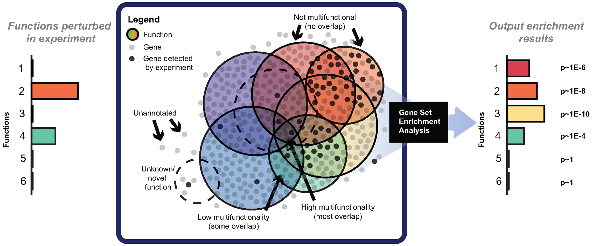
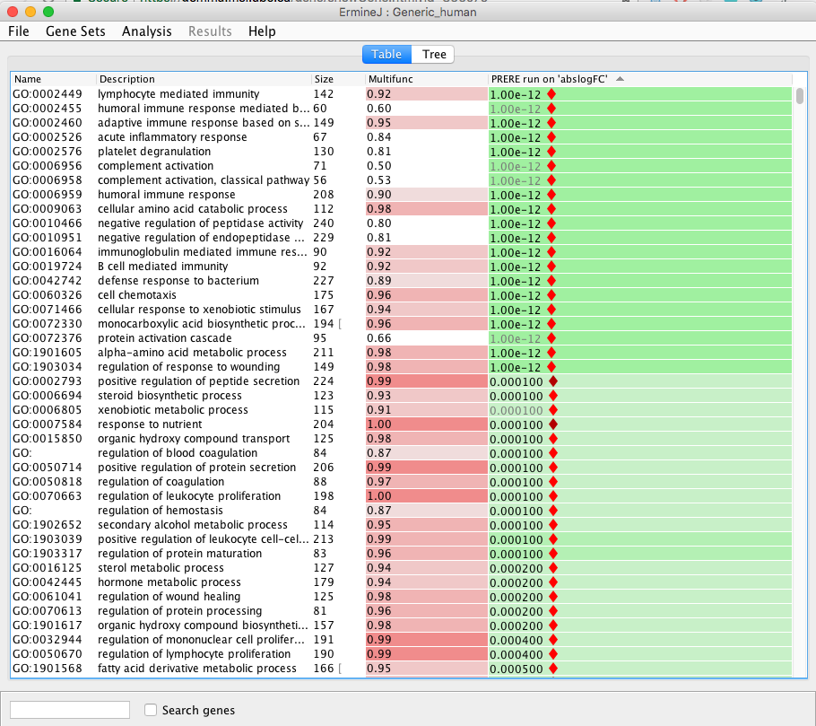

# STAT 540 - Seminar 7: Gene Set Enrichment Analysis

## Learning Objectives

By the end of this seminar, you should

* Have a clear understanding of what a gene set enrichment analysis is
* Have developed an intuition of the statistics underlying an enrichment analysis
* Be able to use the hypergeometric distribution to evaluate over representation of gene sets in an experimentally generated gene "hit list"
* Understand the differences and similarities between the ORA (over representation analysis), ROC, and Precision-recall approaches to enrichment analyses
* Have practical experience working with these different enrichment analysis methods with simulated data
* Have an appreciation for the impact of gene multifunctionality on enrichment analyses
* Have practical experience running a gene set enrichment analysis using ermineJ on a real dataset

There are no graded deliverables for this seminar.

## Packages required

You will need to have the [ermineR](https://github.com/PavlidisLab/ermineR) package installed to run this analysis. Install by running `BiocManager::install("PavlidisLab/ermineR")`. Before you begin, **you will need to have [Java](https://www.java.com/en/download/) installed**. If you have trouble installing Java and/or ermineR, see the [Instructions here](https://github.com/PavlidisLab/ermineR#installation).
    
```{r load, echo=TRUE, results='hide', message=FALSE, warning=FALSE}
library(tidyverse)
library(ermineR)
library(knitr)
theme_set(theme_bw())
```

## Key terms

* **Gene Enrichment Analysis**
* **Over Representation Analysis (ORA)**
* **Hyper Geometric Distribution**
* **Receiver Operating Characteristic (ROC) Curve**
* **Precision-Recall Curve**
* **Sensitivity / Recall / True Positive Rate**
* **False Positive Rate**
* **Specificity**
* **Precision**
* **True Positive / True Negative / False Positive / False Negative**
* **Gene Multifunctionality**

## Part 1: What is an enrichment analysis? And why statistics?

The most common analogy used to explain the basic idea of an enrichment analysis is the [urn problem](https://en.wikipedia.org/wiki/Urn_problem). You don't have to read the Wikipedia page; more details coming :D.

An analogy more relevant to 21st century humans is the Spotify shuffle problem. If your playlist seems to be serving up too much Chopin or Lady Gaga, you might question whether it is really random. The idea of “more Chopin than I expected” is intuitive, but humans are bad at figuring out the probabilities. In science, such misjudgments can have more serious consequences, so we use statistical techniques to tell us how surprised we should be.

### The classic urn analogy and the hypergeometric distribution

Imagine you have an urn. Inside, there are 500 marbles. Of the 500 marbles, 100 are red and 400 are blue. Or so you think.

Now, imagine that you took the urn, which is completely opaque, and you shook it really hard so that the marbles are very well-mixed. Then, you reached into the urn to pick out a marble, noted its color and set it aside. Then you reached into the urn again to pick out another marble. You repeat this **100 times**. In the language of statistics, you are sampling **without replacement**. 

Then, you tally the numbers of red and blue marbles you have and find out that **half (50)** of the **100** marbles you drew were red, and the other half were blue. Is that surprising? Would you think that there were more than 100 red marbles in the original urn? Was the the urn **"enriched"** with red marbles compared to your expectation? That red marbles were **"over represented"** in the sample you drew?

It turns out that the hypergeometric distribution is a very appropriate statistical model for this scenario. It describes the probability distribution of obtaining **k successes** in **n random draws** from a population of **size N** containing **K successes** and **(N - K) failures**. Note that the letters used to represent each variable were chosen arbitrarily. 

Relating this back to our example, we could use the hypergeometric distribution to obtain a p-value that tells us the probability of drawing the **50 red marbles** (successes) in **100 draws** from a population of **100 red marbles** and **400 blue marbles**. Note that picking which colour represents the 'success' is arbitrary.

Let's plot out the probability distribution using the **dhyper()**. 

```{r}
N <- 500 # population size (number of red marbles  + blue marbles)
K <- 100 # number of successes in the population (number of red marbles in the population)

n <- 100 # number of draws (number of marbles sampled)
x <- seq(0, 100) # possible values of k success draws observed

y <- dhyper(x, K, N - K, n) # hypergeometrically distributed probabilities corresponding to each value in x

tibble(x, y) %>% 
  ggplot(aes(x = x, y = y)) +
  geom_line() +
  geom_point()

```

Great. This shows the probability distribution for the number of red marbles in a random sample of 100 marbles without replacement from the urn. 

Back to our thought experiment, suppose we picked out **50 red marbles**. How surprised should we be?

To evaluate how extreme this observation is, we need to find the p-value that represents probability of obtaining **50 or more** red marbles. 

```{r}

k = 50 # number of successful draws observed

# Recall that phyper() gives the cumulative probabilities. 
# p-value = P[X > 49]
pvalue <- phyper(k - 1, K, N - K, n, lower.tail = FALSE)
pvalue
```

A p-value of `r signif(pvalue, 3)`! That is an extremely unlikely observation! Let's visualize this. 

Note that p-value is the "area under curve" in the highlighted area - and there isn't much area at all, as we expected.

```{r}
tibble(x, y) %>% 
  ggplot(aes(x = x, y = y)) +
  geom_line() +
  geom_point() +
  geom_vline(xintercept = k, color = "red") +
  annotate("rect", xmin = k, xmax = K, ymin = 0, ymax = Inf, alpha = .2, fill = "red") +
  ggtitle(paste0("p-value = ", signif(pvalue, 3)))

```

In this case, we would say that the observation we obtained is highly unlikely under the null hypothesis. The null hypothesis being that there were K = 100 red marbles and 400 blue marbles in the urn. We reject the null hypothesis because we see an **"over representation"** of red marbles in our result. In other words, we think there was an **"enrichment of red marbles"** in the urn from which we drew the marbles. 

For the sake of illustration, what if you drew *20 red marbles*, instead? Now what is the p-value for the result of drawing 20 red marbles from a sample of 100?

Let's see... 

```{r}

k = 20

# p-value = P[X > 19]
pvalue <- phyper(k - 1, K, N - K, n, lower.tail = FALSE) 

tibble(x, y) %>% 
  ggplot(aes(x = x, y = y)) +
  geom_line() +
  geom_point() +
  geom_vline(xintercept = k, color = "red") +
  annotate("rect", xmin = k, xmax = K, ymin = 0, ymax = Inf, alpha = .2, fill = "red") +
  ggtitle(paste0("p-value = ", signif(pvalue, 3)))

```

Right, p-value = `r signif(pvalue, 3)`. Looks like getting >=20 red marbles isn't strange at all. In this case, we fail to reject the null hypothesis. In other words, we have **not** observed an **"over representation"** of red marbles in our result. 

### Genes in a genome as marbles in an urn

As you might have guessed it, what we had done in the previous section is what's called an **Over-Representation Analysis** or ORA for short. It is one of the most popular and oldest methods for performing a gene enrichment analysis. And it uses, precisely, the hypergeometric distribution (because it is, in essence, sampling without replacement i.e. you cannot pick the same gene twice).

To see how ORA would work for gene enrichment, we will anchor the previous example in a more relevant scenario using genes :). After all, this is what excites us bioinformaticians.  

Imagine that **the urn is the genome** and **the marbles are genes**. Red marbles would then represent genes belonging to a particular **gene set**. This might be genes annotated with a common GO term (as is most often the case), or genes relevant to some biological pathway, or genes belonging to the same chromosome, etc. Then, there would be a **hit list** of genes that was derived from some experiment. For example, this **hit list** might contain significantly differentially expressed genes in an experiment you performed. This **hit list** would be represented by the marbles drawn in the urn analogy above. The point of the enrichment analysis by ORA is then to look for over-representation of **"red marble genes"** in the **hit list**. 

To make it a bit more concrete, assuming for the moment you have a list of 100 genes that were identified in your experiment, we might want to know: "There are 12 genes involved in cell cycle regulation in my 100 genes. Is that surprising?"

### Some (very!!) important definitions

This brings us to a few very important definitions relevant to the gene enrichment analysis. 

For every enrichment analysis, there are two main inputs: **1. Gene sets** and **2. List of genes to be analyzed**.

#### 1. Gene sets

* These are predefined groups of genes
* They provide the definition of "red marbles"
* The goal of the ORA or enrichment analysis is to see which, if any, gene sets are enriched in your "hit list" (or more accurately, the list of genes you are analyzing)
* The way these gene sets came to be or how they were populated with genes have nothing to do the enrichment analysis at hand; they are pre-defined
* These gene sets are most commonly [GO terms](http://www.geneontology.org/); recall that GO terms describe functions where each GO term would be associated to a set of relevant genes
* Any one gene could be assigned to more than one gene set; keep this thought
  
#### 2. List of genes to be analyzed

* Notice how I have deliberately avoided the term "hit lists" here; more details below but basically there are methods (that we recommend) where you do not have to supply a selected "hit list", but rather, *a ranked list of all the genes*
* This is most commonly the result of some experiment
* The goal of the ORA or enrichment analysis is to see which, if any, gene sets are enriched in this list of genes (or *enriched for high rankings if using a ranked list of all genes*)
* This list of genes is represented by the marbles you drew in the urn analogy
    
Given these inputs, the enrichment analysis will typically go through each gene set to produce a corresponding p-value that represents an evaluation of the enrichment or "over-representation" of the genes in the given gene set in your list of genes. 

## Part 2: The ROC (Receiver Operating Characteristic) and Precision-Recall Methods

[ErmineJ](http://erminej.msl.ubc.ca/) is the software that we will use for performing the gene set enrichment analysis. It was originally developed in the Pavlidis Lab and has since been used widely. Feel free to read more about it in [this paper](https://www.nature.com/articles/nprot.2010.78).

As previously mentioned, you do not need to have a "hit list" in order to perform an enrichment analysis. Consider a typical scenario where a list of genes with p-values was produced in a differential expression analysis experiment. To produce a "hit list", some arbitrary p-value threshold would have to be set. All the genes meeting this threshold would now be seen as "chosen" and everything else discarded. The choice of this threshold can have substantial effects on the enrichment analysis. Additionally, binning your list of genes into "chosen" and "un-chosen" may unnecessarily eliminate some useful information. 

The ORA method that assumes the hypergeometric distribution described above inevitably requires a "hit list". ErmineJ offers a few techniques that are less common, but are equally, if not more, powerful. Two of which we will talk here are the [Receiver Operating Characteristic (ROC)](https://en.wikipedia.org/wiki/Receiver_operating_characteristic) and the [Precision-Recall](https://en.wikipedia.org/wiki/Precision_and_recall) methods for enrichment analysis. Don't let these fancy terms frighten you, though they frightened me at first. These are in fact quite simple ideas.

### Understanding the ROC curve

Let's first look at the ROC method. 

Both the ROC and the precision-recall methods are rank-based methods. They are essentially evaluating whether the genes belonging to a certain gene set are ranked higher in your list of genes than would be expected under the null hypothesis. 

As you might recall, the ROC curve is frequently used to assess the quality of machine learning classifiers in some binary classification (positive or negative) setting. The idea is that ML classifiers will typically rank items in order of likelihood of the item being "positive" (i.e. belonging to a gene set), with most likely items on top and least likely items on the bottom. A similar idea is used here for enrichment analysis. This method is suitable here because, in essence, we would like to assess whether the genes belonging to a given gene set is ranked highly in the given list of genes. 

On the y-axis of the ROC curve, **sensitivity, or equivalently, the true positive rate, or recall** is plotted. On the x-axis, the **false positive rate** is plotted. This can be confusing. Allow me walk you through everything step-by-step. 

#### Sensitivity or Recall or the True Positive Rate

The **true positive rate or sensitivity** is the **(number of true positives) / (the number of true positives + the number of false negatives)**. Recall that true positives are the genes that belong to the gene set that are accurately classified as such. On the other hand, false negatives are genes that belong to the gene set but are misclassified as a negative. 

To put it in plain English: 

**Sensitivity = of all the positives (i.e. genes belonging to the gene set), how many genes were correctly classified as such?**

#### The False Positive Rate

The **false positive rate** is **(the number of false positives) / (the number of false positives + the number of true negatives)**. 

To put it in plain English: 

**The false positive rate = of all negatives (i.e. the genes that do NOT belong to the gene set), how many genes were incorrectly classified as positives?**

#### Constructing the ROC curve

To really understand what an ROC curve is, one must consider how it is constructed; i.e. How each point on the ROC curve is plotted. 

Remember that this is a ranked-based test. 

Start with the list of genes, take the top n = 1 gene. Now pretend you have two lists of genes. The first list contains the top n = 1 gene; this is the "putative positive list" where everything in this list is classified as a positive. The second list consists of the rest of the genes and this is the "putative negative list". Now, compute the true positive rate and the false positive rate given the current classifications. Plot this point. 

Next, take the top n = 2 genes and pretend, again, that you have two lists with the top n = 2 genes receiving a positive classification and the rest receiving a negative classification. Compute the rates again and plot the point. 

Do this incrementally for n = n + 1 until n covers the entire list. Now, draw a curve to connect all the points. The area under this curve (AUC) is the score. The larger the score, the more enrichment there is. Essentially, this is measuring whether the genes belonging to the gene set are ranked highly in the list. 

Now, let's simulate this with some fictional genes. 

```{r}
(allPossibleGenes <- paste0("gene_", letters))

# 12 positive genes
(fictionalGeneSet <- paste0("gene_", letters[1:12])) 
# 14 genes not belonging to the gene set
(negativeGenes <- allPossibleGenes %>% setdiff(fictionalGeneSet)) 

# Now we produce a ranked list of genes to be analyzed. 
# Let's ensure that we place all of the 8 genes belonging 
# to the fictional gene set in the top 10 ranks, and spread 
# the rest 4 in the bottom. This is to simulate that the 
# positives are generally ranked highly, with random noise

set.seed(123)
positiveGeneRanks <- c(sample(1:10, 8, replace = FALSE), 
                       sample(15:25, 4, replace = FALSE))
negativeGeneRanks <- 1:26 %>% setdiff(positiveGeneRanks)

(rankedGeneList <- tibble(gene = c(fictionalGeneSet, negativeGenes),
                    rank = c(positiveGeneRanks, negativeGeneRanks)) %>% 
  arrange(rank))
```

We have artificially created a ranked list of genes that is enriched with genes from the fictional gene set. 

Now let's plot an ROC curve. 

```{r}
truePositiveRate <- numeric(0)
falsePositiveRate <- numeric(0)

for (n in 1:length(allPossibleGenes)) {
  
  # Classifications given current n
  putativePositives <- rankedGeneList$gene[1:n]
  putativeNegatives <- rankedGeneList$gene[n+1:length(rankedGeneList$gene)]
  
  # Compute the sensitivity
  truePositiveCount <- putativePositives %>% intersect(fictionalGeneSet) %>% length()
  falseNegativeCount <- putativeNegatives %>% intersect(negativeGenes) %>% length()
  
  currTruePosRate <- (truePositiveCount / (truePositiveCount + falseNegativeCount))
  truePositiveRate <- c(truePositiveRate, currTruePosRate)

  
  # Compute the false positive rate
  falsePositiveCount <- putativePositives %>% intersect(negativeGenes) %>% length()
  trueNegativeCount <- putativeNegatives %>% intersect(negativeGenes) %>% length()
  
  currFalsePosRate <- (falsePositiveCount / (falsePositiveCount + trueNegativeCount))
  falsePositiveRate <- c(falsePositiveRate, currFalsePosRate)
}

tibble(true_positive_rate = truePositiveRate,
       false_positive_rate = falsePositiveRate) %>% 
  ggplot(aes(x = false_positive_rate, y = true_positive_rate)) +
  geom_line() +
  geom_abline(intercept = 0, slope = 1, color = "red")
```

Notice that at the bottom of the graph, `true_positive_rate` = 0 and at the top, `true_positive_rate` = 1. This is because, at the first iteration, we classified everything as negative while at the last iteration, we classified everything as positive. The x-axis, which displays the false_positive_rate, then informs us "how many false positives occur at the cost of increased *sensitivity*"; remember the highest sensitivity occurs when we simply classify the entire list as being positives. If the ranking of the list is enriched for the genes in the gene set, we would be able to see a slower increase of false positives with respect to sensitivity, lifting the curve up and producing more area under the curve (AUC). This, then, constitutes the measure for enrichment in the ROC method.

**Exercise**: change the ranks around and see what happens to to the ROC curve. Do they match your expectations?

### And the Precision-Recall curve

The precision-recall curve is very similar to the ROC curve, except that it measures the relationship between sensitivity (or recall or true positive rate) and precision.

On the x-axis of the precision-recall curve, **recall, or equivalently, sensitivity or the true positive rate** is plotted. On the y-axis, the **precision** is plotted.

#### Sensitivity or Recall or the True Positive Rate (reminder)

Just to remind you what **recall** is:

The **recall** is the **(number of true positives) / (the number of true positives + the number of false negatives)**. Recall that true positives are the genes that belong to the gene set that are accurately classified as such. On the other hand, false negatives are genes that belong to the gene set but are misclassified as a negative. 

To put it in plain English: 

**Sensitivity = of all the positives (i.e. genes belonging to the gene set), how many genes were correctly classified as such?**

#### Precision (this is new for precision-recall)

The **precision** is **(the number of true positives) / (the number of true positives + the number of false positives)**. 

To put it in plain English: 

**Precision = of all the genes classified as being a positive, how many actually belong to the gene set?**

#### Constructing the precision-recall curve

If you understand how the ROC curve is constructed, you'd have no problem with the construction of the precision-recall curve. It is really the same process, except the measures that we are computing are now different (**precision and recall** instead of **recall and false positive rate**). 

As a quick recap, you simply want to separate the gene list into two lists: a positive and a negative lists. Starting with the top n = 1 gene being the only gene in the positive classification to calculate the metrics and then incrementally increase to n + 1 to recompute the next data point. 

Let's plot a precision-recall curve with our simulated data.

```{r}
truePositiveRate <- numeric(0)
precision <- numeric(0)
for (n in 1:length(allPossibleGenes)) {
  
  # Classifications given current n
  putativePositives <- rankedGeneList$gene[1:n]
  putativeNegatives <- rankedGeneList$gene[n+1:length(rankedGeneList$gene)]
  
  # Compute the sensitivity
  truePositiveCount <- putativePositives %>% intersect(fictionalGeneSet) %>% length()
  falseNegativeCount <- putativeNegatives %>% intersect(negativeGenes) %>% length()
  
  currTruePosRate <- (truePositiveCount / (truePositiveCount + falseNegativeCount))
  truePositiveRate <- c(truePositiveRate, currTruePosRate)

  
  # Compute the false positive rate
  falsePositiveCount <- putativePositives %>% intersect(negativeGenes) %>% length()
  
  currPrecision <- (truePositiveCount / (truePositiveCount + falsePositiveCount))
  precision <- c(precision, currPrecision)
}

tibble(recall = truePositiveRate,
       precision = precision) %>% 
  ggplot(aes(x = recall, y = precision)) +
  geom_line()
```

This is essentially covering the range of sensitivity where at least 1 gene is classified as a positive to, at the very end, everything is classified as a positive. The area under the precision-recall curve, then, is measuring the performance of precision at the cost of increased sensitivity. The intuition is that you want to preserve the maximum proportion of true positives in your putative positives for as long as you can, or further down the list as you can. 

**Exercise**: again, change the ranks around and see what happens to to the precision-recall curve. Do they match your expectations?

### The Precision-Recall method is more stringent

So what is the difference between the ROC and the precision-recall methods, you ask. Great question!

The short answer to this question is that the precision-recall method puts a lot more emphasis on the *highly ranked genes*. If a positive gene's rank fell from 1 to 2, the decrease in area under the precision-recall curve would be much more drastic than if it fell from 100 to 101. 

Here is the intuition underlying the math: The precision metric is measuring "how many of the putative positives are real positives", or (true positive count / putative positive count). Now, suppose you're at the top of the list, this means your putative positive list is small (suppose n = 2). If 1 out of the 2 putative positives is a false positive, your precision then equals 1/2 = 0.5! Now, suppose you are at n = 10, and you have your first false positive here, your precision would be 1/10 = 0.1. See how much more important the top of the list is?

## Part 3: One more thing: the impact of multifunctional genes

What is a STAT 540 seminar without working with real data?? I know you've been waiting for this moment :D.

The [dataset](https://gemma.msl.ubc.ca/expressionExperiment/showExpressionExperiment.html?id=6568) that we are analyzing in this seminar came from this [study: "Liver regeneration signature in hepatitis B virus (HBV)-associated acute liver failure identified by gene expression profiling" by Nissim et al. (2012)](https://www.ncbi.nlm.nih.gov/pubmed/23185381). The study looked at gene expression differences between HBV-associated acute liver failure patients compared to controls.

To save you time, we have done the differential expression analysis for you, so that you can focus on the enrichment analysis. The resulting gene list is here. It has two columns: **1. gene** and **2. logFC**. I have stripped out the p-values among other irrelevant information. We are using logFC here for the sake of demonstrating multifunctionality correlation. Typically, you would use p-values as your scores. 

Let's import this dataset and take a look inside:

```{r}
(geneList <- read_csv("data/ranked_gene_list.csv"))
```

Before we actually proceed to the enrichment analysis, there is just one more thing we need to cover: Gene Multifunctionality.

### The difference between genes in a genome and marbles in an urn

Remember how I said that a single gene could belong to multiple gene sets. Of course, this is biology, not some marbles in an urn. By the way, at least for our purpose, you can think of gene sets as GO terms. 

It turns out that some genes are annotated with a lot of GO terms. We call these genes multifunctional; they are involved with many functions based on the number of GO terms they have. The actual metric used to evaluate how multifunctional a gene is is slightly more complicated and you can read much more about it in [this paper](https://academic.oup.com/nar/article/45/4/e20/2290927). For now, just get the idea that some genes are assigned to more gene sets than others and this can have undesirable effects on the result of the enrichment analysis. 

### How would multifunctional genes affect an enrichment analysis?

How? Why do multifunctional genes matter? Figure 1 from [this paper](https://academic.oup.com/nar/article/45/4/e20/2290927) sums it up pretty well. 



> A conceptual model for gene group analysis. Consider a hypothetical process (e.g. a disease) which involves two gene functions (bars at left). Assume a gene is ‘detected’ in the experiment (with some non-zero probability) if they are involved in one of the functions that underlie the process of interest. In this case, the genes with the highest probability of ‘showing up’ are the ones in functions 2 and 4. From a gene set enrichment analysis of this hit list, it is hoped that enrichment will be found for both functions 2 and 4, but not the others. Yet, genes in these functions are highly multifunctional and share other functions, which show up erroneously as enriched in the analysis (bars on the right). - Fig 1: Ballouz et al., 2016

In essence, it is in our interest to avoid getting results that simply reflect the overlap of functions in multifunctional genes. For this reason, ErmineJ has multifunctionality adjustment directly built-in. To put it simply, for the ROC and precision-recall methods, the software would weigh the ranks of genes by their multifunctionality scores, essentially re-ranking the list according to how big of an impact multifunctionality will have on the results. 

### In case you're wondering: are we trying to avoid false-positives? No!

We are simply trying to detect a needle in a haystack. If multifunctional genes are ranked highly (which is likely, given that these genes are multifunctional), then the enrichment analysis may simply reveal the functions that consist of the largest overlap of these multifunctional genes. That is not to say that these functions are *wrong*, or non-biological, they are simply *nonspecific*. And this makes them less useful. Adjusting for this bias could help us uncover the functions that are more unique to the specific conditions that we're investigating. 

### Correlation with multifunctionality

To make all of this more real, let's look back at our data. We have also provided a dataset that contains the multifunctional scores of most genes in the human genome. We can take a look at how much our gene scores correlate with multifunctionality. 

Let's first import the multifunctionality scores dataset. 

```{r}
(mfScores <- read_csv("data/gene_multifunctionality_scores.csv"))
```

The dataset has two columns: 1. gene, and 2. a multifunctional score for each gene. 

Now let's see if our geneList has some multifunctional bias. 

```{r}
(mergedData <- geneList %>% inner_join(mfScores, by = "gene"))

(rankMfCor <- cor(abs(mergedData$logFC), mergedData$MF.score, method = "spearman"))
```

And there is a Spearman's correlation of **r = `r signif(rankMfCor, 2)`** between our abs(logFC) and multifunctional scores! That is a lot of bias! Yes, we did cherry pick a little :P. But nonetheless, this is still a real dataset and it just goes to show how much multifunctionality can impact your results!

Note that I'm using abs(logFC) - this is just me saying that all I care about is the *magnitude* of the change in expression, not at all the direction of the change. This is a somewhat arbitrary choice. 

Let's plot this out in a scatterplot. 

```{r}
mergedData %>%
  ggplot(aes(x = abs(logFC), y = log10(MF.score))) + 
  geom_point(alpha = 0.1) +
  geom_smooth(method = "lm", se = FALSE) +
  ggtitle(paste0("r = ", rankMfCor))
```

## Part 4: A real analysis using ermineR (ermineJ in R)

Finally, let's run a real enrichment analysis. Since this dataset has a strong multifunction bias, we would expect ermineJ's multifunction adjustment to have a big impact.

Just a quick note, in this seminar we will be using [ermineR](https://github.com/PavlidisLab/ermineR). Refer to the beginning of this seminar for instructions on how to install this package, in case you haven't done so. ErmineR is a wrapper for ermineJ and it was developed by [Ogan Mancarci](https://github.com/oganm) from the Pavlidis Lab.

### Preparing the inputs

So what does ermineJ require to run? Three things: 

1. The gene ontology (GO) XML file
2. The annotation file
3. The List of Genes & scores to be Analyzed

The GO XML file contains all the GO terms and the relationships between them. The annotation file maps the genes to the GO terms. The GO XML file and the annotation file together defines the gene sets.

To save you time, we have already downloaded the GO XML and the annotation files. However, for the future, it may be in your best interest to get the most up-to-date versions. 

Finally, the list of genes and the corresponding scores is derived from some experiment. In our case, this is the result of a differential expression analysis and the scores are abs(logFC). The scores may also be p-values. Once supplied to ermineJ, the software will convert the scores into *ranks* so that the precision-recall (our enrichment analysis method today) method can be performed.

Since our scores are currently in logFC (signed), we will first convert them to absolute values. Again, this is simply a choice to only look at magnitude of differential expression while ignoring the directionality. 

ErmineR requires the input gene list to be a `data.frame` with gene as rownames and at least one column to be the corresponding scores. 

```{r}
# download the latest GO.xml file if it doesn't already exist
if (!file.exists("GO.xml")) { goToday("GO.xml") }

ermineInputGeneScores <- geneList %>% 
  mutate(absolute_logFC = abs(logFC)) %>% 
  select(gene, absolute_logFC) %>% 
  na.omit() %>% 
  as.data.frame() %>% 
  arrange(desc(absolute_logFC)) %>% 
  column_to_rownames("gene")

head(ermineInputGeneScores) # print the first few rows
```

### Using the Precision-Recall method

Looks like we're all ready to perform the enrichment analysis!

```{r}
enrichmentResult <- precRecall(scores = ermineInputGeneScores, 
                               scoreColumn = 1, # column 1 is the scores 
                               bigIsBetter = TRUE, # larger logFC should be ranked higher
                               annotation = "Generic_human", # ask ermineJ to use the Generic_human annotation file (will automatically download)
                               aspects = "B", # look at only biological processes 
                               iterations = 10000, # 10K sampling iterations so that results are stable
                               geneSetDescription = "GO.xml") # use the GO XML file in current directory
```

Note that the output of ermineJ has two components: **1. results** and **2. details**. 

**ouptut$result** is a tibble containing the list of gene sets (in our case, GO terms) analyzed as well as their IDs, scores, among other information. 

**output$details** contains other information about the enrichment analysis such as correlation with multifunctionality, number of sampling iterations, multiple testing adjustment method used, etc. 

Take a moment to examine the outputs you got! 

### Examining the results

Now, let's take a look at output$result, which is probably what you care about the most :P. 

```{r}
enrichmentResult$results %>% arrange(MFPvalue) %>% head() %>% kable()
```

The tibble has the following columns: 

* **Names** - Name of the GO term
* **ID** - Unique identifier of the GO term
* **NumProbes** - Number of probes annotated with this GO term (in our case its the same as NumGenes because we did a gene level analysis)
* **NumGenes** - Number of genes annotated with this GO term
* **RawScore** - The raw area under the precision-recall curve (AUC)
* **Pval** - P-value for evaluating enrichment of this GO term in the gene list
* **CorrectedPvalue** - P-value after multiple testing correction
* **MFPvalue** - P-value after adjusting for multifunctionality
* **CorrectedMFPvalue** - MFPvalue after multiple testing correction
* **Multifunctionality** - Multifunctionality score of this GO term; for manual examination only; this number did not play a role in the enrichment analysis

Exploring the top ranked categories, do you see any that relate to processes you'd expect to be enriched for HBV-associated acute liver failure patients compared to controls?

#### ErmineJ GUI (Graphical User Interface)

ErmineJ also provides a GUI that can be downloaded [here](http://erminej.msl.ubc.ca/download/webstart/). For simplicity, we've opted to stick with the R-environment strictly in this seminar. In the future, you may find convenience in running the desktop GUI version. See a screenshot of results from the very same analysis below:



I know it's late and you want to go <s>home</s> to the kitchen. Hang on, we're almost done!

There's just one last thing I'd like to show you. That is, how did adjusting for gene multifunctionality affect our results? 

Let's look at a scatter plot. 

```{r}
enrichmentResult$results %>% 
  ggplot(aes(x = -log10(Pval), y = -log10(MFPvalue))) +
  geom_point(alpha = 0.2)
```

See the data points on the bottom right corner? Those are the GO terms that lost their statistical significance following adjustment for multifunctionality. Let's zoom to to see what they are. 

```{r}
enrichmentResult$results %>% 
  select(Name, Pval, MFPvalue) %>% 
  mutate(neg_log_pvalue = -log10(Pval),
         neg_log_mfpvalue = -log10(MFPvalue)) %>% 
  mutate(log_pvalue_change = neg_log_mfpvalue - neg_log_pvalue) %>% 
  arrange(desc(abs(log_pvalue_change))) %>% 
  head(10) %>%
  kable()
```
By adjusting for multifunctionality, these GO categories no longer show up in our list of significantly enriched. Comparing these with those that were significantly enriched, what do you think in terms of the biological signifcance of these processes in HBV-associated acute liver failure patients compared to controls?

## Further readings

* [Gene Ontology: tool for the unification of biology](https://www.nature.com/articles/ng0500_25)
* [Gene function analysis in complex data sets using ErmineJ](https://www.nature.com/articles/nprot.2010.78)
* [Using predictive specificity to determine when gene set analysis is biologically meaningful](https://academic.oup.com/nar/article/45/4/e20/2290927)
* [ErmineJ Tutorials](http://erminej.msl.ubc.ca/help/tutorials/)
* [ErmineJ FAQ](http://erminej.msl.ubc.ca/help/frequently-asked-questions/)
* [Wikipedia: Hypergeometric Distribution](https://en.wikipedia.org/wiki/Hypergeometric_distribution)
* [Wikipedia: Urn problem](https://en.wikipedia.org/wiki/Urn_problem)
* [Wikipedia: Receiver Operating Characteristic](https://en.wikipedia.org/wiki/Receiver_operating_characteristic)
* [Wikipedia: Precision and Recall](https://en.wikipedia.org/wiki/Precision_and_recall)

## Attributions

This seminar was developed by [Eric Chu](https://github.com/echu113) with the generous help of [Dr. Paul Pavlidis](https://github.com/ppavlidis), [Ogan Mancarci](https://github.com/oganm), and [Nathaniel Lim](http://www.msl.ubc.ca/users/nzllim).

## Session Info

```{r}
sessionInfo()
```