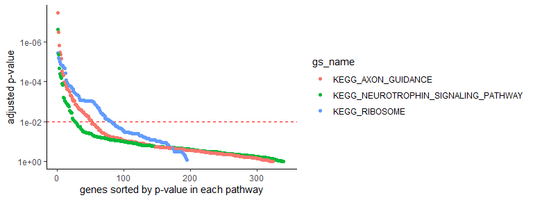
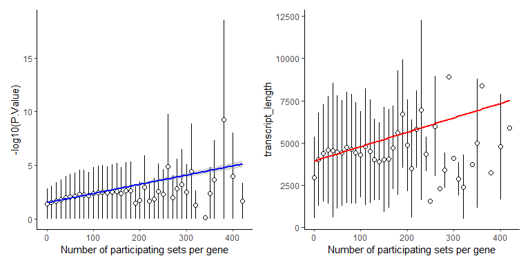
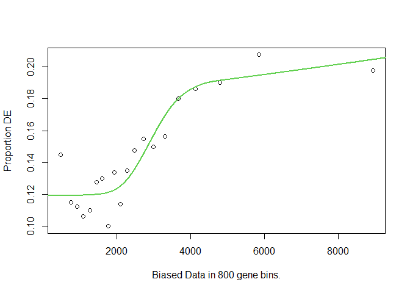
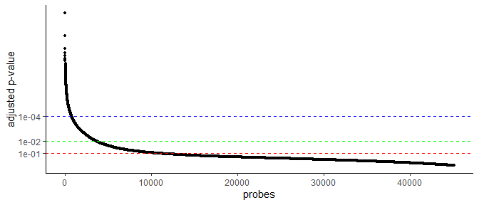

STAT 540 - Seminar 7: Gene Set Enrichment Analysis
================
Last update: 25 febrero, 2022 @ 11:03

## Attributions

This seminar was developed by Yongjin Park

## Learning Objectives

1.  Testing the over-representation of gene sets for your list of top
    significant genes: `goseq`

2.  Rank-based Gene Set Enrichment Analysis based on your list of
    gene-level scores: `fgsea`

## Packages required

Please make sure you are able to load the following libraries before
starting the seminar

``` r
library(tidyverse)         # our good friend
library(patchwork)
library(data.table)        # very handy with large tables
library(R.utils)           # need this to handle gzipped data

# Please make sure you have biomaRt installed but don't load it yet
# biomaRt creates namespace conflicts with dplyr. So we just want load 
# it when required
# library(biomaRt)           # annotate gene information 

# The following libraries can be installed using Bioconductor:
library(msigdbr)           # curated source of gene sets and functions
library(goseq)             # tool for GO term enrichment analysis 
library(fgsea)             # tool for gene set enrichment analysis 
## fgsea can also be installed using the corresponding GitHub repo:
## remotes::install_github("ctlab/fgsea")

theme_set(theme_classic()) # classic theme ggplot
```

*Remark on a technical issue*: You may not be able to install everything
from the scratch depending on your machine/platform. If you’re using
`Ubuntu/Debian` Linux, you might want to install some dependent `R`
packages via `apt-get`:

``` sh
sudo apt install r-bioc-rsamtools
sudo apt intall r-cran-biasedurn
```

*Remark on a technical issue*: You need `C++` compiler installed in your
machine if you want to use `fgsea` with best performance.

Outline:

-   [Recap: Differential Expression
    analysis](#recap-Differential-Expression-Analysis)

-   [Part 1: When we know how to draw lines between the significant and
    the
    insignificant](#part-1-gene-set-analysis-testing-over-representation)

-   [Part 2: When we want to use gene-level scores to rank the
    importance](#part-2-rank-based-gene-set-enrichment-analysis)

-   [Deliverables](#deliverables)

# Recap Differential Expression Analysis

## Run Differential Expression Gene analysis

Let’s use the same data used in
[`seminar-05`](https://github.com/STAT540-UBC/seminar-05/blob/main/sm5_differential_expression_analysis.md).
You can repeat the same code of `seminar-05`, but we copied that for
completeness (only in
[`Rmd`](https://github.com/STAT540-UBC/seminar-05/blob/main/sm7_gsa_network.Rmd)).

As a result, we have:

``` r
head(DEG.stat.dt)
```

    ##    dev_stageE16 dev_stageP10 dev_stageP2 dev_stageP6  AveExpr        F
    ## 1:    -3.961300   -3.0413588  -3.5622994 -3.76595110 6.528244 498.7106
    ## 2:    -3.444810   -3.1864997  -3.1650116 -3.31764169 5.853610 277.7777
    ## 3:    -5.113539   -4.7804105  -4.9552037 -4.63356418 9.382327 200.3950
    ## 4:    -5.533556   -3.9843389  -4.6514613 -4.73368077 7.028447 176.8973
    ## 5:    -6.186842   -4.1710853  -4.8842390 -4.99687261 8.318210 159.0014
    ## 6:     3.660868    0.1145409   0.7496469  0.04310452 7.278059 154.0316
    ##         P.Value    adj.P.Val        probe
    ## 1: 7.137780e-18 3.219210e-13   1440645_at
    ## 2: 1.159691e-15 2.615162e-11   1451507_at
    ## 3: 1.944860e-14 2.923838e-10   1416041_at
    ## 4: 5.678876e-14 6.403074e-10 1425222_x_at
    ## 5: 1.415802e-13 1.123672e-09   1451635_at
    ## 6: 1.857330e-13 1.123672e-09 1422929_s_at

## We want to convert the probe names to gene symbols used in gene set databases

Sometimes, the authors forget to attach feature annotation information;
then, you must manually map these to gene symbols or ENSEMBL IDs
commonly used in pathway annotation databases. We will use `biomaRt`
package to construct this map.

``` r
probe.info.file <- "mouse_human_map.rds"
```

Although running `biomaRt` (or a similar kind) is essential in many
researches (especially in cross-species analysis), we will not cover the
details in this seminar. However, you are welcomed to explore the source
code as much as you like
[`here`](https://github.com/STAT540-UBC/seminar-05/blob/main/sm7_gsa_network.Rmd).
We share `.rds` file for a quick data access.

``` r
probe.info.map <-
    readRDS(probe.info.file) %>%          # read RDS
    rename(probe = affy_mouse430_2) %>%   # Change the var. name
    rename(chr = chromosome_name) %>%     # shorten the chr name
    rename(gene_symbol = hgnc_symbol) %>% # Will use human gene symbol
    as.data.table()
```

It looks like this:

``` r
probe.info.map %>%
    head() %>%
    knitr::kable()
```

| probe          | mgi\_symbol | gene\_symbol | ensembl\_gene\_id | chr        | transcription\_start\_site | transcript\_length |
|:---------------|:------------|:-------------|:------------------|:-----------|---------------------------:|-------------------:|
| 1426088\_at    | mt-Nd5      | MT-ND5       | ENSG00000198786   | MT         |                      12337 |               1812 |
| 1417629\_at    | Prodh       |              | ENSG00000277196   | KI270734.1 |                     161852 |               2405 |
| 1417629\_at    | Prodh       |              | ENSG00000277196   | KI270734.1 |                     161750 |               1990 |
| 1452434\_s\_at | Dgcr6       |              | ENSG00000278817   | KI270734.1 |                     131494 |               1213 |
| 1428753\_a\_at | Dgcr6       |              | ENSG00000278817   | KI270734.1 |                     131494 |               1213 |
| 1417253\_at    | Frg1        |              | ENSG00000273748   | GL000219.1 |                      83311 |                372 |

We could have multiple transcripts within a gene, so let’s take the
longest one:

``` r
probe.info.map <-
    probe.info.map[order(probe.info.map$transcript_length, decreasing = TRUE),
                   head(.SD, 1),
                   by = .(probe, gene_symbol, chr)]
```

The same map, but a shorter list: 336,181 to 33,950.

``` r
probe.info.map %>%
    head() %>%
    knitr::kable()
```

| probe          | gene\_symbol | chr | mgi\_symbol | ensembl\_gene\_id | transcription\_start\_site | transcript\_length |
|:---------------|:-------------|:----|:------------|:------------------|---------------------------:|-------------------:|
| 1444083\_at    | TTN          | 2   | Ttn         | ENSG00000155657   |                  178807423 |             109224 |
| 1427446\_s\_at | TTN          | 2   | Ttn         | ENSG00000155657   |                  178807423 |             109224 |
| 1444638\_at    | TTN          | 2   | Ttn         | ENSG00000155657   |                  178807423 |             109224 |
| 1427445\_a\_at | TTN          | 2   | Ttn         | ENSG00000155657   |                  178807423 |             109224 |
| 1431928\_at    | TTN          | 2   | Ttn         | ENSG00000155657   |                  178807423 |             109224 |
| 1443001\_at    | TTN          | 2   | Ttn         | ENSG00000155657   |                  178807423 |             109224 |

When we match the probe names with the mouse and human gene symbols, we
can directly use this DEG table for downstream enrichment analysis of
gene sets annotated by human gene symbols.

``` r
DEG.stat.dt %>%
    left_join(probe.info.map) %>%
    select(probe, gene_symbol, P.Value, adj.P.Val) %>%
    na.omit() %>%
    head(10) %>%
    mutate(P.Value = num.sci(P.Value)) %>%
    mutate(adj.P.Val = num.sci(adj.P.Val)) %>%
    knitr::kable()
```

| probe          | gene\_symbol | P.Value | adj.P.Val |
|:---------------|:-------------|:--------|:----------|
| 1451507\_at    | MEF2C        | 1.2e-15 | 2.6e-11   |
| 1416041\_at    | SGK1         | 1.9e-14 | 2.9e-10   |
| 1425222\_x\_at | SLC22A9      | 5.7e-14 | 6.4e-10   |
| 1451635\_at    | SLC22A9      | 1.4e-13 | 1.1e-09   |
| 1422929\_s\_at | ATOH7        | 1.9e-13 | 1.1e-09   |
| 1429028\_at    | DOCK11       | 2.0e-13 | 1.1e-09   |
| 1424852\_at    | MEF2C        | 2.5e-13 | 1.1e-09   |
| 1425171\_at    | RHO          | 4.5e-13 | 1.9e-09   |
| 1451617\_at    | RHO          | 5.3e-13 | 2.0e-09   |
| 1451618\_at    | RHO          | 6.2e-13 | 2.1e-09   |

``` r
# num.sci is a convenient function defined in the seminar's Rmd file to convert long numbers into scientific notation.
```

-   Why human gene names for the mouse study?

-   Why do the same Affymetrix probe correspond to multiple human genes?

# How/where to obtain biologically meaningful gene sets

Here, we will use the MSigDB database and GWAS catalogue, but there are
many ways you can obtain gene sets. Traditionally, Gene Ontology (GO)
terms have been used as a go-to database for gene sets. However, the
enrichment of GO terms might be slightly different from what we want to
achieve in a set-based analysis. Unlike pathway annotations and GWAS
catalogue, GO terms have hierarchical relationships (or directed acyclic
graph) with one another, which we would need to consider in calibrating
the null distribution.

## Molecular Signature Database

[MSigDB](http://www.gsea-msigdb.org/gsea/msigdb/) provides a
comprehensive list of gene sets and pathways manually curated by experts
or derived from previous experimental results, including GO terms. We do
not need to download them one by one since someone made a convenient
package to retrieve a current version of MSigDB into R. You can download
the raw text files from the website, too.

**Note**: We will interchangeably use a pathway and a gene set since we
do not deal with gene-gene interactions within a pathway.

There are many species:

``` r
knitr::kable(msigdbr::msigdbr_species())
```

| species\_name                   | species\_common\_name                                          |
|:--------------------------------|:---------------------------------------------------------------|
| Anolis carolinensis             | Carolina anole, green anole                                    |
| Bos taurus                      | bovine, cattle, cow, dairy cow, domestic cattle, domestic cow  |
| Caenorhabditis elegans          | roundworm                                                      |
| Canis lupus familiaris          | dog, dogs                                                      |
| Danio rerio                     | leopard danio, zebra danio, zebra fish, zebrafish              |
| Drosophila melanogaster         | fruit fly                                                      |
| Equus caballus                  | domestic horse, equine, horse                                  |
| Felis catus                     | cat, cats, domestic cat                                        |
| Gallus gallus                   | bantam, chicken, chickens, Gallus domesticus                   |
| Homo sapiens                    | human                                                          |
| Macaca mulatta                  | rhesus macaque, rhesus macaques, Rhesus monkey, rhesus monkeys |
| Monodelphis domestica           | gray short-tailed opossum                                      |
| Mus musculus                    | house mouse, mouse                                             |
| Ornithorhynchus anatinus        | duck-billed platypus, duckbill platypus, platypus              |
| Pan troglodytes                 | chimpanzee                                                     |
| Rattus norvegicus               | brown rat, Norway rat, rat, rats                               |
| Saccharomyces cerevisiae        | baker’s yeast, brewer’s yeast, S. cerevisiae                   |
| Schizosaccharomyces pombe 972h- | NA                                                             |
| Sus scrofa                      | pig, pigs, swine, wild boar                                    |
| Xenopus tropicalis              | tropical clawed frog, western clawed frog                      |

There are many collections available:

``` r
knitr::kable(msigdbr::msigdbr_collections())
```

| gs\_cat | gs\_subcat      | num\_genesets |
|:--------|:----------------|--------------:|
| C1      |                 |           278 |
| C2      | CGP             |          3368 |
| C2      | CP              |            29 |
| C2      | CP:BIOCARTA     |           292 |
| C2      | CP:KEGG         |           186 |
| C2      | CP:PID          |           196 |
| C2      | CP:REACTOME     |          1604 |
| C2      | CP:WIKIPATHWAYS |           615 |
| C3      | MIR:MIR\_Legacy |           221 |
| C3      | MIR:MIRDB       |          2377 |
| C3      | TFT:GTRD        |           523 |
| C3      | TFT:TFT\_Legacy |           610 |
| C4      | CGN             |           427 |
| C4      | CM              |           431 |
| C5      | <GO:BP>         |          7481 |
| C5      | <GO:CC>         |           996 |
| C5      | <GO:MF>         |          1708 |
| C5      | HPO             |          4813 |
| C6      |                 |           189 |
| C7      | IMMUNESIGDB     |          4872 |
| C7      | VAX             |           347 |
| C8      |                 |           671 |
| H       |                 |            50 |

We will focus on the KEGG pathways named by human gene symbols:

``` r
KEGG.human.db <- msigdbr::msigdbr(species = "human",
                                  category = "C2",
                                  subcategory = "CP:KEGG")
```

## GWAS catalog

We can download public data mapping SNPs to diseases/phenotypes from
[the NHGRI-EBI GWAS Catalog](https://www.ebi.ac.uk/gwas/). We can safely
assume a SNP from any given gene can associate the gene itself with the
disease/phenotype. The GWAS catalogue file is already processed and
stored in this repository for your convenience, but you’re welcome to
try out the code
[`here`](https://github.com/STAT540-UBC/seminar-05/blob/main/sm7_gsa_network.Rmd).

``` r
gwas.tidy.file <- "gwas_catalog_tidy.tsv.gz"
```

``` r
gwas.db <- fread(gwas.tidy.file)      # fread to read gzipped txt file
gwas.db[, gs_name := `DISEASE/TRAIT`] # will use gs_name for a gene set name

# The := annotation is specific to data.table, in this case we will create a column called 'gs_name' which will reference to the column "DISEASE/TRAIT"
```

-   *Note*: `fread`, `strsplit`, and `by=.()` operations are usually
    much faster than the `tidyverse` counterparts–`read_tsv`,
    `separate`, and `group_by()`. The GWAS catalogue is pretty big; the
    number of rows after pruning can increase to 229,459 gene-level
    associations.

For instance, we can take GWAS genes associated with Alzheimer’s
disease-related disorders:

``` r
gwas.db[str_detect(`DISEASE/TRAIT`, "[Aa]lzheimer") & !is.na(gene_symbol)] %>%
    head() %>%
    mutate(p.value = num.sci(p.value)) %>%
    select(`gs_name`, `gene_symbol`, `p.value`, `PVALUE_MLOG`) %>%
    knitr::kable()
```

| gs\_name            | gene\_symbol | p.value | PVALUE\_MLOG |
|:--------------------|:-------------|:--------|-------------:|
| Alzheimer’s disease | APOE         | 2e-303  |     302.6990 |
| Alzheimer’s disease | TOMM40       | 1e-295  |     295.0000 |
| Alzheimer’s disease | APOC1        | 8e-149  |     148.0969 |
| Alzheimer’s disease | APOC1P1      | 8e-149  |     148.0969 |
| Alzheimer’s disease | APOE         | 1e-62   |      62.0000 |
| Alzheimer’s disease | APOC1        | 1e-62   |      62.0000 |

-   *Note*: `PVALUE_MLOG`: -log10(p-value).

Lets do a quick recap before moving on the interesting part; what have
we done so far?

1.  Standardized gene nomenclature in results from
    [`seminar-05`](https://github.com/STAT540-UBC/seminar-05/blob/main/sm5_differential_expression_analysis.md)
    and matched probes to human gene symbols.

2.  Loaded MSigDB information for human KEGG pathways.

3.  Obtained known GWAS information about genes associated with
    disease/phenotype.

# Part 1 Gene set analysis testing over-representation

### Hypergeometric test assumes a theoretical null distribution

#### What are the over-represented KEGG pathways?

How do they look like? For instance, let’s take a look at some pathways
(`gs_name`).

``` r
.gs <- c("KEGG_NEUROTROPHIN_SIGNALING_PATHWAY",
         "KEGG_AXON_GUIDANCE",
         "KEGG_RIBOSOME")

CUTOFF <- 1e-2 # q-value cutoff

.dt <-
    KEGG.human.db %>%
    filter(`gs_name` %in% .gs) %>%
    left_join(probe.info.map) %>%
    left_join(DEG.stat.dt) %>%    
    group_by(gs_name) %>%          # for each gene set
    arrange(adj.P.Val) %>%         # sort genes by p-value
    mutate(g = 1:n()) %>%          # add gene order index
    ungroup()

ggplot(.dt, aes(g, -log10(adj.P.Val), colour=`gs_name`)) +
    geom_hline(yintercept = -log10(CUTOFF), colour = "red", lty = 2) +
    geom_point() + xlab("genes sorted by p-value in each pathway") +
    scale_y_continuous("adjusted p-value",
                       labels = function(x) num.sci(10^(-x)))
```



-   Which one is significant?

#### Remember that we learned about the hypergeometric test in the class!

What are the counts? Let’s match gene counts with the black/white ball
analogy used in `R`’s `phyper` manual page.

-   `q`: the number of genes in the pathway (**white** balls)
    overlapping with the genes in the DEG list (balls **drawn**)
-   `m`: the number of genes in this pathay (**white** balls)
-   `n`: the number of genes not in this pathway (**black** balls)
-   `k`: the number of genes in the DEG list (balls **drawn**)

Under the null hypothesis:

$$

H\_{0} : q q^{}

$$

We may observe *q*<sup>⋆</sup> (out of *k*) genes overlapping with a
gene set of interest by random sampling of *k* genes **without**
replacement.

Therefore, we can calculate the p-value:

$$
P(q \\\\&gt; q^{\\star}\\\|n, m, k) = 1 - \\sum\_{q = 0}^{q^{\\star}} {m \\choose q } {n \\choose k-q} / {n+m \\choose k}
$$

In `R`’s `phyper`, it’s as simple as:

``` r
phyper(q, m, n, k, lower.tail = FALSE)
```

#### Let’s test all the genes and pathways more systematically

``` r
#' @param gene.dt gene-level statitsics with `gene_symbol` and `adj.P.Val`
#' @param geneset.dt gene set membership with `gene_symbol` and `gs_name`
run.hyper.test <- function(gene.dt, geneset.dt, cutoff = CUTOFF) {

    .genes <- unique(gene.dt[, .(gene_symbol, adj.P.Val)]) %>%
        na.omit()
    .sets <- as.data.table(geneset.dt)
    .sets <- .sets[gene_symbol %in% .genes$gene_symbol,
                   .(gene_symbol, gs_name)]

    .dt <- left_join(.sets, .genes, by = "gene_symbol") %>% 
        as.data.table()

    ## Total number of genes
    ntot <- length(unique(.dt$gene_symbol))
    ## Total number of significant DEGs
    nsig <- nrow(unique(.dt[adj.P.Val < cutoff, .(gene_symbol)]))
    ## Gene set size
    gs.size <- .dt[,
                   .(m = length(unique(gene_symbol))),
                   by = .(gs_name)]
    ## Gene set overlap size
    overlap.size <- .dt[adj.P.Val < cutoff,
                        .(q = length(unique(gene_symbol))),
                        by = .(gs_name)]

    left_join(gs.size, overlap.size, by = "gs_name") %>%
        mutate(`q` = if_else(is.na(`q`), 0, as.numeric(`q`))) %>% 
        mutate(n = `ntot` - `m`) %>%
        mutate(k = `nsig`) %>%
        mutate(p.val = phyper(`q`, `m`, `n`, `k`, lower.tail=FALSE)) %>%
        arrange(p.val) %>%
        as.data.table
}
```

``` r
deg.dt <- DEG.stat.dt[, .(probe, adj.P.Val)] %>% 
    left_join(probe.info.map, by = "probe") %>%
    as.data.table()
```

#### KEGG pathway enrichment

``` r
hyper.kegg.dt <- run.hyper.test(deg.dt,
                                KEGG.human.db,
                                cutoff=1e-2)
```

| gs\_name                                         |   m |   q |    n |   k |     p.val |
|:-------------------------------------------------|----:|----:|-----:|----:|----------:|
| KEGG\_RIBOSOME                                   |  66 |  40 | 4401 | 685 | 0.0000000 |
| KEGG\_PROGESTERONE\_MEDIATED\_OOCYTE\_MATURATION |  83 |  29 | 4384 | 685 | 0.0000021 |
| KEGG\_CELL\_CYCLE                                | 122 |  36 | 4345 | 685 | 0.0000167 |
| KEGG\_AXON\_GUIDANCE                             | 128 |  36 | 4339 | 685 | 0.0000538 |
| KEGG\_DNA\_REPLICATION                           |  34 |  14 | 4433 | 685 | 0.0000560 |
| KEGG\_CYSTEINE\_AND\_METHIONINE\_METABOLISM      |  32 |  13 | 4435 | 685 | 0.0001110 |
| KEGG\_STEROID\_BIOSYNTHESIS                      |  17 |   8 | 4450 | 685 | 0.0003392 |
| KEGG\_OOCYTE\_MEIOSIS                            | 108 |  28 | 4359 | 685 | 0.0012769 |
| KEGG\_NON\_SMALL\_CELL\_LUNG\_CANCER             |  53 |  15 | 4414 | 685 | 0.0044710 |
| KEGG\_GAP\_JUNCTION                              |  82 |  21 | 4385 | 685 | 0.0048022 |

#### GWAS catalogue enrichment

``` r
hyper.gwas.dt <- run.hyper.test(deg.dt,
                                gwas.db,
                                cutoff=1e-2)
```

| gs\_name                        |    m |   q |     n |    k |   p.val |
|:--------------------------------|-----:|----:|------:|-----:|--------:|
| Cortical surface area           |  699 | 157 | 12267 | 1969 | 1.0e-07 |
| PR interval                     |  220 |  61 | 12746 | 1969 | 5.0e-07 |
| Highest math class taken (MTAG) |  738 | 159 | 12228 | 1969 | 8.0e-07 |
| Gamma glutamyl transpeptidase   |  341 |  84 | 12625 | 1969 | 1.4e-06 |
| Hemoglobin A1c levels           |  372 |  90 | 12594 | 1969 | 1.4e-06 |
| Schizophrenia                   |  677 | 146 | 12289 | 1969 | 2.2e-06 |
| Cortical thickness              |  519 | 117 | 12447 | 1969 | 2.3e-06 |
| Systolic blood pressure         | 1168 | 231 | 11798 | 1969 | 3.7e-06 |
| Metabolite levels               | 1135 | 225 | 11831 | 1969 | 4.2e-06 |
| Educational attainment (MTAG)   |  900 | 183 | 12066 | 1969 | 6.9e-06 |

For the DEGs associated with neurodevelopmental stages, many of them
make sense! What are your interpretations? But, let’s take further
precautions.

### Gene set analysis based on empirical null distribution

#### Why do we need another GSA method?

We decided to use a hypergeometric test, we implicitly take the
assumption of *a uniform sampling* of balls in urns *without
replacement*. Well, the “without replacement” part makes sense because
we don’t draw a DEG more than once in our analysis. However, the
“uniform sampling” part may not hold in practice considering that some
balls can be bigger than the other. Those bigger balls can be colored
differently.

In the gene set terminology, we need to ask the following questions:

-   Are all the genes equally distributed in the gene sets?

-   Did our DEG analysis tend to hit genes and pathways “uniformly?”

Let’s use all the canonical pathways in the MSig database to demonstrate
a potential bias.

``` r
C2.human.db <- msigdbr::msigdbr(species = "human", category = "C2")
```

Mesh up with our DEG list:

``` r
gene.level.stat <-
    DEG.stat.dt %>% 
    left_join(probe.info.map, by = "probe") %>%
    left_join(C2.human.db, by = "gene_symbol") %>%
    select(gene_symbol, gs_name, P.Value, transcript_length) %>% 
    filter(!is.na(gene_symbol)) %>% 
    as.data.table() %>%
    (function(.dt){
        .dt[, .(transcript_length = max(transcript_length),
                P.Value = min(P.Value),
                num.gs = length(unique(gs_name))),
            by = .(gene_symbol)]
    })
```

Let’s visualize them in regular intervals.

``` r
gene.level.stat[, num.gs.tick := round(num.gs/10)*10]

.dt <- gene.level.stat[,
                       .(mean.length = mean(transcript_length),
                         sd.length = sd(transcript_length),
                         mean.pval = mean(-log10(P.Value)),
                         sd.pval = mean(-log10(P.Value))),
                       by = .(num.gs.tick)]
```

What do you think?

``` r
.aes <- aes(num.gs.tick, mean.pval,
            ymin=pmax(mean.pval - sd.pval, 0),
            ymax=mean.pval + sd.pval)

p1 <-
    ggplot(gene.level.stat, aes(num.gs, -log10(P.Value))) +
    geom_linerange(.aes, data = .dt, size=.5) +
    geom_point(.aes, data=.dt, pch=21, fill = "white", size = 2) +
    geom_smooth(method="lm", colour="blue") +
    xlab("Number of participating sets per gene")

.aes <- aes(num.gs.tick, mean.length,
            ymin=pmax(mean.length - sd.length, 0),
            ymax=mean.length + sd.length)

p2 <-
    ggplot(gene.level.stat, aes(num.gs, transcript_length)) +
    geom_linerange(.aes, data = .dt, size=.5) +
    geom_point(.aes, data=.dt, pch=21, fill = "white", size = 2) +
    geom_smooth(se=FALSE, method="lm", colour="red") +
    xlab("Number of participating sets per gene")

p1 | p2
```



Anecdotally, long genes tend to participate in multiple functions as a
result of an evolutionary process. They can be more recent, a
constituent of multiple gene duplicates relating to the brain or
mammalian-specific functions, such as neurons and energy consumption.

You might want to read this paper: [Gene Size Matters: An Analysis of
Gene Length in the Human
Genome](https://www.frontiersin.org/articles/10.3389/fgene.2021.559998/full)

### We can handle such a gene-level bias by calibrating a better null model before enrichment analysis

We will use
[`goseq`](https://bioconductor.org/packages/release/bioc/html/goseq.html)
method–[Gene ontology analysis for RNA-seq: accounting for selection
bias](https://genomebiology.biomedcentral.com/articles/10.1186/gb-2010-11-2-r14).
Even though the method was initially developed for GO term enrichment
analysis, it can handle any other types of gene sets.

### Run `goseq` analysis to take into account gene-level biases

Prepare our DEG list for the `goseq` analysis

``` r
deg.vec <- DEG.stat.dt %>%
    left_join(probe.info.map) %>%
    filter(!is.na(ensembl_gene_id)) %>% 
    arrange(P.Value) %>% 
    as.data.table %>% 
    (function(.dt) { .dt[, head(.SD,1), by = .(ensembl_gene_id)] }) %>% 
    mutate(v = as.integer(adj.P.Val < CUTOFF)) %>%
    (function(.dt) { v <- .dt$v; names(v) <- .dt$ensembl_gene_id; v })
```

It will look like this:

``` r
head(deg.vec)
```

    ## ENSG00000081189 ENSG00000118515 ENSG00000149742 ENSG00000179774 ENSG00000147251 
    ##               1               1               1               1               1 
    ## ENSG00000163914 
    ##               1

or this:

``` r
tail(deg.vec)
```

    ## ENSG00000186143 ENSG00000119411 ENSG00000162227 ENSG00000100918 ENSG00000039650 
    ##               0               0               0               0               0 
    ## ENSG00000065491 
    ##               0

The `goseq` method addresses a potential gene-level bias by estimating
gene-level weights (a null distribution of gene lengths) in our DEG
study. The following is an excerpt from the `goseq` vignette:

> “We first need to obtain a weighting for each gene, depending on its
> length, given by the PWF. As you may have noticed when running
> supportedGenomes or supportedGeneIDs, length data is available in the
> local database for our gene ID,”ensGene" and our genome, “hg19”. We
> will let goseq automatically fetch this data from its databases."

``` r
pwf <- goseq::nullp(deg.vec,"hg19","ensGene")
```



Using this null PWF object, we can simply run tests for all the GO
terms. As the name suggests, we do not need to prepare anything else for
GO enrichment analysis.

``` r
goseq.results.file <- "goseq_results.RDS"
run.if.needed(goseq.results.file, {
    goseq.results <- goseq::goseq(pwf,"hg19","ensGene")
    saveRDS(goseq.results, goseq.results.file)
})
goseq.results <- readRDS(goseq.results.file)
```

What do you think?

``` r
head(goseq.results, 10) %>%
    mutate(over_represented_pvalue = num.sci(over_represented_pvalue)) %>% 
    knitr::kable()
```

|       | category     | over\_represented\_pvalue | under\_represented\_pvalue | numDEInCat | numInCat | term                                                        | ontology |
|:------|:-------------|:--------------------------|---------------------------:|-----------:|---------:|:------------------------------------------------------------|:---------|
| 3318  | <GO:0006614> | 6.2e-17                   |                          1 |         40 |       76 | SRP-dependent cotranslational protein targeting to membrane | BP       |
| 7125  | <GO:0022626> | 6.6e-17                   |                          1 |         43 |       85 | cytosolic ribosome                                          | CC       |
| 3317  | <GO:0006613> | 1.4e-16                   |                          1 |         41 |       80 | cotranslational protein targeting to membrane               | BP       |
| 3769  | <GO:0007399> | 3.5e-16                   |                          1 |        478 |     2265 | nervous system development                                  | BP       |
| 7283  | <GO:0030182> | 6.4e-16                   |                          1 |        308 |     1310 | neuron differentiation                                      | BP       |
| 13327 | <GO:0048666> | 2.2e-15                   |                          1 |        261 |     1067 | neuron development                                          | BP       |
| 13356 | <GO:0048699> | 6.3e-15                   |                          1 |        331 |     1460 | generation of neurons                                       | BP       |
| 11947 | <GO:0045047> | 1.3e-14                   |                          1 |         41 |       88 | protein targeting to ER                                     | BP       |
| 7081  | <GO:0022008> | 3.8e-14                   |                          1 |        344 |     1553 | neurogenesis                                                | BP       |
| 137   | <GO:0000278> | 9.5e-14                   |                          1 |        221 |      944 | mitotic cell cycle                                          | BP       |

How about other custom gene sets, e.g., KEGG pathways or all the
canonical pathways? Let’s take a look at the following excerpt in the
manual page.

    Usage:

         goseq(pwf, genome, id, gene2cat = NULL,  
                 test.cats=c("GO:CC", "GO:BP", "GO:MF"), 
                 method = "Wallenius", repcnt = 2000, use_genes_without_cat=FALSE)

    Arguments:

         pwf: An object containing gene names, DE calls, the probability
              weighting function. Usually generated by nullp.

      genome: A string identifying the genome that ‘genes’ refer to.  For a
              list of supported organisms run supportedGenomes.

          id: A string identifying the gene identifier used by ‘genes’.
              For a list of supported gene IDs run supportedGeneIDs.

    gene2cat: A data frame with two columns containing the mapping between
              genes and the categories of interest.

We can build a custom `gene2cat` `data.frame`.

``` r
canonical.gene2cat <- C2.human.db %>%
    dplyr::select(ensembl_gene, gs_name) %>%
    distinct() %>%
    as.data.frame()

canonical.goseq.results.file <- "goseq_canonical_results.RDS"
run.if.needed(canonical.goseq.results.file, {
    .results <- goseq::goseq(pwf, "hg19", gene2cat = canonical.gene2cat)
    saveRDS(.results, canonical.goseq.results.file)
})
canonical.goseq.results <- readRDS(canonical.goseq.results.file)
```

``` r
head(canonical.goseq.results, 10) %>%
    mutate(over_represented_pvalue = num.sci(over_represented_pvalue)) %>% 
    knitr::kable()
```

|      | category                                           | over\_represented\_pvalue | under\_represented\_pvalue | numDEInCat | numInCat |
|:-----|:---------------------------------------------------|:--------------------------|---------------------------:|-----------:|---------:|
| 1255 | GOBERT\_OLIGODENDROCYTE\_DIFFERENTIATION\_UP       | 7.1e-29                   |                          1 |        184 |      559 |
| 1254 | GOBERT\_OLIGODENDROCYTE\_DIFFERENTIATION\_DN       | 9.6e-24                   |                          1 |        283 |     1051 |
| 2025 | LE\_EGR2\_TARGETS\_UP                              | 1.3e-23                   |                          1 |         60 |      107 |
| 1478 | HORIUCHI\_WTAP\_TARGETS\_DN                        | 9.3e-22                   |                          1 |        110 |      300 |
| 3507 | REACTOME\_EUKARYOTIC\_TRANSLATION\_ELONGATION      | 9.6e-22                   |                          1 |         43 |       71 |
| 771  | CHIANG\_LIVER\_CANCER\_SUBCLASS\_PROLIFERATION\_UP | 2.0e-21                   |                          1 |         76 |      169 |
| 1092 | FLORIO\_NEOCORTEX\_BASAL\_RADIAL\_GLIA\_DN         | 1.3e-20                   |                          1 |         79 |      180 |
| 1831 | KEGG\_RIBOSOME                                     | 2.1e-20                   |                          1 |         40 |       66 |
| 1055 | FEVR\_CTNNB1\_TARGETS\_DN                          | 3.8e-20                   |                          1 |        161 |      541 |
| 136  | BENPORATH\_CYCLING\_GENES                          | 4.8e-20                   |                          1 |        175 |      613 |

# Part 2 Rank-based Gene Set Enrichment Analysis

Let’s take back. What is the premise of (discrete) gene set analysis? In
our DEG analysis, we discovered 3578 probes/genes (of a total of 45101
probes) significantly perturbed over the course of developmental
process. It can be tricky to determine when to draw the line between the
significant and the insignificant genes.

``` r
ggplot(DEG.stat.dt, aes(1:nrow(DEG.stat.dt), -log10(adj.P.Val))) +
    geom_point(stroke=0) +
    xlab("probes") +
    geom_hline(yintercept = 1, lty = 2, colour="red") +
    geom_hline(yintercept = 2, lty = 2, colour="green") +
    geom_hline(yintercept = 4, lty = 2, colour="blue") +
    scale_y_continuous("adjusted p-value",
                       breaks = c(1, 2, 4),
                       labels=function(x) num.sci(10^(-x)))
```



The original Gene Set Enrichment Analysis method is not so scalable and
gunky in permutation steps. To calibrate low P-values, e.g., 1e-6, you
would literally need to sample a million permutations for all the gene
sets (with some exaggeration). The authors of `fgsea` come up with smart
computation tricks and approximate p-value calculation quite accurately.
You can check out this preprint:
<https://www.biorxiv.org/content/10.1101/060012v3>

## Step 1. Prepare your gene sets to feed them in to `fgsea` arguments

`fgsea` takes a list of lists of genes. We can construct them by looping
through gene sets, i.e., `for`, but that’s not `R`’s way and would be
pretty slow. Here is a helper function to do that for us.

``` r
make.gs.lol <- function(.dt) {
    .dt <- as.data.table(.dt) %>% unique()
    .list <-
        .dt[, .(gene = .(gene_symbol)), by = .(gs_name)] %>%
        as.list()
    .names <- .list$gs_name
    .ret <- .list$gene
    names(.ret) <- .names
    return(.ret)
}
```

For instance, we can convert KEGG pathway `tibble` in this way:

``` r
KEGG.lol <- KEGG.human.db %>% select(gene_symbol, gs_name) %>% make.gs.lol()
```

In case you were wondering about the shape, it looks like this:

``` r
KEGG.lol[1:2]
```

    ## $KEGG_ABC_TRANSPORTERS
    ##  [1] "ABCA1"  "ABCA10" "ABCA12" "ABCA13" "ABCA2"  "ABCA3"  "ABCA4"  "ABCA5" 
    ##  [9] "ABCA6"  "ABCA7"  "ABCA8"  "ABCA9"  "ABCB1"  "ABCB10" "ABCB11" "ABCB4" 
    ## [17] "ABCB5"  "ABCB6"  "ABCB7"  "ABCB8"  "ABCB9"  "ABCC1"  "ABCC10" "ABCC11"
    ## [25] "ABCC12" "ABCC2"  "ABCC3"  "ABCC4"  "ABCC5"  "ABCC6"  "ABCC8"  "ABCC9" 
    ## [33] "ABCD1"  "ABCD2"  "ABCD3"  "ABCD4"  "ABCG1"  "ABCG2"  "ABCG4"  "ABCG5" 
    ## [41] "ABCG8"  "CFTR"   "TAP1"   "TAP2"  
    ## 
    ## $KEGG_ACUTE_MYELOID_LEUKEMIA
    ##  [1] "AKT1"     "AKT2"     "AKT3"     "ARAF"     "BAD"      "BRAF"    
    ##  [7] "CCNA1"    "CCND1"    "CEBPA"    "CHUK"     "EIF4EBP1" "FLT3"    
    ## [13] "GRB2"     "HRAS"     "IKBKB"    "IKBKG"    "JUP"      "KIT"     
    ## [19] "KRAS"     "LEF1"     "MAP2K1"   "MAP2K2"   "MAPK1"    "MAPK3"   
    ## [25] "MTOR"     "MYC"      "NFKB1"    "NRAS"     "PIK3CA"   "PIK3CB"  
    ## [31] "PIK3CD"   "PIK3CG"   "PIK3R1"   "PIK3R2"   "PIK3R3"   "PIK3R5"  
    ## [37] "PIM1"     "PIM2"     "PML"      "PPARD"    "RAF1"     "RARA"    
    ## [43] "RELA"     "RPS6KB1"  "RPS6KB2"  "RUNX1"    "RUNX1T1"  "SOS1"    
    ## [49] "SOS2"     "SPI1"     "STAT3"    "STAT5A"   "STAT5B"   "TCF7"    
    ## [55] "TCF7L1"   "TCF7L2"   "ZBTB16"

We will also need a named vector of gene-level scores. Here, we use
`-log10(adj.P.Val)` as our gene-level score:

``` r
deg.scores <- DEG.stat.dt %>%
    left_join(probe.info.map) %>%
    filter(!is.na(ensembl_gene_id)) %>% 
    arrange(P.Value) %>% 
    as.data.table %>% 
  # Here .SD is a reference to the data itself. So in this case we are
  # taking the most significant result from every gene symbol
    (function(.dt) { .dt[, head(.SD,1), by = .(gene_symbol)] }) %>%
  # Convert the adjusted pvalue to a score
    mutate(v = -log10(adj.P.Val)) %>% 
  # Reduce the data frame to a named vector of scores
    (function(.dt) { v <- .dt$v; names(v) <- .dt$gene_symbol; v })
```

## Step 2. Run `fgsea` and interpreter the results

Now we have all the ingredients.

``` r
kegg.fgsea <- fgsea::fgsea(pathways = KEGG.lol, stats = deg.scores, scoreType = "pos")
```

Show top 3 genes for each pathway:

``` r
# Here, we are "pasting" the first three genes in the leadingEdge column
kegg.fgsea[,
           topGenes := paste0(head(unlist(`leadingEdge`), 3), collapse=", "),
           by = .(pathway)]
```

Do we see the same results?

``` r
kegg.fgsea %>%
    arrange(pval) %>%
    head(10) %>% 
    select(-leadingEdge) %>% 
    knitr::kable()
```

| pathway                                          |      pval |      padj |   log2err |        ES |      NES | size | topGenes             |
|:-------------------------------------------------|----------:|----------:|----------:|----------:|---------:|-----:|:---------------------|
| KEGG\_RIBOSOME                                   | 0.0000000 | 0.0000000 | 0.8266573 | 0.6856763 | 1.985503 |   66 | RPL31, RPL23A, RPL15 |
| KEGG\_CELL\_CYCLE                                | 0.0000750 | 0.0069765 | 0.5384341 | 0.5048543 | 1.505751 |  122 | CCND1, CDKN1C, MCM6  |
| KEGG\_PROGESTERONE\_MEDIATED\_OOCYTE\_MATURATION | 0.0001576 | 0.0097697 | 0.5188481 | 0.5345082 | 1.567830 |   83 | KRAS, CCNB1, PIK3R1  |
| KEGG\_CYSTEINE\_AND\_METHIONINE\_METABOLISM      | 0.0004033 | 0.0177454 | 0.4984931 | 0.6236481 | 1.687826 |   32 | CDO1, AMD1, DNMT3B   |
| KEGG\_DNA\_REPLICATION                           | 0.0005633 | 0.0177454 | 0.4772708 | 0.6193616 | 1.687254 |   34 | MCM6, MCM7, MCM2     |
| KEGG\_AXON\_GUIDANCE                             | 0.0005724 | 0.0177454 | 0.4772708 | 0.4792875 | 1.431784 |  128 | ABLIM1, NCK2, ROBO2  |
| KEGG\_GAP\_JUNCTION                              | 0.0019054 | 0.0506298 | 0.4550599 | 0.4922953 | 1.443031 |   82 | TUBB2B, KRAS, PRKCA  |
| KEGG\_STEROID\_BIOSYNTHESIS                      | 0.0022384 | 0.0520428 | 0.4317077 | 0.6874421 | 1.742621 |   17 | CYP51A1, MSMO1, SQLE |
| KEGG\_FRUCTOSE\_AND\_MANNOSE\_METABOLISM         | 0.0034963 | 0.0722573 | 0.4317077 | 0.5769388 | 1.571686 |   34 | HK2, PFKFB2, ALDOC   |
| KEGG\_MAPK\_SIGNALING\_PATHWAY                   | 0.0050194 | 0.0788383 | 0.4070179 | 0.4140507 | 1.267528 |  259 | MEF2C, JUN, CACNB2   |

We can do the same thing for the GWAS catalogue.

``` r
gwas.lol <- gwas.db %>% select(gene_symbol, gs_name) %>% make.gs.lol()
gwas.fgsea <- fgsea::fgsea(pathways = gwas.lol, stats = deg.scores, scoreType = "pos")

gwas.fgsea[,
           topGenes := paste0(head(unlist(`leadingEdge`), 3), collapse=", "),
           by = .(pathway)]

gwas.fgsea %>%
    arrange(pval) %>%
    head(10) %>% 
    select(-leadingEdge) %>% 
    knitr::kable()
```

| pathway                                     |    pval |     padj |   log2err |        ES |      NES | size | topGenes               |
|:--------------------------------------------|--------:|---------:|----------:|----------:|---------:|-----:|:-----------------------|
| Protein quantitative trait loci (liver)     | 0.0e+00 | 3.00e-07 | 0.7881868 | 0.4132858 | 1.300670 | 1217 | SGK1, KLHL1, INHBB     |
| Metabolite levels                           | 0.0e+00 | 6.00e-07 | 0.7614608 | 0.4095140 | 1.286601 | 1135 | SGK1, ATOH7, C14orf132 |
| Schizophrenia                               | 0.0e+00 | 6.00e-07 | 0.7614608 | 0.4341164 | 1.351348 |  677 | MEF2C, TMTC1, LIMA1    |
| Cortical surface area                       | 0.0e+00 | 6.00e-07 | 0.7614608 | 0.4355612 | 1.356896 |  699 | MEF2C, SOX11, WWC1     |
| Highest math class taken (MTAG)             | 1.0e-07 | 6.30e-06 | 0.7049757 | 0.4244059 | 1.322553 |  738 | MEF2C, SALL3, INHBB    |
| PR interval                                 | 2.0e-07 | 8.00e-06 | 0.6901325 | 0.5005374 | 1.515957 |  220 | BCL6, SYNE3, EPAS1     |
| Educational attainment (MTAG)               | 2.0e-07 | 8.60e-06 | 0.6901325 | 0.4094558 | 1.282498 |  900 | MEF2C, OSBPL3, SLC17A1 |
| Systolic blood pressure                     | 7.0e-07 | 2.63e-05 | 0.6594444 | 0.3962629 | 1.246351 | 1168 | PFKFB2, LIMA1, AHRR    |
| Educational attainment (years of education) | 8.0e-07 | 2.63e-05 | 0.6594444 | 0.4040904 | 1.267718 |  968 | MEF2C, SLC17A1, KCNJ3  |
| Refractive error                            | 1.2e-06 | 3.75e-05 | 0.6435518 | 0.4439863 | 1.368148 |  402 | GCKR, YBX3, CNGB3      |

# Deliverables

## Deliverable \#1 (1pt)

Run the discrete version of gene set analysis for the genes
significantly associated with the interaction effect in
[`seminar-05`](https://github.com/STAT540-UBC/seminar-05/blob/e042df71546221beb96ae44dbf252568c7797a93/sm5_differential_expression_analysis.Rmd#L706).
Show your results as the top 10 KEGG pathways or GWAS disease/traits.

-   Prepare input: get DEGs wich are associated with the interaction
    effect.

*Hint: Remember to join your results with the variable* `probe.info.map`

``` r
## your code here
```

-   (0.5 pt) Run hypergeometric tests.

*Hint: use the custom function that implements* `phyper()`

``` r
## your code here
```

-   (0.5 pt) Run `goseq` analysis.

*Hint: Don’t forget to create your null distribution for the interaction
genes.*

``` r
## your code here
```

## Deliverable \#2 (1pt)

-   Run `fgsea` or
    [`GSEABase`](https://bioconductor.org/packages/release/bioc/html/GSEABase.html)
    for the same DEGs testing the interaction effect (0.5 pt). What will
    be your choice of gene-level scores? You can also take into account
    the sign of effect sizes.

For reproducibility, please set the parameter `nproc = 1` from `fgsea()`
function and don’t change the seed in the following chunk:

``` r
set.seed(123)
```

*Hint: Remember to use list of lists (lol) for one of the inputs.*

``` r
## your code here
```

-   **Discussion**: Can we handle gene-level bias in `fgsea` or other
    GSEA methods? Justify your answer and suggest possible
    improvement/correction ideas (0.5 pt).
