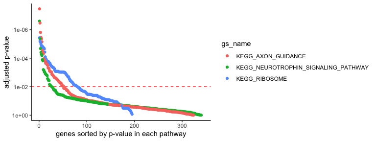
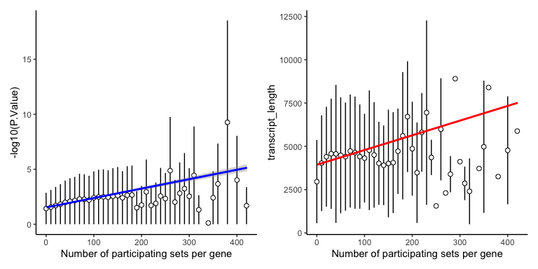
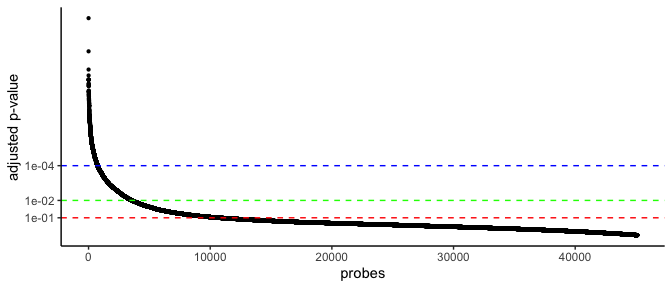

STAT 540 - Seminar 7: Gene Set Enrichment Analysis
==================================================

Learning Objectives
-------------------

1.  Testing the over-representation of gene sets for your list of top
    significant genes

2.  Score-based Gene Set Enrichment Analysis based on your list of
    gene-level scores

Outline:

-   [Recap: Differential Expression
    analysis](#recap-Differential-Expression-Analysis)

-   [Part 1: When we know how to draw lines between the significant and
    the
    insignificant](#part-1-gene-set-analysis-testing-over-representation)

-   [Part 2: When we want to use gene-level scores to rank the
    importance](#part-2-score-based-gene-set-enrichment-analysis)

-   [deliverable](#deliverable)

Recap Differential Expression Analysis
======================================

Run Differential Expression Gene analysis
-----------------------------------------

Let’s use the same data used in
[`seminar-05`](https://github.com/STAT540-UBC/seminar-05/blob/main/sm5_differential_expression_analysis.md).
You can repeat the same code of `seminar-05`, but we copied that for
completeness (only in `Rmd`).

As a result, we have:

    head(DEG.stat.dt)

    ##    dev_stageE16 dev_stageP10 dev_stageP2 dev_stageP6  AveExpr        F
    ## 1:    -3.961300   -3.0413588  -3.5622994 -3.76595110 6.528244 498.7106
    ## 2:    -3.444810   -3.1864997  -3.1650116 -3.31764169 5.853610 277.7777
    ## 3:    -5.113539   -4.7804105  -4.9552037 -4.63356418 9.382327 200.3950
    ## 4:    -5.533556   -3.9843389  -4.6514613 -4.73368077 7.028447 176.8973
    ## 5:    -6.186842   -4.1710853  -4.8842390 -4.99687261 8.318210 159.0014
    ## 6:     3.660868    0.1145409   0.7496469  0.04310452 7.278059 154.0316
    ##         P.Value    adj.P.Val        probe
    ## 1: 7.137780e-18 3.219210e-13   1440645_at
    ## 2: 1.159691e-15 2.615162e-11   1451507_at
    ## 3: 1.944860e-14 2.923838e-10   1416041_at
    ## 4: 5.678876e-14 6.403074e-10 1425222_x_at
    ## 5: 1.415802e-13 1.123672e-09   1451635_at
    ## 6: 1.857330e-13 1.123672e-09 1422929_s_at

We want to convert the probe names to gene symbols/ENSEMBL IDs (and human orthologs, too)
-----------------------------------------------------------------------------------------

Sometimes, the authors forget to attach feature annotation information;
then, you must manually map these to gene symbols or ENSEMBL IDs
commonly used in pathway annotation databases. We will use `biomaRt`
package to construct this map.

    probe.info.file <- "mouse_human_map.rds"
    run.if.needed(probe.info.file, {

        ## Will use biomaRt that can access ENSEMBL database
        ## and make query to retrive what you need
        if (!require("BiocManager", quietly = TRUE)){
            install.packages("BiocManager")
        }
        if(!require(biomaRt)) BiocManager::install("biomaRt")

        ## Loading biomaRt library can mess up dplyr namespace
        ## not sure about the current version of R and the package
        ## 0. Make an access point to mouse and human databases
        mouse.db <- biomaRt::useMart("ensembl", dataset = "mmusculus_gene_ensembl")
        human.db <- biomaRt::useMart("ensembl", dataset = "hsapiens_gene_ensembl")

        ## 1. Link mouse and human databases
        ## This may take sometime depending on your internet speed
        mouse.human.map <-
            biomaRt::getLDS(
                         attributes = c("affy_mouse430_2","mgi_symbol"),
                         filters = "affy_mouse430_2",
                         values = unique(DEG.stat.dt$`probe`),
                         mart = mouse.db,
                         attributesL = c("hgnc_symbol","ensembl_gene_id"),
                         martL = human.db,
                         uniqueRows = TRUE,
                         bmHeader=FALSE) %>%
            as.data.table() %>%
            unique()

        ## 2. Take some attributes for human genes
        ## Read some human gene-specific information
        ## This will also take a while...
        human.prop <- biomaRt::getBM(attributes = c("ensembl_gene_id",
                                                    "chromosome_name",
                                                    "transcription_start_site",
                                                    "transcript_length"),
                                     filters = "ensembl_gene_id",
                                     values = unique(mouse.human.map$`ensembl_gene_id`),
                                     mart = human.db,
                                     bmHeader=FALSE,
                                     useCache=FALSE) %>%
            as.data.table() %>%
            unique()

        ## 3. Match them up
        .map <- mouse.human.map %>%
            left_join(human.prop) %>%
            as.data.table() %>%
            unique()

        unloadNamespace("biomaRt")       # messy namespace
        unloadNamespace("AnnotationDbi") # this, too
        saveRDS(.map, probe.info.file)
    })

    probe.info.map <-
        readRDS(probe.info.file) %>%          # read RDS
        rename(probe = affy_mouse430_2) %>%   # Change the var. name
        rename(chr = chromosome_name) %>%     # shorten the chr name
        rename(gene_symbol = hgnc_symbol) %>% # Will use human gene symbol
        as.data.table()

    ## multiple transcripts can exist; let's take the longest one
    probe.info.map <-
        probe.info.map[order(probe.info.map$transcript_length, decreasing = TRUE),
                       head(.SD, 1),
                       by = .(probe, gene_symbol, chr)]

Match the probe names with the mouse and human gene symbols

    DEG.stat.dt %>%
        left_join(probe.info.map) %>%
        select(probe, gene_symbol, P.Value, adj.P.Val) %>%
        na.omit() %>%
        head(10) %>%
        mutate(P.Value = num.sci(P.Value)) %>%
        mutate(adj.P.Val = num.sci(adj.P.Val)) %>%
        knitr::kable()

<table>
<thead>
<tr class="header">
<th style="text-align: left;">probe</th>
<th style="text-align: left;">gene_symbol</th>
<th style="text-align: left;">P.Value</th>
<th style="text-align: left;">adj.P.Val</th>
</tr>
</thead>
<tbody>
<tr class="odd">
<td style="text-align: left;">1451507_at</td>
<td style="text-align: left;">MEF2C</td>
<td style="text-align: left;">1.2e-15</td>
<td style="text-align: left;">2.6e-11</td>
</tr>
<tr class="even">
<td style="text-align: left;">1416041_at</td>
<td style="text-align: left;">SGK1</td>
<td style="text-align: left;">1.9e-14</td>
<td style="text-align: left;">2.9e-10</td>
</tr>
<tr class="odd">
<td style="text-align: left;">1425222_x_at</td>
<td style="text-align: left;">SLC22A9</td>
<td style="text-align: left;">5.7e-14</td>
<td style="text-align: left;">6.4e-10</td>
</tr>
<tr class="even">
<td style="text-align: left;">1451635_at</td>
<td style="text-align: left;">SLC22A9</td>
<td style="text-align: left;">1.4e-13</td>
<td style="text-align: left;">1.1e-09</td>
</tr>
<tr class="odd">
<td style="text-align: left;">1422929_s_at</td>
<td style="text-align: left;">ATOH7</td>
<td style="text-align: left;">1.9e-13</td>
<td style="text-align: left;">1.1e-09</td>
</tr>
<tr class="even">
<td style="text-align: left;">1429028_at</td>
<td style="text-align: left;">DOCK11</td>
<td style="text-align: left;">2.0e-13</td>
<td style="text-align: left;">1.1e-09</td>
</tr>
<tr class="odd">
<td style="text-align: left;">1424852_at</td>
<td style="text-align: left;">MEF2C</td>
<td style="text-align: left;">2.5e-13</td>
<td style="text-align: left;">1.1e-09</td>
</tr>
<tr class="even">
<td style="text-align: left;">1425171_at</td>
<td style="text-align: left;">RHO</td>
<td style="text-align: left;">4.5e-13</td>
<td style="text-align: left;">1.9e-09</td>
</tr>
<tr class="odd">
<td style="text-align: left;">1451617_at</td>
<td style="text-align: left;">RHO</td>
<td style="text-align: left;">5.3e-13</td>
<td style="text-align: left;">2.0e-09</td>
</tr>
<tr class="even">
<td style="text-align: left;">1451618_at</td>
<td style="text-align: left;">RHO</td>
<td style="text-align: left;">6.2e-13</td>
<td style="text-align: left;">2.1e-09</td>
</tr>
</tbody>
</table>

-   Why human gene names for the mouse study?

-   Why do the same Affymetrix probe correspond to multiple human genes?

How/where to obtain biologically meaningful gene sets
=====================================================

Here, we will use the MSigDB database and GWAS catalogue, but there are
many ways you can obtain gene sets. Traditionally, Gene Ontology (GO)
terms have been used as a go-to database for gene sets. However, the
enrichment of GO terms might be slightly different from what we want to
achieve in a set-based analysis. Unlike pathway annotations and GWAS
catalogue, GO terms have hierarchical relationships (or directed acyclic
graph) with one another, which we would need to consider in calibrating
the null distribution.

Molecular Signature Database
----------------------------

[MSigDB](http://www.gsea-msigdb.org/gsea/msigdb/) provides a
comprehensive list of gene sets and pathways manually curated by experts
or derived from previous experimental results, including GO terms. We do
not need to download them one by one since someone made a convenient
package to retrieve a current version of MSigDB into R. You can download
the raw text files from the website, too.

**Note**: We will interchangeably use a pathway and a gene set since we
do not deal with gene-gene interactions within a pathway.

    if(!require(msigdbr)) install.packages("msigdbr")

There are many species:

    knitr::kable(msigdbr::msigdbr_species())

<table>
<colgroup>
<col style="width: 33%" />
<col style="width: 66%" />
</colgroup>
<thead>
<tr class="header">
<th style="text-align: left;">species_name</th>
<th style="text-align: left;">species_common_name</th>
</tr>
</thead>
<tbody>
<tr class="odd">
<td style="text-align: left;">Anolis carolinensis</td>
<td style="text-align: left;">Carolina anole, green anole</td>
</tr>
<tr class="even">
<td style="text-align: left;">Bos taurus</td>
<td style="text-align: left;">bovine, cattle, cow, dairy cow, domestic cattle, domestic cow</td>
</tr>
<tr class="odd">
<td style="text-align: left;">Caenorhabditis elegans</td>
<td style="text-align: left;">roundworm</td>
</tr>
<tr class="even">
<td style="text-align: left;">Canis lupus familiaris</td>
<td style="text-align: left;">dog, dogs</td>
</tr>
<tr class="odd">
<td style="text-align: left;">Danio rerio</td>
<td style="text-align: left;">leopard danio, zebra danio, zebra fish, zebrafish</td>
</tr>
<tr class="even">
<td style="text-align: left;">Drosophila melanogaster</td>
<td style="text-align: left;">fruit fly</td>
</tr>
<tr class="odd">
<td style="text-align: left;">Equus caballus</td>
<td style="text-align: left;">domestic horse, equine, horse</td>
</tr>
<tr class="even">
<td style="text-align: left;">Felis catus</td>
<td style="text-align: left;">cat, cats, domestic cat</td>
</tr>
<tr class="odd">
<td style="text-align: left;">Gallus gallus</td>
<td style="text-align: left;">bantam, chicken, chickens, Gallus domesticus</td>
</tr>
<tr class="even">
<td style="text-align: left;">Homo sapiens</td>
<td style="text-align: left;">human</td>
</tr>
<tr class="odd">
<td style="text-align: left;">Macaca mulatta</td>
<td style="text-align: left;">rhesus macaque, rhesus macaques, Rhesus monkey, rhesus monkeys</td>
</tr>
<tr class="even">
<td style="text-align: left;">Monodelphis domestica</td>
<td style="text-align: left;">gray short-tailed opossum</td>
</tr>
<tr class="odd">
<td style="text-align: left;">Mus musculus</td>
<td style="text-align: left;">house mouse, mouse</td>
</tr>
<tr class="even">
<td style="text-align: left;">Ornithorhynchus anatinus</td>
<td style="text-align: left;">duck-billed platypus, duckbill platypus, platypus</td>
</tr>
<tr class="odd">
<td style="text-align: left;">Pan troglodytes</td>
<td style="text-align: left;">chimpanzee</td>
</tr>
<tr class="even">
<td style="text-align: left;">Rattus norvegicus</td>
<td style="text-align: left;">brown rat, Norway rat, rat, rats</td>
</tr>
<tr class="odd">
<td style="text-align: left;">Saccharomyces cerevisiae</td>
<td style="text-align: left;">baker’s yeast, brewer’s yeast, S. cerevisiae</td>
</tr>
<tr class="even">
<td style="text-align: left;">Schizosaccharomyces pombe 972h-</td>
<td style="text-align: left;">NA</td>
</tr>
<tr class="odd">
<td style="text-align: left;">Sus scrofa</td>
<td style="text-align: left;">pig, pigs, swine, wild boar</td>
</tr>
<tr class="even">
<td style="text-align: left;">Xenopus tropicalis</td>
<td style="text-align: left;">tropical clawed frog, western clawed frog</td>
</tr>
</tbody>
</table>

There are many collections available:

    knitr::kable(msigdbr::msigdbr_collections())

<table>
<thead>
<tr class="header">
<th style="text-align: left;">gs_cat</th>
<th style="text-align: left;">gs_subcat</th>
<th style="text-align: right;">num_genesets</th>
</tr>
</thead>
<tbody>
<tr class="odd">
<td style="text-align: left;">C1</td>
<td style="text-align: left;"></td>
<td style="text-align: right;">278</td>
</tr>
<tr class="even">
<td style="text-align: left;">C2</td>
<td style="text-align: left;">CGP</td>
<td style="text-align: right;">3368</td>
</tr>
<tr class="odd">
<td style="text-align: left;">C2</td>
<td style="text-align: left;">CP</td>
<td style="text-align: right;">29</td>
</tr>
<tr class="even">
<td style="text-align: left;">C2</td>
<td style="text-align: left;">CP:BIOCARTA</td>
<td style="text-align: right;">292</td>
</tr>
<tr class="odd">
<td style="text-align: left;">C2</td>
<td style="text-align: left;">CP:KEGG</td>
<td style="text-align: right;">186</td>
</tr>
<tr class="even">
<td style="text-align: left;">C2</td>
<td style="text-align: left;">CP:PID</td>
<td style="text-align: right;">196</td>
</tr>
<tr class="odd">
<td style="text-align: left;">C2</td>
<td style="text-align: left;">CP:REACTOME</td>
<td style="text-align: right;">1604</td>
</tr>
<tr class="even">
<td style="text-align: left;">C2</td>
<td style="text-align: left;">CP:WIKIPATHWAYS</td>
<td style="text-align: right;">615</td>
</tr>
<tr class="odd">
<td style="text-align: left;">C3</td>
<td style="text-align: left;">MIR:MIR_Legacy</td>
<td style="text-align: right;">221</td>
</tr>
<tr class="even">
<td style="text-align: left;">C3</td>
<td style="text-align: left;">MIR:MIRDB</td>
<td style="text-align: right;">2377</td>
</tr>
<tr class="odd">
<td style="text-align: left;">C3</td>
<td style="text-align: left;">TFT:GTRD</td>
<td style="text-align: right;">523</td>
</tr>
<tr class="even">
<td style="text-align: left;">C3</td>
<td style="text-align: left;">TFT:TFT_Legacy</td>
<td style="text-align: right;">610</td>
</tr>
<tr class="odd">
<td style="text-align: left;">C4</td>
<td style="text-align: left;">CGN</td>
<td style="text-align: right;">427</td>
</tr>
<tr class="even">
<td style="text-align: left;">C4</td>
<td style="text-align: left;">CM</td>
<td style="text-align: right;">431</td>
</tr>
<tr class="odd">
<td style="text-align: left;">C5</td>
<td style="text-align: left;"><a href="GO:BP" class="uri">GO:BP</a></td>
<td style="text-align: right;">7481</td>
</tr>
<tr class="even">
<td style="text-align: left;">C5</td>
<td style="text-align: left;"><a href="GO:CC" class="uri">GO:CC</a></td>
<td style="text-align: right;">996</td>
</tr>
<tr class="odd">
<td style="text-align: left;">C5</td>
<td style="text-align: left;"><a href="GO:MF" class="uri">GO:MF</a></td>
<td style="text-align: right;">1708</td>
</tr>
<tr class="even">
<td style="text-align: left;">C5</td>
<td style="text-align: left;">HPO</td>
<td style="text-align: right;">4813</td>
</tr>
<tr class="odd">
<td style="text-align: left;">C6</td>
<td style="text-align: left;"></td>
<td style="text-align: right;">189</td>
</tr>
<tr class="even">
<td style="text-align: left;">C7</td>
<td style="text-align: left;">IMMUNESIGDB</td>
<td style="text-align: right;">4872</td>
</tr>
<tr class="odd">
<td style="text-align: left;">C7</td>
<td style="text-align: left;">VAX</td>
<td style="text-align: right;">347</td>
</tr>
<tr class="even">
<td style="text-align: left;">C8</td>
<td style="text-align: left;"></td>
<td style="text-align: right;">671</td>
</tr>
<tr class="odd">
<td style="text-align: left;">H</td>
<td style="text-align: left;"></td>
<td style="text-align: right;">50</td>
</tr>
</tbody>
</table>

We will focus on the KEGG pathways named by human gene symbols:

    KEGG.human.db <- msigdbr::msigdbr(species = "human",
                                      category = "C2",
                                      subcategory = "CP:KEGG")

GWAS catalog
------------

We can download public data mapping SNPs (genes) to diseases/phenotypes
from [the NHGRI-EBI GWAS Catalog](https://www.ebi.ac.uk/gwas/). The GWAS
catalogue file is already processed and stored in this repository for
your convenience, but you’re welcome to try out the code.

    ## It make take some time
    gwas.file <- "gwas_catalog_v1.0-associations_e105_r2022-02-02.tsv.gz"

    run.if.needed(gwas.file, {
        url <- "https://www.ebi.ac.uk/gwas/api/search/downloads/full"
        .file <- str_remove(gwas.file, ".gz$")
        download.file(url, destfile = .file)
        gzip(.file)
        unlink(.file)
    })

    ## make it tidy by taking only what we need
    gwas.tidy.file <- "gwas_catalog_tidy.tsv.gz"

    run.if.needed(gwas.tidy.file, {

        .dt <-
            fread(gwas.file, sep="\t", quote="") %>%
            select(`MAPPED_GENE`, `DISEASE/TRAIT`, `PVALUE_MLOG`)

        ## remove redundant associations
        .dt <- .dt[order(.dt$PVALUE_MLOG, decreasing = TRUE),
                   head(.SD, 1),
                   by = .(`MAPPED_GENE`, `DISEASE/TRAIT`)]

        ## remove traits with too few associations
        .count <- .dt[, .(.N), by = .(`DISEASE/TRAIT`)]
        .dt <- left_join(.count[`N` >= 100, ], .dt)[nchar(`MAPPED_GENE`)> 0,]

        ## simply split gene lists and unlist
        .dt <- .dt[,
                   .(gene_symbol = unlist(strsplit(`MAPPED_GENE`, split="[ ,.-]+"))),
                   by = .(`DISEASE/TRAIT`, PVALUE_MLOG)]
        .dt[, p.value := 10^(-PVALUE_MLOG)]

        fwrite(.dt, file=gwas.tidy.file)
    })

    gwas.db <- fread(gwas.tidy.file)
    gwas.db[, gs_name := `DISEASE/TRAIT`]

-   *Note*: `fread`, `strsplit`, and `by=.()` operations are usually
    much faster than the `tidyverse` counterparts–`read_tsv`,
    `separate`, and `group_by()`. The GWAS catalogue is pretty big; the
    number of rows after pruning can increase to 229,459 gene-level
    associations.

For instance, we can take GWAS genes associated with Alzheimer’s
disease-related disorders:

    gwas.db[str_detect(`DISEASE/TRAIT`, "[Aa]lzheimer") & !is.na(gene_symbol)] %>%
        head() %>%
        mutate(p.value = num.sci(p.value)) %>%
        select(`gs_name`, `gene_symbol`, `p.value`, `PVALUE_MLOG`) %>%
        knitr::kable()

<table>
<thead>
<tr class="header">
<th style="text-align: left;">gs_name</th>
<th style="text-align: left;">gene_symbol</th>
<th style="text-align: left;">p.value</th>
<th style="text-align: right;">PVALUE_MLOG</th>
</tr>
</thead>
<tbody>
<tr class="odd">
<td style="text-align: left;">Alzheimer’s disease</td>
<td style="text-align: left;">APOE</td>
<td style="text-align: left;">2e-303</td>
<td style="text-align: right;">302.6990</td>
</tr>
<tr class="even">
<td style="text-align: left;">Alzheimer’s disease</td>
<td style="text-align: left;">TOMM40</td>
<td style="text-align: left;">1e-295</td>
<td style="text-align: right;">295.0000</td>
</tr>
<tr class="odd">
<td style="text-align: left;">Alzheimer’s disease</td>
<td style="text-align: left;">APOC1</td>
<td style="text-align: left;">8e-149</td>
<td style="text-align: right;">148.0969</td>
</tr>
<tr class="even">
<td style="text-align: left;">Alzheimer’s disease</td>
<td style="text-align: left;">APOC1P1</td>
<td style="text-align: left;">8e-149</td>
<td style="text-align: right;">148.0969</td>
</tr>
<tr class="odd">
<td style="text-align: left;">Alzheimer’s disease</td>
<td style="text-align: left;">APOE</td>
<td style="text-align: left;">1e-62</td>
<td style="text-align: right;">62.0000</td>
</tr>
<tr class="even">
<td style="text-align: left;">Alzheimer’s disease</td>
<td style="text-align: left;">APOC1</td>
<td style="text-align: left;">1e-62</td>
<td style="text-align: right;">62.0000</td>
</tr>
</tbody>
</table>

-   *Note*: `PVALUE_MLOG`: -log10(p-value).

Part 1 Gene set analysis testing over-representation
====================================================

### Hypergeometric test assumes a theoretical null distribution

#### What are the over-represented KEGG pathways?

How do they look like? For instance, let’s take a look at some pathways
(`gs_name`).

    .gs <- c("KEGG_NEUROTROPHIN_SIGNALING_PATHWAY",
             "KEGG_AXON_GUIDANCE",
             "KEGG_RIBOSOME")

    CUTOFF <- 1e-2 # q-value cutoff

    .dt <-
        KEGG.human.db %>%
        filter(`gs_name` %in% .gs) %>%
        left_join(probe.info.map) %>%
        left_join(DEG.stat.dt) %>%    
        group_by(gs_name) %>%          # for each gene set
        arrange(adj.P.Val) %>%         # sort genes by p-value
        mutate(g = 1:n()) %>%          # add gene order index
        ungroup()

    ggplot(.dt, aes(g, -log10(adj.P.Val), colour=`gs_name`)) +
        geom_hline(yintercept = -log10(CUTOFF), colour = "red", lty = 2) +
        geom_point() + xlab("genes sorted by p-value in each pathway") +
        scale_y_continuous("adjusted p-value",
                           labels = function(x) num.sci(10^(-x)))

-   Which one is significant?

#### Remember that we learned in the class about the hypergeometric test!

What are the counts? Let’s match gene counts with the black/white ball
analogy used in `R`’s `phyper` manual page.

-   `q`: the number of genes in the pathway (**white** balls)
    overlapping with the genes in the DEG list (balls **drawn**)
-   `m`: the number of genes in this pathay (**white** balls)
-   `n`: the number of genes not in this pathway (**black** balls)
-   `k`: the number of genes in the DEG list (balls **drawn**)

Under the null hypothesis:

*H*0: *q* ≤ *q*⋆

We may observe overlap *q*⋆ genes by random sampling of *k*
genes **without** replacement.

Therefore, we can calculate the p-value:

$P(q &gt; q^{\\star}|n, m, k) = 1 - \\sum\_{q = 0}^{q^{\\star}} {m \\choose q } {n \\choose k-q} / {n+m \\choose k}$

In `R`’s `phyper`, it’s as simple as:

    phyper(q, m, n, k, lower.tail = FALSE)

#### Let’s test all the genes and pathways more systematically

    #' @param gene.dt gene-level statitsics with `gene_symbol` and `adj.P.Val`
    #' @param geneset.dt gene set membership with `gene_symbol` and `gs_name`
    run.hyper.test <- function(gene.dt, geneset.dt, cutoff = CUTOFF) {

        .genes <- unique(gene.dt[, .(gene_symbol, adj.P.Val)]) %>%
            na.omit()
        .sets <- as.data.table(geneset.dt)
        .sets <- .sets[gene_symbol %in% .genes$gene_symbol,
                       .(gene_symbol, gs_name)]

        .dt <- left_join(.sets, .genes, by = "gene_symbol") %>% 
            as.data.table()

        ## Total number of genes
        ntot <- length(unique(.dt$gene_symbol))
        ## Total number of significant DEGs
        nsig <- nrow(unique(.dt[adj.P.Val < cutoff, .(gene_symbol)]))
        ## Gene set size
        gs.size <- .dt[,
                       .(m = length(unique(gene_symbol))),
                       by = .(gs_name)]
        ## Gene set overlap size
        overlap.size <- .dt[adj.P.Val < cutoff,
                            .(q = length(unique(gene_symbol))),
                            by = .(gs_name)]

        left_join(gs.size, overlap.size, by = "gs_name") %>%
            mutate(`q` = if_else(is.na(`q`), 0, as.numeric(`q`))) %>% 
            mutate(n = `ntot` - `m`) %>%
            mutate(k = `nsig`) %>%
            mutate(p.val = phyper(`q`, `m`, `n`, `k`, lower.tail=FALSE)) %>%
            arrange(p.val) %>%
            as.data.table
    }

    deg.dt <- DEG.stat.dt[, .(probe, adj.P.Val)] %>% 
        left_join(probe.info.map, by = "probe") %>%
        as.data.table()

#### KEGG pathway enrichment

    hyper.kegg.dt <- run.hyper.test(deg.dt,
                                    KEGG.human.db,
                                    cutoff=1e-2)

<table>
<thead>
<tr class="header">
<th style="text-align: left;">gs_name</th>
<th style="text-align: right;">m</th>
<th style="text-align: right;">q</th>
<th style="text-align: right;">n</th>
<th style="text-align: right;">k</th>
<th style="text-align: right;">p.val</th>
</tr>
</thead>
<tbody>
<tr class="odd">
<td style="text-align: left;">KEGG_RIBOSOME</td>
<td style="text-align: right;">66</td>
<td style="text-align: right;">40</td>
<td style="text-align: right;">4401</td>
<td style="text-align: right;">685</td>
<td style="text-align: right;">0.0000000</td>
</tr>
<tr class="even">
<td style="text-align: left;">KEGG_PROGESTERONE_MEDIATED_OOCYTE_MATURATION</td>
<td style="text-align: right;">83</td>
<td style="text-align: right;">29</td>
<td style="text-align: right;">4384</td>
<td style="text-align: right;">685</td>
<td style="text-align: right;">0.0000021</td>
</tr>
<tr class="odd">
<td style="text-align: left;">KEGG_CELL_CYCLE</td>
<td style="text-align: right;">122</td>
<td style="text-align: right;">36</td>
<td style="text-align: right;">4345</td>
<td style="text-align: right;">685</td>
<td style="text-align: right;">0.0000167</td>
</tr>
<tr class="even">
<td style="text-align: left;">KEGG_AXON_GUIDANCE</td>
<td style="text-align: right;">128</td>
<td style="text-align: right;">36</td>
<td style="text-align: right;">4339</td>
<td style="text-align: right;">685</td>
<td style="text-align: right;">0.0000538</td>
</tr>
<tr class="odd">
<td style="text-align: left;">KEGG_DNA_REPLICATION</td>
<td style="text-align: right;">34</td>
<td style="text-align: right;">14</td>
<td style="text-align: right;">4433</td>
<td style="text-align: right;">685</td>
<td style="text-align: right;">0.0000560</td>
</tr>
<tr class="even">
<td style="text-align: left;">KEGG_CYSTEINE_AND_METHIONINE_METABOLISM</td>
<td style="text-align: right;">32</td>
<td style="text-align: right;">13</td>
<td style="text-align: right;">4435</td>
<td style="text-align: right;">685</td>
<td style="text-align: right;">0.0001110</td>
</tr>
<tr class="odd">
<td style="text-align: left;">KEGG_STEROID_BIOSYNTHESIS</td>
<td style="text-align: right;">17</td>
<td style="text-align: right;">8</td>
<td style="text-align: right;">4450</td>
<td style="text-align: right;">685</td>
<td style="text-align: right;">0.0003392</td>
</tr>
<tr class="even">
<td style="text-align: left;">KEGG_OOCYTE_MEIOSIS</td>
<td style="text-align: right;">108</td>
<td style="text-align: right;">28</td>
<td style="text-align: right;">4359</td>
<td style="text-align: right;">685</td>
<td style="text-align: right;">0.0012769</td>
</tr>
<tr class="odd">
<td style="text-align: left;">KEGG_NON_SMALL_CELL_LUNG_CANCER</td>
<td style="text-align: right;">53</td>
<td style="text-align: right;">15</td>
<td style="text-align: right;">4414</td>
<td style="text-align: right;">685</td>
<td style="text-align: right;">0.0044710</td>
</tr>
<tr class="even">
<td style="text-align: left;">KEGG_GAP_JUNCTION</td>
<td style="text-align: right;">82</td>
<td style="text-align: right;">21</td>
<td style="text-align: right;">4385</td>
<td style="text-align: right;">685</td>
<td style="text-align: right;">0.0048022</td>
</tr>
</tbody>
</table>

#### GWAS catalogue enrichment

    hyper.gwas.dt <- run.hyper.test(deg.dt,
                                    gwas.db,
                                    cutoff=1e-2)

<table>
<thead>
<tr class="header">
<th style="text-align: left;">gs_name</th>
<th style="text-align: right;">m</th>
<th style="text-align: right;">q</th>
<th style="text-align: right;">n</th>
<th style="text-align: right;">k</th>
<th style="text-align: right;">p.val</th>
</tr>
</thead>
<tbody>
<tr class="odd">
<td style="text-align: left;">Cortical surface area</td>
<td style="text-align: right;">699</td>
<td style="text-align: right;">157</td>
<td style="text-align: right;">12267</td>
<td style="text-align: right;">1969</td>
<td style="text-align: right;">1.0e-07</td>
</tr>
<tr class="even">
<td style="text-align: left;">PR interval</td>
<td style="text-align: right;">220</td>
<td style="text-align: right;">61</td>
<td style="text-align: right;">12746</td>
<td style="text-align: right;">1969</td>
<td style="text-align: right;">5.0e-07</td>
</tr>
<tr class="odd">
<td style="text-align: left;">Highest math class taken (MTAG)</td>
<td style="text-align: right;">738</td>
<td style="text-align: right;">159</td>
<td style="text-align: right;">12228</td>
<td style="text-align: right;">1969</td>
<td style="text-align: right;">8.0e-07</td>
</tr>
<tr class="even">
<td style="text-align: left;">Gamma glutamyl transpeptidase</td>
<td style="text-align: right;">341</td>
<td style="text-align: right;">84</td>
<td style="text-align: right;">12625</td>
<td style="text-align: right;">1969</td>
<td style="text-align: right;">1.4e-06</td>
</tr>
<tr class="odd">
<td style="text-align: left;">Hemoglobin A1c levels</td>
<td style="text-align: right;">372</td>
<td style="text-align: right;">90</td>
<td style="text-align: right;">12594</td>
<td style="text-align: right;">1969</td>
<td style="text-align: right;">1.4e-06</td>
</tr>
<tr class="even">
<td style="text-align: left;">Schizophrenia</td>
<td style="text-align: right;">677</td>
<td style="text-align: right;">146</td>
<td style="text-align: right;">12289</td>
<td style="text-align: right;">1969</td>
<td style="text-align: right;">2.2e-06</td>
</tr>
<tr class="odd">
<td style="text-align: left;">Cortical thickness</td>
<td style="text-align: right;">519</td>
<td style="text-align: right;">117</td>
<td style="text-align: right;">12447</td>
<td style="text-align: right;">1969</td>
<td style="text-align: right;">2.3e-06</td>
</tr>
<tr class="even">
<td style="text-align: left;">Systolic blood pressure</td>
<td style="text-align: right;">1168</td>
<td style="text-align: right;">231</td>
<td style="text-align: right;">11798</td>
<td style="text-align: right;">1969</td>
<td style="text-align: right;">3.7e-06</td>
</tr>
<tr class="odd">
<td style="text-align: left;">Metabolite levels</td>
<td style="text-align: right;">1135</td>
<td style="text-align: right;">225</td>
<td style="text-align: right;">11831</td>
<td style="text-align: right;">1969</td>
<td style="text-align: right;">4.2e-06</td>
</tr>
<tr class="even">
<td style="text-align: left;">Educational attainment (MTAG)</td>
<td style="text-align: right;">900</td>
<td style="text-align: right;">183</td>
<td style="text-align: right;">12066</td>
<td style="text-align: right;">1969</td>
<td style="text-align: right;">6.9e-06</td>
</tr>
</tbody>
</table>

For the DEGs associated with neurodevelopmental stages, many of them
make sense! What are your interpretations? But, let’s take further
precautions.

### Gene set analysis based on empirical null distribution

#### Why do we need another GSA method?

Remember the null data generating process of the hypergeometric
distribution: a uniform sampling of balls in urns without replacement.
Well, the “without replacement” part makes sense because we don’t draw a
DEG more than once in our analysis. However, the “uniform sampling” part
may not hold in practice considering that some balls can be bigger than
the other. Those bigger balls can be coloured differently.

In the gene set terminology, we need to ask the following questions:

-   Are all the genes equally distributed in the gene sets?

-   Did our DEG analysis tend to hit genes and pathways “uniformly?”

Let’s use all the canonical pathways in the MSig database to demonstrate
a potential bias.

    C2.human.db <- msigdbr::msigdbr(species = "human", category = "C2")

Mesh up with our DEG list:

    gene.level.stat <-
        DEG.stat.dt %>% 
        left_join(probe.info.map, by = "probe") %>%
        left_join(C2.human.db, by = "gene_symbol") %>%
        select(gene_symbol, gs_name, P.Value, transcript_length) %>% 
        filter(!is.na(gene_symbol)) %>% 
        as.data.table() %>%
        (function(.dt){
            .dt[, .(transcript_length = max(transcript_length),
                    P.Value = min(P.Value),
                    num.gs = length(unique(gs_name))),
                by = .(gene_symbol)]
        })

Let’s visualize them in regular intervals.

    gene.level.stat[, num.gs.tick := round(num.gs/10)*10]

    .dt <- gene.level.stat[,
                           .(mean.length = mean(transcript_length),
                             sd.length = sd(transcript_length),
                             mean.pval = mean(-log10(P.Value)),
                             sd.pval = mean(-log10(P.Value))),
                           by = .(num.gs.tick)]

What do you think?

    .aes <- aes(num.gs.tick, mean.pval,
                ymin=pmax(mean.pval - sd.pval, 0),
                ymax=mean.pval + sd.pval)

    p1 <-
        ggplot(gene.level.stat, aes(num.gs, -log10(P.Value))) +
        geom_linerange(.aes, data = .dt, size=.5) +
        geom_point(.aes, data=.dt, pch=21, fill = "white", size = 2) +
        geom_smooth(method="lm", colour="blue") +
        xlab("Number of participating sets per gene")

    .aes <- aes(num.gs.tick, mean.length,
                ymin=pmax(mean.length - sd.length, 0),
                ymax=mean.length + sd.length)

    p2 <-
        ggplot(gene.level.stat, aes(num.gs, transcript_length)) +
        geom_linerange(.aes, data = .dt, size=.5) +
        geom_point(.aes, data=.dt, pch=21, fill = "white", size = 2) +
        geom_smooth(se=FALSE, method="lm", colour="red") +
        xlab("Number of participating sets per gene")

    p1 | p2

Anecdotally, long genes tend to participate in multiple functions as a
result of an evolutionary process. They can be more recent, a
constituent of multiple gene duplicates relating to the brain or
mammalian-specific functions, such as neurons and energy consumption.

[Gene Size Matters: An Analysis of Gene Length in the Human
Genome](https://www.frontiersin.org/articles/10.3389/fgene.2021.559998/full)

### We can handle such a gene-level bias by calibrating a better null model before enrichment analysis

We will use
[`goseq`](https://bioconductor.org/packages/release/bioc/html/goseq.html)
method–[Gene ontology analysis for RNA-seq: accounting for selection
bias](https://genomebiology.biomedcentral.com/articles/10.1186/gb-2010-11-2-r14).
Even though the method was initially developed for GO term enrichment
analysis, it can handle any other types of gene sets.

#### Install `goseq` package to ease your job.

    if (!require("BiocManager", quietly = TRUE)) install.packages("BiocManager")
    if (!require(goseq)) BiocManager::install("goseq")

*Remark on a technical issue*: You may not be able to install everything
from the scratch depending on your machine/platform. If you’re using
`Ubuntu/Debian` Linux, you might want to install some dependent `R`
packages via `apt-get`:

    sudo apt install r-bioc-rsamtools
    sudo apt intall r-cran-biasedurn

### Run `goseq` analysis to take into account gene-level biases

Prepare our DEG list for the `goseq` analysis

    deg.vec <- DEG.stat.dt %>%
        left_join(probe.info.map) %>%
        filter(!is.na(ensembl_gene_id)) %>% 
        arrange(P.Value) %>% 
        as.data.table %>% 
        (function(.dt) { .dt[, head(.SD,1), by = .(ensembl_gene_id)] }) %>% 
        mutate(v = as.integer(adj.P.Val < CUTOFF)) %>%
        (function(.dt) { v <- .dt$v; names(v) <- .dt$ensembl_gene_id; v })

It will look like this:

    head(deg.vec)

    ## ENSG00000081189 ENSG00000118515 ENSG00000149742 ENSG00000179774 ENSG00000147251 
    ##               1               1               1               1               1 
    ## ENSG00000163914 
    ##               1

or this:

    tail(deg.vec)

    ## ENSG00000186143 ENSG00000119411 ENSG00000162227 ENSG00000100918 ENSG00000039650 
    ##               0               0               0               0               0 
    ## ENSG00000065491 
    ##               0

The `goseq` method addresses a potential gene-level bias by estimating
gene-level weights (a null distribution of gene lengths) in our DEG
study. The following is an excerpt from the `goseq` vignette:

> “We first need to obtain a weighting for each gene, depending on its
> length, given by the PWF. As you may have noticed when running
> supportedGenomes or supportedGeneIDs, length data is available in the
> local database for our gene ID, “ensGene” and our genome, “hg19”. We
> will let goseq automatically fetch this data from its databases."

    pwf <- goseq::nullp(deg.vec,"hg19","ensGene")

Using this null PWF object, we can simply run tests for all the GO
terms. As the name suggests, we do not need to prepare anything else for
GO enrichment analysis.

    goseq.results.file <- "goseq_results.RDS"
    run.if.needed(goseq.results.file, {
        goseq.results <- goseq::goseq(pwf,"hg19","ensGene")
        saveRDS(goseq.results, goseq.results.file)
    })
    goseq.results <- readRDS(goseq.results.file)

What do you think?

    head(goseq.results, 10) %>%
        mutate(over_represented_pvalue = num.sci(over_represented_pvalue)) %>% 
        knitr::kable()

<table>
<colgroup>
<col style="width: 3%" />
<col style="width: 7%" />
<col style="width: 15%" />
<col style="width: 16%" />
<col style="width: 7%" />
<col style="width: 5%" />
<col style="width: 38%" />
<col style="width: 5%" />
</colgroup>
<thead>
<tr class="header">
<th style="text-align: left;"></th>
<th style="text-align: left;">category</th>
<th style="text-align: left;">over_represented_pvalue</th>
<th style="text-align: right;">under_represented_pvalue</th>
<th style="text-align: right;">numDEInCat</th>
<th style="text-align: right;">numInCat</th>
<th style="text-align: left;">term</th>
<th style="text-align: left;">ontology</th>
</tr>
</thead>
<tbody>
<tr class="odd">
<td style="text-align: left;">3318</td>
<td style="text-align: left;"><a href="GO:0006614" class="uri">GO:0006614</a></td>
<td style="text-align: left;">6.2e-17</td>
<td style="text-align: right;">1</td>
<td style="text-align: right;">40</td>
<td style="text-align: right;">76</td>
<td style="text-align: left;">SRP-dependent cotranslational protein targeting to membrane</td>
<td style="text-align: left;">BP</td>
</tr>
<tr class="even">
<td style="text-align: left;">7125</td>
<td style="text-align: left;"><a href="GO:0022626" class="uri">GO:0022626</a></td>
<td style="text-align: left;">6.6e-17</td>
<td style="text-align: right;">1</td>
<td style="text-align: right;">43</td>
<td style="text-align: right;">85</td>
<td style="text-align: left;">cytosolic ribosome</td>
<td style="text-align: left;">CC</td>
</tr>
<tr class="odd">
<td style="text-align: left;">3317</td>
<td style="text-align: left;"><a href="GO:0006613" class="uri">GO:0006613</a></td>
<td style="text-align: left;">1.4e-16</td>
<td style="text-align: right;">1</td>
<td style="text-align: right;">41</td>
<td style="text-align: right;">80</td>
<td style="text-align: left;">cotranslational protein targeting to membrane</td>
<td style="text-align: left;">BP</td>
</tr>
<tr class="even">
<td style="text-align: left;">3769</td>
<td style="text-align: left;"><a href="GO:0007399" class="uri">GO:0007399</a></td>
<td style="text-align: left;">3.5e-16</td>
<td style="text-align: right;">1</td>
<td style="text-align: right;">478</td>
<td style="text-align: right;">2265</td>
<td style="text-align: left;">nervous system development</td>
<td style="text-align: left;">BP</td>
</tr>
<tr class="odd">
<td style="text-align: left;">7283</td>
<td style="text-align: left;"><a href="GO:0030182" class="uri">GO:0030182</a></td>
<td style="text-align: left;">6.4e-16</td>
<td style="text-align: right;">1</td>
<td style="text-align: right;">308</td>
<td style="text-align: right;">1310</td>
<td style="text-align: left;">neuron differentiation</td>
<td style="text-align: left;">BP</td>
</tr>
<tr class="even">
<td style="text-align: left;">13327</td>
<td style="text-align: left;"><a href="GO:0048666" class="uri">GO:0048666</a></td>
<td style="text-align: left;">2.2e-15</td>
<td style="text-align: right;">1</td>
<td style="text-align: right;">261</td>
<td style="text-align: right;">1067</td>
<td style="text-align: left;">neuron development</td>
<td style="text-align: left;">BP</td>
</tr>
<tr class="odd">
<td style="text-align: left;">13356</td>
<td style="text-align: left;"><a href="GO:0048699" class="uri">GO:0048699</a></td>
<td style="text-align: left;">6.3e-15</td>
<td style="text-align: right;">1</td>
<td style="text-align: right;">331</td>
<td style="text-align: right;">1460</td>
<td style="text-align: left;">generation of neurons</td>
<td style="text-align: left;">BP</td>
</tr>
<tr class="even">
<td style="text-align: left;">11947</td>
<td style="text-align: left;"><a href="GO:0045047" class="uri">GO:0045047</a></td>
<td style="text-align: left;">1.3e-14</td>
<td style="text-align: right;">1</td>
<td style="text-align: right;">41</td>
<td style="text-align: right;">88</td>
<td style="text-align: left;">protein targeting to ER</td>
<td style="text-align: left;">BP</td>
</tr>
<tr class="odd">
<td style="text-align: left;">7081</td>
<td style="text-align: left;"><a href="GO:0022008" class="uri">GO:0022008</a></td>
<td style="text-align: left;">3.8e-14</td>
<td style="text-align: right;">1</td>
<td style="text-align: right;">344</td>
<td style="text-align: right;">1553</td>
<td style="text-align: left;">neurogenesis</td>
<td style="text-align: left;">BP</td>
</tr>
<tr class="even">
<td style="text-align: left;">137</td>
<td style="text-align: left;"><a href="GO:0000278" class="uri">GO:0000278</a></td>
<td style="text-align: left;">9.5e-14</td>
<td style="text-align: right;">1</td>
<td style="text-align: right;">221</td>
<td style="text-align: right;">944</td>
<td style="text-align: left;">mitotic cell cycle</td>
<td style="text-align: left;">BP</td>
</tr>
</tbody>
</table>

How about other custom gene sets, e.g., KEGG pathways or all the
canonical pathways? Let’s take a look at the following excerpt in the
manual page.

    Usage:

         goseq(pwf, genome, id, gene2cat = NULL,  
                 test.cats=c("GO:CC", "GO:BP", "GO:MF"), 
                 method = "Wallenius", repcnt = 2000, use_genes_without_cat=FALSE)

    Arguments:

         pwf: An object containing gene names, DE calls, the probability
              weighting function. Usually generated by nullp.

      genome: A string identifying the genome that ‘genes’ refer to.  For a
              list of supported organisms run supportedGenomes.

          id: A string identifying the gene identifier used by ‘genes’.
              For a list of supported gene IDs run supportedGeneIDs.

    gene2cat: A data frame with two columns containing the mapping between
              genes and the categories of interest.

We can build a custom `gene2cat` `data.frame`.

    canonical.gene2cat <- C2.human.db %>%
        dplyr::select(ensembl_gene, gs_name) %>%
        distinct() %>%
        as.data.frame()

    canonical.goseq.results.file <- "goseq_canonical_results.RDS"
    run.if.needed(canonical.goseq.results.file, {
        .results <- goseq::goseq(pwf, "hg19", gene2cat = canonical.gene2cat)
        saveRDS(.results, canonical.goseq.results.file)
    })
    canonical.goseq.results <- readRDS(canonical.goseq.results.file)

    head(canonical.goseq.results, 10) %>%
        mutate(over_represented_pvalue = num.sci(over_represented_pvalue)) %>% 
        knitr::kable()

<table>
<colgroup>
<col style="width: 4%" />
<col style="width: 38%" />
<col style="width: 20%" />
<col style="width: 20%" />
<col style="width: 9%" />
<col style="width: 7%" />
</colgroup>
<thead>
<tr class="header">
<th style="text-align: left;"></th>
<th style="text-align: left;">category</th>
<th style="text-align: left;">over_represented_pvalue</th>
<th style="text-align: right;">under_represented_pvalue</th>
<th style="text-align: right;">numDEInCat</th>
<th style="text-align: right;">numInCat</th>
</tr>
</thead>
<tbody>
<tr class="odd">
<td style="text-align: left;">1255</td>
<td style="text-align: left;">GOBERT_OLIGODENDROCYTE_DIFFERENTIATION_UP</td>
<td style="text-align: left;">7.1e-29</td>
<td style="text-align: right;">1</td>
<td style="text-align: right;">184</td>
<td style="text-align: right;">559</td>
</tr>
<tr class="even">
<td style="text-align: left;">1254</td>
<td style="text-align: left;">GOBERT_OLIGODENDROCYTE_DIFFERENTIATION_DN</td>
<td style="text-align: left;">9.6e-24</td>
<td style="text-align: right;">1</td>
<td style="text-align: right;">283</td>
<td style="text-align: right;">1051</td>
</tr>
<tr class="odd">
<td style="text-align: left;">2025</td>
<td style="text-align: left;">LE_EGR2_TARGETS_UP</td>
<td style="text-align: left;">1.3e-23</td>
<td style="text-align: right;">1</td>
<td style="text-align: right;">60</td>
<td style="text-align: right;">107</td>
</tr>
<tr class="even">
<td style="text-align: left;">1478</td>
<td style="text-align: left;">HORIUCHI_WTAP_TARGETS_DN</td>
<td style="text-align: left;">9.3e-22</td>
<td style="text-align: right;">1</td>
<td style="text-align: right;">110</td>
<td style="text-align: right;">300</td>
</tr>
<tr class="odd">
<td style="text-align: left;">3507</td>
<td style="text-align: left;">REACTOME_EUKARYOTIC_TRANSLATION_ELONGATION</td>
<td style="text-align: left;">9.6e-22</td>
<td style="text-align: right;">1</td>
<td style="text-align: right;">43</td>
<td style="text-align: right;">71</td>
</tr>
<tr class="even">
<td style="text-align: left;">771</td>
<td style="text-align: left;">CHIANG_LIVER_CANCER_SUBCLASS_PROLIFERATION_UP</td>
<td style="text-align: left;">2.0e-21</td>
<td style="text-align: right;">1</td>
<td style="text-align: right;">76</td>
<td style="text-align: right;">169</td>
</tr>
<tr class="odd">
<td style="text-align: left;">1092</td>
<td style="text-align: left;">FLORIO_NEOCORTEX_BASAL_RADIAL_GLIA_DN</td>
<td style="text-align: left;">1.3e-20</td>
<td style="text-align: right;">1</td>
<td style="text-align: right;">79</td>
<td style="text-align: right;">180</td>
</tr>
<tr class="even">
<td style="text-align: left;">1831</td>
<td style="text-align: left;">KEGG_RIBOSOME</td>
<td style="text-align: left;">2.1e-20</td>
<td style="text-align: right;">1</td>
<td style="text-align: right;">40</td>
<td style="text-align: right;">66</td>
</tr>
<tr class="odd">
<td style="text-align: left;">1055</td>
<td style="text-align: left;">FEVR_CTNNB1_TARGETS_DN</td>
<td style="text-align: left;">3.8e-20</td>
<td style="text-align: right;">1</td>
<td style="text-align: right;">161</td>
<td style="text-align: right;">541</td>
</tr>
<tr class="even">
<td style="text-align: left;">136</td>
<td style="text-align: left;">BENPORATH_CYCLING_GENES</td>
<td style="text-align: left;">4.8e-20</td>
<td style="text-align: right;">1</td>
<td style="text-align: right;">175</td>
<td style="text-align: right;">613</td>
</tr>
</tbody>
</table>

Part 2 Score-based Gene Set Enrichment Analysis
===============================================

Let’s take back. What is the premise of (discrete) gene set analysis? In
our DEG analysis, we discovered 3578 probes/genes (of a total of 45101
probes) significantly perturbed over the course of developmental
process. It can be tricky to determine when to draw the line between the
significant and the insignificant genes.

    ggplot(DEG.stat.dt, aes(1:nrow(DEG.stat.dt), -log10(adj.P.Val))) +
        geom_point(stroke=0) +
        xlab("probes") +
        geom_hline(yintercept = 1, lty = 2, colour="red") +
        geom_hline(yintercept = 2, lty = 2, colour="green") +
        geom_hline(yintercept = 4, lty = 2, colour="blue") +
        scale_y_continuous("adjusted p-value",
                           breaks = c(1, 2, 4),
                           labels=function(x) num.sci(10^(-x)))

Step 0. Install “fast” Gene Set Enrichment Analysis
---------------------------------------------------

The original Gene Set Enrichment Analysis method is not so scalable and
gunky in permutation steps. To calibrate low P-values, e.g., 1e-6, you
would literally need to sample a million permutations for all the gene
sets (with some exaggeration). The authors of `fgsea` come up with smart
computation tricks and approximate p-value calculation quite accurately.
You can check out this preprint:
<https://www.biorxiv.org/content/10.1101/060012v3>

#### Option 1. `Bioconductor` package manager

    if (!require("BiocManager", quietly = TRUE))
        install.packages("BiocManager")

    BiocManager::install("fgsea")

#### Option 2. Compile source codes in the `GitHub` repository

<https://github.com/ctlab/fgsea>

    remotes::install_github("ctlab/fgsea")

*Remark on a technical issue*: You need `C++` compiler installed in your
machine if you want to use this package with best performance.

Step 1. Prepare your gene sets to feed them in to `fgsea` arguments
-------------------------------------------------------------------

`fgsea` takes a list of lists of genes. We can construct them by looping
through gene sets, i.e., `for`, but that’s not `R`’s way and would be
pretty slow. Here is a helper function to do that for us.

    make.gs.lol <- function(.dt) {
        .dt <- as.data.table(.dt) %>% unique()
        .list <-
            .dt[, .(gene = .(gene_symbol)), by = .(gs_name)] %>%
            as.list()
        .names <- .list$gs_name
        .ret <- .list$gene
        names(.ret) <- .names
        return(.ret)
    }

For instance, we can convert KEGG pathway `tibble` in this way:

    KEGG.lol <- KEGG.human.db %>% select(gene_symbol, gs_name) %>% make.gs.lol()

In case you were wondering about the shape, it looks like this:

    KEGG.lol[1:2]

    ## $KEGG_ABC_TRANSPORTERS
    ##  [1] "ABCA1"  "ABCA10" "ABCA12" "ABCA13" "ABCA2"  "ABCA3"  "ABCA4"  "ABCA5" 
    ##  [9] "ABCA6"  "ABCA7"  "ABCA8"  "ABCA9"  "ABCB1"  "ABCB10" "ABCB11" "ABCB4" 
    ## [17] "ABCB5"  "ABCB6"  "ABCB7"  "ABCB8"  "ABCB9"  "ABCC1"  "ABCC10" "ABCC11"
    ## [25] "ABCC12" "ABCC2"  "ABCC3"  "ABCC4"  "ABCC5"  "ABCC6"  "ABCC8"  "ABCC9" 
    ## [33] "ABCD1"  "ABCD2"  "ABCD3"  "ABCD4"  "ABCG1"  "ABCG2"  "ABCG4"  "ABCG5" 
    ## [41] "ABCG8"  "CFTR"   "TAP1"   "TAP2"  
    ## 
    ## $KEGG_ACUTE_MYELOID_LEUKEMIA
    ##  [1] "AKT1"     "AKT2"     "AKT3"     "ARAF"     "BAD"      "BRAF"    
    ##  [7] "CCNA1"    "CCND1"    "CEBPA"    "CHUK"     "EIF4EBP1" "FLT3"    
    ## [13] "GRB2"     "HRAS"     "IKBKB"    "IKBKG"    "JUP"      "KIT"     
    ## [19] "KRAS"     "LEF1"     "MAP2K1"   "MAP2K2"   "MAPK1"    "MAPK3"   
    ## [25] "MTOR"     "MYC"      "NFKB1"    "NRAS"     "PIK3CA"   "PIK3CB"  
    ## [31] "PIK3CD"   "PIK3CG"   "PIK3R1"   "PIK3R2"   "PIK3R3"   "PIK3R5"  
    ## [37] "PIM1"     "PIM2"     "PML"      "PPARD"    "RAF1"     "RARA"    
    ## [43] "RELA"     "RPS6KB1"  "RPS6KB2"  "RUNX1"    "RUNX1T1"  "SOS1"    
    ## [49] "SOS2"     "SPI1"     "STAT3"    "STAT5A"   "STAT5B"   "TCF7"    
    ## [55] "TCF7L1"   "TCF7L2"   "ZBTB16"

We will also need a named vector of gene-level scores. Here, we use
`-log10(adj.P.Val)` as our gene-level score:

    deg.scores <- DEG.stat.dt %>%
        left_join(probe.info.map) %>%
        filter(!is.na(ensembl_gene_id)) %>% 
        arrange(P.Value) %>% 
        as.data.table %>% 
        (function(.dt) { .dt[, head(.SD,1), by = .(gene_symbol)] }) %>%
        mutate(v = -log10(adj.P.Val)) %>% 
        (function(.dt) { v <- .dt$v; names(v) <- .dt$gene_symbol; v })

Step 2. Run `fgsea` and interpreter the results
-----------------------------------------------

Now we have all the ingredients.

    kegg.fgsea <- fgsea::fgsea(pathways = KEGG.lol, stats = deg.scores, scoreType = "pos")

Show top 3 genes for each pathway:

    kegg.fgsea[,
               topGenes := paste0(head(unlist(`leadingEdge`), 3), collapse=", "),
               by = .(pathway)]

Do we see the same results?

    kegg.fgsea %>%
        arrange(pval) %>%
        head(10) %>% 
        select(-leadingEdge) %>% 
        knitr::kable()

<table style="width:100%;">
<colgroup>
<col style="width: 37%" />
<col style="width: 8%" />
<col style="width: 8%" />
<col style="width: 8%" />
<col style="width: 8%" />
<col style="width: 7%" />
<col style="width: 4%" />
<col style="width: 18%" />
</colgroup>
<thead>
<tr class="header">
<th style="text-align: left;">pathway</th>
<th style="text-align: right;">pval</th>
<th style="text-align: right;">padj</th>
<th style="text-align: right;">log2err</th>
<th style="text-align: right;">ES</th>
<th style="text-align: right;">NES</th>
<th style="text-align: right;">size</th>
<th style="text-align: left;">topGenes</th>
</tr>
</thead>
<tbody>
<tr class="odd">
<td style="text-align: left;">KEGG_RIBOSOME</td>
<td style="text-align: right;">0.0000000</td>
<td style="text-align: right;">0.0000000</td>
<td style="text-align: right;">0.8266573</td>
<td style="text-align: right;">0.6856763</td>
<td style="text-align: right;">1.955695</td>
<td style="text-align: right;">66</td>
<td style="text-align: left;">RPL31, RPL23A, RPL15</td>
</tr>
<tr class="even">
<td style="text-align: left;">KEGG_PROGESTERONE_MEDIATED_OOCYTE_MATURATION</td>
<td style="text-align: right;">0.0001576</td>
<td style="text-align: right;">0.0117376</td>
<td style="text-align: right;">0.5188481</td>
<td style="text-align: right;">0.5345082</td>
<td style="text-align: right;">1.544711</td>
<td style="text-align: right;">83</td>
<td style="text-align: left;">KRAS, CCNB1, PIK3R1</td>
</tr>
<tr class="odd">
<td style="text-align: left;">KEGG_CELL_CYCLE</td>
<td style="text-align: right;">0.0001893</td>
<td style="text-align: right;">0.0117376</td>
<td style="text-align: right;">0.5188481</td>
<td style="text-align: right;">0.5048543</td>
<td style="text-align: right;">1.492740</td>
<td style="text-align: right;">122</td>
<td style="text-align: left;">CCND1, CDKN1C, MCM6</td>
</tr>
<tr class="even">
<td style="text-align: left;">KEGG_DNA_REPLICATION</td>
<td style="text-align: right;">0.0003714</td>
<td style="text-align: right;">0.0166097</td>
<td style="text-align: right;">0.4984931</td>
<td style="text-align: right;">0.6193616</td>
<td style="text-align: right;">1.695204</td>
<td style="text-align: right;">34</td>
<td style="text-align: left;">MCM6, MCM7, MCM2</td>
</tr>
<tr class="odd">
<td style="text-align: left;">KEGG_AXON_GUIDANCE</td>
<td style="text-align: right;">0.0005358</td>
<td style="text-align: right;">0.0166097</td>
<td style="text-align: right;">0.4772708</td>
<td style="text-align: right;">0.4792875</td>
<td style="text-align: right;">1.417986</td>
<td style="text-align: right;">128</td>
<td style="text-align: left;">ABLIM1, NCK2, ROBO2</td>
</tr>
<tr class="even">
<td style="text-align: left;">KEGG_CYSTEINE_AND_METHIONINE_METABOLISM</td>
<td style="text-align: right;">0.0005358</td>
<td style="text-align: right;">0.0166097</td>
<td style="text-align: right;">0.4772708</td>
<td style="text-align: right;">0.6236481</td>
<td style="text-align: right;">1.699308</td>
<td style="text-align: right;">32</td>
<td style="text-align: left;">CDO1, AMD1, DNMT3B</td>
</tr>
<tr class="odd">
<td style="text-align: left;">KEGG_STEROID_BIOSYNTHESIS</td>
<td style="text-align: right;">0.0016475</td>
<td style="text-align: right;">0.0437772</td>
<td style="text-align: right;">0.4550599</td>
<td style="text-align: right;">0.6874421</td>
<td style="text-align: right;">1.749421</td>
<td style="text-align: right;">17</td>
<td style="text-align: left;">CYP51A1, MSMO1, SQLE</td>
</tr>
<tr class="even">
<td style="text-align: left;">KEGG_GAP_JUNCTION</td>
<td style="text-align: right;">0.0027934</td>
<td style="text-align: right;">0.0622790</td>
<td style="text-align: right;">0.4317077</td>
<td style="text-align: right;">0.4922953</td>
<td style="text-align: right;">1.422260</td>
<td style="text-align: right;">82</td>
<td style="text-align: left;">TUBB2B, KRAS, PRKCA</td>
</tr>
<tr class="odd">
<td style="text-align: left;">KEGG_GALACTOSE_METABOLISM</td>
<td style="text-align: right;">0.0032003</td>
<td style="text-align: right;">0.0622790</td>
<td style="text-align: right;">0.4317077</td>
<td style="text-align: right;">0.6098009</td>
<td style="text-align: right;">1.607919</td>
<td style="text-align: right;">25</td>
<td style="text-align: left;">HK2, B4GALT2, B4GALT1</td>
</tr>
<tr class="even">
<td style="text-align: left;">KEGG_FRUCTOSE_AND_MANNOSE_METABOLISM</td>
<td style="text-align: right;">0.0033483</td>
<td style="text-align: right;">0.0622790</td>
<td style="text-align: right;">0.4317077</td>
<td style="text-align: right;">0.5769388</td>
<td style="text-align: right;">1.579092</td>
<td style="text-align: right;">34</td>
<td style="text-align: left;">HK2, PFKFB2, ALDOC</td>
</tr>
</tbody>
</table>

We can do the same thing for the GWAS catalogue.

    gwas.lol <- gwas.db %>% select(gene_symbol, gs_name) %>% make.gs.lol()
    gwas.fgsea <- fgsea::fgsea(pathways = gwas.lol, stats = deg.scores, scoreType = "pos")

    gwas.fgsea[,
               topGenes := paste0(head(unlist(`leadingEdge`), 3), collapse=", "),
               by = .(pathway)]

    gwas.fgsea %>%
        arrange(pval) %>%
        head(10) %>% 
        select(-leadingEdge) %>% 
        knitr::kable()

<table>
<colgroup>
<col style="width: 37%" />
<col style="width: 6%" />
<col style="width: 7%" />
<col style="width: 8%" />
<col style="width: 8%" />
<col style="width: 7%" />
<col style="width: 4%" />
<col style="width: 19%" />
</colgroup>
<thead>
<tr class="header">
<th style="text-align: left;">pathway</th>
<th style="text-align: right;">pval</th>
<th style="text-align: right;">padj</th>
<th style="text-align: right;">log2err</th>
<th style="text-align: right;">ES</th>
<th style="text-align: right;">NES</th>
<th style="text-align: right;">size</th>
<th style="text-align: left;">topGenes</th>
</tr>
</thead>
<tbody>
<tr class="odd">
<td style="text-align: left;">Protein quantitative trait loci (liver)</td>
<td style="text-align: right;">0.0e+00</td>
<td style="text-align: right;">3.00e-07</td>
<td style="text-align: right;">0.8012156</td>
<td style="text-align: right;">0.4132858</td>
<td style="text-align: right;">1.303968</td>
<td style="text-align: right;">1217</td>
<td style="text-align: left;">SGK1, KLHL1, INHBB</td>
</tr>
<tr class="even">
<td style="text-align: left;">Cortical surface area</td>
<td style="text-align: right;">0.0e+00</td>
<td style="text-align: right;">9.00e-07</td>
<td style="text-align: right;">0.7614608</td>
<td style="text-align: right;">0.4355612</td>
<td style="text-align: right;">1.361633</td>
<td style="text-align: right;">699</td>
<td style="text-align: left;">MEF2C, SOX11, WWC1</td>
</tr>
<tr class="odd">
<td style="text-align: left;">Metabolite levels</td>
<td style="text-align: right;">0.0e+00</td>
<td style="text-align: right;">1.30e-06</td>
<td style="text-align: right;">0.7477397</td>
<td style="text-align: right;">0.4095140</td>
<td style="text-align: right;">1.290547</td>
<td style="text-align: right;">1135</td>
<td style="text-align: left;">SGK1, ATOH7, C14orf132</td>
</tr>
<tr class="even">
<td style="text-align: left;">Schizophrenia</td>
<td style="text-align: right;">0.0e+00</td>
<td style="text-align: right;">1.40e-06</td>
<td style="text-align: right;">0.7337620</td>
<td style="text-align: right;">0.4341164</td>
<td style="text-align: right;">1.356828</td>
<td style="text-align: right;">677</td>
<td style="text-align: left;">MEF2C, TMTC1, LIMA1</td>
</tr>
<tr class="odd">
<td style="text-align: left;">Highest math class taken (MTAG)</td>
<td style="text-align: right;">0.0e+00</td>
<td style="text-align: right;">2.90e-06</td>
<td style="text-align: right;">0.7195128</td>
<td style="text-align: right;">0.4244059</td>
<td style="text-align: right;">1.328177</td>
<td style="text-align: right;">738</td>
<td style="text-align: left;">MEF2C, SALL3, INHBB</td>
</tr>
<tr class="even">
<td style="text-align: left;">PR interval</td>
<td style="text-align: right;">1.0e-07</td>
<td style="text-align: right;">7.60e-06</td>
<td style="text-align: right;">0.6901325</td>
<td style="text-align: right;">0.5005374</td>
<td style="text-align: right;">1.521248</td>
<td style="text-align: right;">220</td>
<td style="text-align: left;">BCL6, SYNE3, EPAS1</td>
</tr>
<tr class="odd">
<td style="text-align: left;">Educational attainment (MTAG)</td>
<td style="text-align: right;">4.0e-07</td>
<td style="text-align: right;">1.61e-05</td>
<td style="text-align: right;">0.6749629</td>
<td style="text-align: right;">0.4094558</td>
<td style="text-align: right;">1.286353</td>
<td style="text-align: right;">900</td>
<td style="text-align: left;">MEF2C, OSBPL3, SLC17A1</td>
</tr>
<tr class="even">
<td style="text-align: left;">Systolic blood pressure</td>
<td style="text-align: right;">7.0e-07</td>
<td style="text-align: right;">2.63e-05</td>
<td style="text-align: right;">0.6594444</td>
<td style="text-align: right;">0.3962629</td>
<td style="text-align: right;">1.249196</td>
<td style="text-align: right;">1168</td>
<td style="text-align: left;">PFKFB2, LIMA1, AHRR</td>
</tr>
<tr class="odd">
<td style="text-align: left;">Educational attainment (years of education)</td>
<td style="text-align: right;">1.0e-06</td>
<td style="text-align: right;">3.58e-05</td>
<td style="text-align: right;">0.6435518</td>
<td style="text-align: right;">0.4040904</td>
<td style="text-align: right;">1.271836</td>
<td style="text-align: right;">968</td>
<td style="text-align: left;">MEF2C, SLC17A1, KCNJ3</td>
</tr>
<tr class="even">
<td style="text-align: left;">Self-reported math ability (MTAG)</td>
<td style="text-align: right;">1.7e-06</td>
<td style="text-align: right;">5.30e-05</td>
<td style="text-align: right;">0.6435518</td>
<td style="text-align: right;">0.4309756</td>
<td style="text-align: right;">1.340259</td>
<td style="text-align: right;">518</td>
<td style="text-align: left;">MEF2C, INHBB, GALNT13</td>
</tr>
</tbody>
</table>

Deliverable
===========

Deliverable \#1 (1pt)
---------------------

Run the discrete version of gene set analysis for the genes
significantly associated with the interaction effect in
[`seminar-05`](https://github.com/STAT540-UBC/seminar-05/blob/e042df71546221beb96ae44dbf252568c7797a93/sm5_differential_expression_analysis.Rmd#L706).
Show your results as top KEGG pathways and GWAS disease/traits.

-   (0.5 pt) Run hypergeometric tests.

<!-- -->

    ## your code here

-   (0.5 pt) Run `goseq` analysis.

<!-- -->

    ## your code here

Deliverable \#2 (1pt)
---------------------

-   Run `fgsea` or
    [`GSEABase`](https://bioconductor.org/packages/release/bioc/html/GSEABase.html)
    for the same DEGs testing the interaction effect (0.5 pt).

<!-- -->

    ## your code here

-   **Discussion**: Can we handle gene-level bias in `fgsea` or other
    GSEA methods? Justify your answer and suggest possible
    improvement/correction ideas (0.5 pt).
