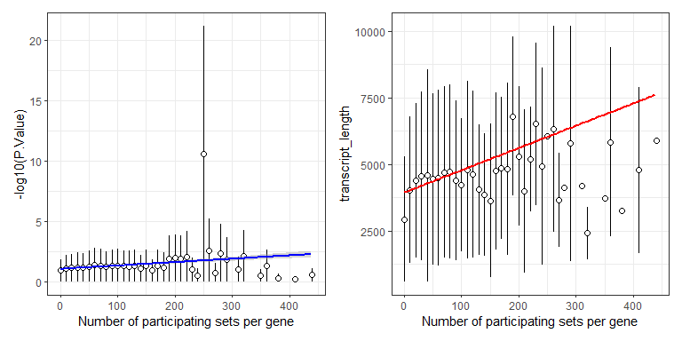
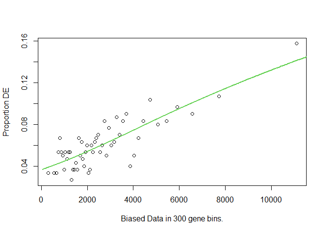

STAT 540 - Seminar 8: Gene Set Enrichment Analysis
================
Last update: 25 February, 2024

## Attributions

This seminar was developed by Yongjin Park and modified by Keegan
Korthauer

## Learning Objectives

1.  Testing the over-representation of gene sets for your list of top
    significant genes: `goseq`

2.  Rank-based Gene Set Enrichment Analysis based on your list of
    gene-level scores: `fgsea`

## Packages required

Please make sure you are able to load the following libraries before
starting the seminar

``` r
library(tidyverse)         # our good friend
library(patchwork)
library(data.table)        # very handy with large tables
library(R.utils)           # need this to handle gzipped data

# Please make sure you have biomaRt installed but don't load it yet
# biomaRt creates namespace conflicts with dplyr. So we just want load 
# it when required
# library(biomaRt)           # annotate gene information 

# The following libraries can be installed using Bioconductor:
library(msigdbr)           # curated source of gene sets and functions
library(goseq)             # tool for GO term enrichment analysis 
library(fgsea)             # tool for gene set enrichment analysis 

## `goseq` and `fgseq` can be installed by bioconductor package manager:
## if (!require("BiocManager", quietly = TRUE))
##     install.packages("BiocManager")
## BiocManager::install("goseq")
## BiocManager::install("fgsea")

theme_set(theme_bw()) # classic theme ggplot
```

*Remark on a technical issue (Ubuntu/Debian Linux only)*: You may not be
able to install everything from the scratch depending on your
machine/platform. If you’re using `Ubuntu/Debian` Linux, you might want
to install some dependent `R` packages via `apt-get`:

``` sh
# for example, to install R package "BiasedUrn" from cran
sudo apt install r-cran-biasedurn

# for example, to install R package "geneLenDataBase" from Bioconductor
sudo apt install r-bioc-genelendatabase
```

*Remark on a technical issue*: You need `C++` compiler installed in your
machine if you want to use `fgsea` with best performance.

Outline:

- [Recap: Differential Expression
  analysis](#recap-Differential-Expression-Analysis)

- [Part 1: When we want to draw lines between the significant and the
  insignificant](#part-1-gene-set-analysis-testing-over-representation)

- [Part 2: When we want to use gene-level scores to rank all
  genes](#part-2-rank-based-gene-set-enrichment-analysis)

- [Exercises](#deliverables)

# Recap Differential Expression Analysis

## Run Differential Expression Gene analysis

Let’s use the same data used in
[`seminar-05`](https://github.com/STAT540-UBC/seminar-05/blob/main/sm5_differential_expression_analysis.md).
This code is just repeating some code from `seminar-05` for convenience,
where we’ll fit the model with additive factors for genotype and
developmental stage. We’ll pull out the test for every gene for the
genotype (NrlKO vs WT) coefficient which we’ll use to illustrate several
gene set analyses throughout the seminar. We’ll also save the results of
testing for any effect of developmental stage in the same model, and
save the results (to be loaded for the deliverable).

``` r
deg.genotype.file <- "data/DEG_genotype.rds"
deg.stage.file <- "data/DEG_stage.rds"

run.if.needed(deg.genotype.file, {
    eset.file <- "data/GSE4051.rds"
    run.if.needed(eset.file,{
        eset <- GEOquery::getGEO("GSE4051", getGPL = FALSE)[[1]]
        saveRDS(eset, file=eset.file)
    })
    eset <- readRDS(eset.file)
                                       
    meta.data <-
        Biobase::pData(eset) %>%
        mutate(sample_id = geo_accession) %>%
        mutate(dev_stage =  case_when(
                   grepl("E16", title) ~ "E16",
                   grepl("P2", title) ~ "P02",
                   grepl("P6", title) ~ "P06",
                   grepl("P10", title) ~ "P10",
                   grepl("4 weeks", title) ~ "P28"
               )) %>%
        mutate(genotype = case_when(
                   grepl("Nrl-ko", title) ~ "NrlKO",
                   grepl("wt", title) ~ "WT"
               )) %>%
        dplyr::select(sample_id, genotype, dev_stage)

    expr.mat <- Biobase::exprs(eset)
    design.mat <- model.matrix( ~ genotype + dev_stage, meta.data)
    DEG.stat.dt <- limma::lmFit(expr.mat, design.mat) %>%
        limma::eBayes() %>%
        limma::topTable(coef = c("dev_stageP02", "dev_stageP06", "dev_stageP10", "dev_stageP28"), number = Inf) %>%
        (function(x) { x %>% mutate(probe = rownames(x)) }) %>%
        as.data.table
    saveRDS(DEG.stat.dt, deg.stage.file)
    
    DEG.genotype.stat.dt <- limma::lmFit(expr.mat, design.mat) %>%
        limma::eBayes() %>%
        limma::topTable(coef = "genotypeWT", number = Inf, sort.by = "p") %>%
        (function(x) { x %>% mutate(probe = rownames(x)) }) %>%
        as.data.table
    saveRDS(DEG.genotype.stat.dt , deg.genotype.file)
})
DEG.stat.dt <- readRDS(deg.genotype.file)
```

As a result, we have:

``` r
head(DEG.stat.dt)
```

    ##         logFC  AveExpr         t      P.Value    adj.P.Val        B
    ## 1:  5.2108065 8.733103  21.61189 4.201389e-22 1.894868e-17 37.11469
    ## 2:  3.9872758 9.323796  13.21908 2.524904e-15 5.693784e-11 24.07843
    ## 3:  0.8600933 8.268122  12.68818 8.501048e-15 1.178200e-10 22.98888
    ## 4: -1.0064831 8.260647 -12.59935 1.044943e-14 1.178200e-10 22.80284
    ## 5:  2.0794336 9.495435  12.47262 1.404916e-14 1.267262e-10 22.53556
    ## 6:  1.8772642 9.173111  12.38915 1.709168e-14 1.284753e-10 22.35830
    ##           probe
    ## 1:   1450946_at
    ## 2:   1426288_at
    ## 3:   1442070_at
    ## 4:   1418108_at
    ## 5: 1422679_s_at
    ## 6:   1455140_at

## We want to convert the probe names to gene symbols used in gene set databases

Sometimes, feature annotation information is not included in publicly
available data. In that case, you must manually map these to gene
symbols or ENSEMBL IDs commonly used in pathway annotation databases. We
will use `biomaRt` package to construct this map.

``` r
probe.info.file <- "data/mouse_human_map.rds"
```

Although running `biomaRt` (or a similar kind) is essential in many
researches (especially in cross-species analysis), we will not cover the
details in this seminar. However, you are welcomed to explore the source
code as much as you like
[`here`](https://github.com/STAT540-UBC/seminar-05/blob/main/sm7_gsa_network.Rmd).
We share `.rds` file for a quick data access.

``` r
run.if.needed(probe.info.file, {

    ## Will use biomaRt that can access ENSEMBL database
    ## and make query to retrive what you need
    library(biomaRt)
    ## Loading biomaRt library can mess up dplyr namespace
    ## not sure about the current version of R and the package
    ## 0. Make an access point to mouse and human databases
    human.db <- biomaRt::useMart("ensembl", dataset = "hsapiens_gene_ensembl", 
                                 host = "https://dec2021.archive.ensembl.org/") 
    mouse.db <- biomaRt::useMart("ensembl", dataset = "mmusculus_gene_ensembl", 
                                 host = "https://dec2021.archive.ensembl.org/")
    
    ## 1. Link mouse and human databases
    ## This may take sometime depending on your internet speed
    mouse.human.map <-
        biomaRt::getLDS(
                     attributes = c("affy_mouse430_2","mgi_symbol"),
                     filters = "affy_mouse430_2",
                     values = unique(DEG.stat.dt$`probe`),
                     mart = mouse.db,
                     attributesL = c("hgnc_symbol","ensembl_gene_id"),
                     martL = human.db,
                     uniqueRows = TRUE,
                     bmHeader=FALSE) %>%
        as.data.table() %>%
        unique()

    ## 2. Take some attributes for human genes
    ## Read some human gene-specific information
    ## This will also take a while...
    human.prop <- biomaRt::getBM(attributes = c("ensembl_gene_id",
                                                "chromosome_name",
                                                "transcription_start_site",
                                                "transcript_length"),
                                 filters = "ensembl_gene_id",
                                 values = unique(mouse.human.map$`ensembl_gene_id`),
                                 mart = human.db,
                                 bmHeader=FALSE,
                                 useCache=FALSE) %>%
        as.data.table() %>%
        unique()

    ## 3. Match them up
    .map <- mouse.human.map %>%
        left_join(human.prop) %>%
        as.data.table() %>%
        unique() %>% 
        dplyr::rename(probe = affy_mouse430_2) %>%   # Change the var. name
        dplyr::rename(chr = chromosome_name) %>%     # shorten the chr name
        dplyr::rename(gene_symbol = hgnc_symbol) %>% # Will use human gene symbol
        as.data.table()

    saveRDS(.map, probe.info.file)
})
```

``` r
probe.info.map <- 
    readRDS(probe.info.file)          # read RDS
```

It looks like this:

``` r
probe.info.map %>%
    head() %>%
    knitr::kable()
```

| probe        | mgi_symbol | gene_symbol | ensembl_gene_id | chr        | transcription_start_site | transcript_length |
|:-------------|:-----------|:------------|:----------------|:-----------|-------------------------:|------------------:|
| 1426088_at   | mt-Nd5     | MT-ND5      | ENSG00000198786 | MT         |                    12337 |              1812 |
| 1417629_at   | Prodh      |             | ENSG00000277196 | KI270734.1 |                   161852 |              2405 |
| 1417629_at   | Prodh      |             | ENSG00000277196 | KI270734.1 |                   161750 |              1990 |
| 1452434_s_at | Dgcr6      |             | ENSG00000278817 | KI270734.1 |                   131494 |              1213 |
| 1428753_a_at | Dgcr6      |             | ENSG00000278817 | KI270734.1 |                   131494 |              1213 |
| 1417253_at   | Frg1       |             | ENSG00000273748 | GL000219.1 |                    83311 |               372 |

We could have multiple transcripts within a gene, so let’s take the
longest one:

``` r
n0 <- nrow(probe.info.map) # save how many rows before filtering 
probe.info.map <-
    probe.info.map[order(probe.info.map$transcript_length, decreasing = TRUE),
                   head(.SD, 1),
                   by = .(probe, gene_symbol, chr)]
```

The same map, but a shorter list: 336,181 to 33,950.

``` r
probe.info.map %>%
    head() %>%
    knitr::kable()
```

| probe        | gene_symbol | chr | mgi_symbol | ensembl_gene_id | transcription_start_site | transcript_length |
|:-------------|:------------|:----|:-----------|:----------------|-------------------------:|------------------:|
| 1444083_at   | TTN         | 2   | Ttn        | ENSG00000155657 |                178807423 |            109224 |
| 1427446_s_at | TTN         | 2   | Ttn        | ENSG00000155657 |                178807423 |            109224 |
| 1444638_at   | TTN         | 2   | Ttn        | ENSG00000155657 |                178807423 |            109224 |
| 1427445_a_at | TTN         | 2   | Ttn        | ENSG00000155657 |                178807423 |            109224 |
| 1431928_at   | TTN         | 2   | Ttn        | ENSG00000155657 |                178807423 |            109224 |
| 1443001_at   | TTN         | 2   | Ttn        | ENSG00000155657 |                178807423 |            109224 |

When we match the probe names with the mouse and human gene symbols, we
can directly use this DEG table for downstream enrichment analysis of
gene sets annotated by human gene symbols.

``` r
DEG.stat.dt %>%
    left_join(probe.info.map) %>%
    dplyr::select(probe, gene_symbol, P.Value, adj.P.Val) %>%
    na.omit() %>%
    head(10) %>%
    mutate(P.Value = num.sci(P.Value)) %>%
    mutate(adj.P.Val = num.sci(adj.P.Val)) %>%
    knitr::kable()
```

| probe        | gene_symbol | P.Value | adj.P.Val |
|:-------------|:------------|:--------|:----------|
| 1450946_at   | NRL         | 4.2e-22 | 1.9e-17   |
| 1426288_at   | LRP4        | 2.5e-15 | 5.7e-11   |
| 1418108_at   | RTKN2       | 1.0e-14 | 1.2e-10   |
| 1422679_s_at | CTR9        | 1.4e-14 | 1.3e-10   |
| 1455140_at   | PITPNM3     | 1.7e-14 | 1.3e-10   |
| 1423631_at   | NR2E3       | 3.7e-14 | 2.0e-10   |
| 1428733_at   | GNGT2       | 4.0e-14 | 2.0e-10   |
| 1449526_a_at | GDPD3       | 5.7e-14 | 2.6e-10   |
| 1453299_a_at | PNP         | 5.2e-13 | 2.1e-09   |
| 1419740_at   | PDE6B       | 5.7e-13 | 2.1e-09   |

``` r
# num.sci is a convenient function defined in the seminar's Rmd file to convert long numbers into scientific notation.
```

- **Why human gene names for the mouse study?** We would like to do some
  exploration to link the genes found in this study to human genes that
  have been found to harbour genetic variation that is associated with
  certain phenotypes (including disease) - notably, Genome-wide
  Association studies. Note that gene ontologies and pathways are also
  well-annotated for mouse, so this step is not required (i.e. we could
  instead perform gene set analysis on the mouse genes, and indeed this
  type of analysis is very common).

- **Why do some Affymetrix probes correspond to multiple human genes?**
  The mapping from probe to mouse gene is not necessarily 1:1, and
  neither is the mapping from a mouse gene to a human gene.

# How/where to obtain biologically meaningful gene sets

Here, we will use the Molecular Signature Database (MSigDB) database and
GWAS catalogue, but there are many ways you can obtain gene sets.
Traditionally, Gene Ontology (GO) terms have been used as a go-to
database for gene sets. However, the enrichment of GO terms might be
slightly different from what we want to achieve in a set-based analysis.
Unlike pathway annotations and GWAS catalogue, GO terms have
hierarchical relationships (or directed acyclic graph) with one another,
which we would need to consider in calibrating the null distribution.

## MSigDB: Molecular Signature Database

[MSigDB](http://www.gsea-msigdb.org/gsea/msigdb/) provides a
comprehensive list of gene sets and pathways manually curated by experts
or derived from previous experimental results, including GO terms. We do
not need to download them one by one since someone made a convenient
package to retrieve a current version of MSigDB into R. You can download
the raw text files from the website, too.

**Note**: We will interchangeably use a pathway and a gene set since we
do not deal with gene-gene interactions within a pathway.

There are many species:

``` r
knitr::kable(msigdbr::msigdbr_species())
```

| species_name                    | species_common_name                                                     |
|:--------------------------------|:------------------------------------------------------------------------|
| Anolis carolinensis             | Carolina anole, green anole                                             |
| Bos taurus                      | bovine, cattle, cow, dairy cow, domestic cattle, domestic cow, ox, oxen |
| Caenorhabditis elegans          | NA                                                                      |
| Canis lupus familiaris          | dog, dogs                                                               |
| Danio rerio                     | leopard danio, zebra danio, zebra fish, zebrafish                       |
| Drosophila melanogaster         | fruit fly                                                               |
| Equus caballus                  | domestic horse, equine, horse                                           |
| Felis catus                     | cat, cats, domestic cat                                                 |
| Gallus gallus                   | bantam, chicken, chickens, Gallus domesticus                            |
| Homo sapiens                    | human                                                                   |
| Macaca mulatta                  | rhesus macaque, rhesus macaques, Rhesus monkey, rhesus monkeys          |
| Monodelphis domestica           | gray short-tailed opossum                                               |
| Mus musculus                    | house mouse, mouse                                                      |
| Ornithorhynchus anatinus        | duck-billed platypus, duckbill platypus, platypus                       |
| Pan troglodytes                 | chimpanzee                                                              |
| Rattus norvegicus               | brown rat, Norway rat, rat, rats                                        |
| Saccharomyces cerevisiae        | baker’s yeast, brewer’s yeast, S. cerevisiae                            |
| Schizosaccharomyces pombe 972h- | NA                                                                      |
| Sus scrofa                      | pig, pigs, swine, wild boar                                             |
| Xenopus tropicalis              | tropical clawed frog, western clawed frog                               |

There are many collections available:

``` r
knitr::kable(msigdbr::msigdbr_collections())
```

| gs_cat | gs_subcat       | num_genesets |
|:-------|:----------------|-------------:|
| C1     |                 |          299 |
| C2     | CGP             |         3384 |
| C2     | CP              |           29 |
| C2     | CP:BIOCARTA     |          292 |
| C2     | CP:KEGG         |          186 |
| C2     | CP:PID          |          196 |
| C2     | CP:REACTOME     |         1615 |
| C2     | CP:WIKIPATHWAYS |          664 |
| C3     | MIR:MIRDB       |         2377 |
| C3     | MIR:MIR_Legacy  |          221 |
| C3     | TFT:GTRD        |          518 |
| C3     | TFT:TFT_Legacy  |          610 |
| C4     | CGN             |          427 |
| C4     | CM              |          431 |
| C5     | <GO:BP>         |         7658 |
| C5     | <GO:CC>         |         1006 |
| C5     | <GO:MF>         |         1738 |
| C5     | HPO             |         5071 |
| C6     |                 |          189 |
| C7     | IMMUNESIGDB     |         4872 |
| C7     | VAX             |          347 |
| C8     |                 |          700 |
| H      |                 |           50 |

We will focus on the [Kyoto Encyclopedia of Genes and Genomes
(KEGG)](https://www.genome.jp/kegg/) pathways named by human gene
symbols:

``` r
KEGG.human.db <- msigdbr::msigdbr(species = "human",
                                  category = "C2",
                                  subcategory = "CP:KEGG")
```

## GWAS catalog

We can download public data mapping SNPs to associated
diseases/phenotypes in large human cohort studies from [the NHGRI-EBI
GWAS Catalog](https://www.ebi.ac.uk/gwas/). The GWAS catalog file is
already processed and stored in this repository for your convenience,
but you’re welcome to try out the code below which generates this file.

``` r
gwas.tidy.file <- "data/gwas_catalog_tidy.tsv.gz"

## make it tidy by taking only what we need
run.if.needed(gwas.tidy.file, {

    ## It make take some time
    gwas.file <- "data/gwas_catalog_v1.0-associations_e105_r2022-02-02.tsv.gz"

    run.if.needed(gwas.file, {
        url <- "https://www.ebi.ac.uk/gwas/api/search/downloads/full" 
        .file <- str_remove(gwas.file, ".gz$")
        download.file(url, destfile = .file, timeout = 600) # this step can take several minutes
        gzip(.file)
    })

    .dt <-
        fread(gwas.file, sep="\t", quote="") %>%
        dplyr::select(`MAPPED_GENE`, `DISEASE/TRAIT`, `PVALUE_MLOG`)

    ## remove redundant associations
    .dt <- .dt[order(.dt$PVALUE_MLOG, decreasing = TRUE),
               head(.SD, 1),
               by = .(`MAPPED_GENE`, `DISEASE/TRAIT`)]

    ## remove traits with too few associations
    .count <- .dt[, .(.N), by = .(`DISEASE/TRAIT`)]
    .dt <- left_join(.count[`N` >= 100, ], .dt)[nchar(`MAPPED_GENE`)> 0,]

    ## simply split gene lists and unlist
    .dt <- .dt[,
               .(gene_symbol = unlist(strsplit(`MAPPED_GENE`, split="[ ,.-]+"))),
               by = .(`DISEASE/TRAIT`, PVALUE_MLOG)]
    .dt[, p.value := 10^(-PVALUE_MLOG)]

    fwrite(.dt, file=gwas.tidy.file)
    file.remove(gwas.file) # remove large file
})
```

``` r
gwas.db <- fread(gwas.tidy.file)      # fread to read gzipped txt file
gwas.db[, gs_name := `DISEASE/TRAIT`] # will use gs_name for a gene set name

# The := annotation is specific to data.table, in this case we will create a column called 'gs_name' which will reference to the column "DISEASE/TRAIT"
```

- *Note*: `fread`, `strsplit`, and `by=.()` operations are usually much
  faster than the `tidyverse` counterparts–`read_tsv`, `separate`, and
  `group_by()`. The GWAS catalog is pretty big; the number of rows after
  pruning can increase to 298,633 gene-level associations.

For instance, we can take GWAS genes associated with Alzheimer’s
disease-related disorders:

``` r
gwas.db[str_detect(`DISEASE/TRAIT`, "[Aa]lzheimer") & !is.na(gene_symbol)] %>%
    head() %>%
    mutate(p.value = num.sci(p.value)) %>%
    dplyr::select(`gs_name`, `gene_symbol`, `p.value`, `PVALUE_MLOG`) %>%
    knitr::kable()
```

| gs_name                                                                     | gene_symbol | p.value | PVALUE_MLOG |
|:----------------------------------------------------------------------------|:------------|:--------|------------:|
| Alzheimer’s disease polygenic risk score (upper quantile vs lower quantile) | APOC1       | 0e+00   |    672.6990 |
| Alzheimer’s disease polygenic risk score (upper quantile vs lower quantile) | APOC1P1     | 0e+00   |    672.6990 |
| Alzheimer’s disease polygenic risk score (upper quantile vs lower quantile) | BCAM        | 7e-192  |    191.1549 |
| Alzheimer’s disease polygenic risk score (upper quantile vs lower quantile) | TOMM40      | 3e-156  |    155.5229 |
| Alzheimer’s disease polygenic risk score (upper quantile vs lower quantile) | APOE        | 3e-156  |    155.5229 |
| Alzheimer’s disease polygenic risk score (upper quantile vs lower quantile) | BCL3        | 3e-117  |    116.5229 |

- *Note*: `PVALUE_MLOG`: -log10(p-value).

Lets do a quick recap before moving on the interesting part; what have
we done so far?

1.  Standardized gene nomenclature in results from
    [`seminar-05`](https://github.com/STAT540-UBC/seminar-05/blob/main/sm5_differential_expression_analysis.md)
    and matched probes to human gene symbols.

2.  Loaded MSigDB information for human KEGG pathways.

3.  Obtained known GWAS information about genes associated with
    disease/phenotype.

# Part 1 Gene set analysis testing over-representation

### Hypergeometric test assumes a theoretical null distribution

#### What are the over-represented KEGG pathways?

How do they look like? For instance, let’s take a look at some pathways
(`gs_name`).

``` r
.gs <- c("KEGG_GLYCOSAMINOGLYCAN_BIOSYNTHESIS_KERATAN_SULFATE",
         "KEGG_NOD_LIKE_RECEPTOR_SIGNALING_PATHWAY",
         "KEGG_RIBOSOME")

CUTOFF <- 1e-2 # q-value cutoff

.dt <-
    KEGG.human.db %>%
    filter(`gs_name` %in% .gs) %>%
    left_join(probe.info.map) %>%
    left_join(DEG.stat.dt) %>%    
    group_by(gs_name) %>%          # for each gene set
    arrange(adj.P.Val) %>%         # sort genes by p-value
    mutate(g = 1:n()) %>%          # add gene order index
    ungroup() %>%
    filter(!is.na(adj.P.Val))

ggplot(.dt, aes(g, -log10(adj.P.Val), colour=`gs_name`)) +
    geom_hline(yintercept = -log10(CUTOFF), colour = "red", lty = 2) +
    geom_point() + xlab("genes sorted by p-value in each pathway") +
    scale_y_continuous("adjusted p-value",
                       labels = function(x) num.sci(10^(-x)))
```


- Which ones are significant?

#### Remember that we learned about the hypergeometric test in the class!

What are the counts? Let’s match gene counts with the black/white ball
analogy used in `R`’s `phyper` manual page.

- `q`: the number of genes in the pathway (**white** balls) overlapping
  with the genes in the DEG list (balls **drawn**)
- `m`: the number of genes in this pathay (**white** balls)
- `n`: the number of genes not in this pathway (**black** balls)
- `k`: the number of genes in the DEG list (balls **drawn**)

Under the null hypothesis:

$$H_{0} : q \le q^{\star}$$

We may observe $q^{\star}$ (out of $k$) genes overlapping with a gene
set of interest by random sampling of $k$ genes **without** replacement.

Therefore, we can calculate the p-value:

$$P(q > q^{\star}\|n, m, k) = 1 - \sum_{q = 0}^{q^{\star}} {m \choose q } {n \choose k-q} / {n+m \choose k}$$

In `R`’s `phyper`, it’s as simple as:

``` r
phyper(q, m, n, k, lower.tail = FALSE)
```

#### Let’s test all the genes and pathways more systematically

``` r
#' @param gene.dt gene-level statitsics with `gene_symbol` and `adj.P.Val`
#' @param geneset.dt gene set membership with `gene_symbol` and `gs_name`
run.hyper.test <- function(gene.dt, geneset.dt, cutoff = CUTOFF) {

    .genes <- unique(gene.dt[, .(gene_symbol, adj.P.Val)]) %>%
        na.omit()
    .sets <- as.data.table(geneset.dt)
    .sets <- .sets[gene_symbol %in% .genes$gene_symbol,
                   .(gene_symbol, gs_name)]

    .dt <- left_join(.sets, .genes, by = "gene_symbol", relationship = "many-to-many") %>% 
        as.data.table()

    ## Total number of genes
    ntot <- length(unique(.dt$gene_symbol))
    ## Total number of significant DEGs
    nsig <- nrow(unique(.dt[adj.P.Val < cutoff, .(gene_symbol)]))
    ## Gene set size
    gs.size <- .dt[,
                   .(m = length(unique(gene_symbol))),
                   by = .(gs_name)]
    ## Gene set overlap size
    overlap.size <- .dt[adj.P.Val < cutoff,
                        .(q = length(unique(gene_symbol))),
                        by = .(gs_name)]

    left_join(gs.size, overlap.size, by = "gs_name") %>%
        mutate(`q` = if_else(is.na(`q`), 0, as.numeric(`q`))) %>% 
        mutate(n = `ntot` - `m`) %>%
        mutate(k = `nsig`) %>%
        mutate(p.val = phyper(`q`, `m`, `n`, `k`, lower.tail=FALSE)) %>%
        arrange(p.val) %>%
        as.data.table
}
```

``` r
deg.dt <- DEG.stat.dt[, .(probe, adj.P.Val)] %>% 
    left_join(probe.info.map, by = "probe") %>%
    as.data.table()
```

#### KEGG pathway enrichment

``` r
hyper.kegg.dt <- run.hyper.test(deg.dt,
                                KEGG.human.db,
                                cutoff=1e-2)
```

| gs_name                                                       |   m |   q |    n |   k |     p.val |
|:--------------------------------------------------------------|----:|----:|-----:|----:|----------:|
| KEGG_CELL_ADHESION_MOLECULES_CAMS                             | 115 |  17 | 4355 | 287 | 0.0003221 |
| KEGG_TIGHT_JUNCTION                                           | 120 |  16 | 4350 | 287 | 0.0015023 |
| KEGG_GAP_JUNCTION                                             |  82 |  12 | 4388 | 287 | 0.0019258 |
| KEGG_GLYCOSPHINGOLIPID_BIOSYNTHESIS_LACTO_AND_NEOLACTO_SERIES |  22 |   5 | 4448 | 287 | 0.0020635 |
| KEGG_GNRH_SIGNALING_PATHWAY                                   |  94 |  13 | 4376 | 287 | 0.0024039 |
| KEGG_TYPE_II_DIABETES_MELLITUS                                |  47 |   8 | 4423 | 287 | 0.0025532 |
| KEGG_FRUCTOSE_AND_MANNOSE_METABOLISM                          |  34 |   6 | 4436 | 287 | 0.0049997 |
| KEGG_COLORECTAL_CANCER                                        |  62 |   9 | 4408 | 287 | 0.0055388 |
| KEGG_MELANOGENESIS                                            |  96 |  12 | 4374 | 287 | 0.0077607 |
| KEGG_GLYCOSAMINOGLYCAN_BIOSYNTHESIS_KERATAN_SULFATE           |  14 |   3 | 4456 | 287 | 0.0099647 |

#### GWAS catalogue enrichment

``` r
hyper.gwas.dt <- run.hyper.test(deg.dt,
                                gwas.db,
                                cutoff=1e-2)
```

| gs_name                                                        |    m |   q |     n |   k | p.val |
|:---------------------------------------------------------------|-----:|----:|------:|----:|------:|
| Educational attainment                                         | 2506 | 263 | 11439 | 896 |     0 |
| Personality traits or cognitive traits (multivariate analysis) |  359 |  59 | 13586 | 896 |     0 |
| Refractive error                                               |  439 |  67 | 13506 | 896 |     0 |
| Educational attainment (MTAG)                                  |  959 | 114 | 12986 | 896 |     0 |
| Body mass index                                                | 2251 | 214 | 11694 | 896 |     0 |
| Smoking initiation                                             | 1469 | 151 | 12476 | 896 |     0 |
| Schizophrenia                                                  | 1197 | 129 | 12748 | 896 |     0 |
| Total PHF-tau (SNP x SNP interaction)                          | 1482 | 152 | 12463 | 896 |     0 |
| Educational attainment (years of education)                    | 1006 | 113 | 12939 | 896 |     0 |
| Self-reported math ability (MTAG)                              |  550 |  72 | 13395 | 896 |     0 |

For the DEGs associated with Nrl knockout, some of them make sense! For
example, keratan sulfate seems to be important for the cornea, and
Refractive error is a type of vision problem that makes it hard to see
clearly. What are your interpretations? But, let’s take further
precautions.

### Gene set analysis based on empirical null distribution

#### Why do we need another GSA method?

We decided to use a hypergeometric test, we implicitly take the
assumption of *a uniform sampling* of balls in urns *without
replacement*. Well, the “without replacement” part makes sense because
we don’t draw a DEG more than once in our analysis. However, the
“uniform sampling” part may not hold in practice considering that some
balls can be bigger than the other. Those bigger balls can be colored
differently.

In the gene set terminology, we need to ask the following questions:

- Are all the genes equally distributed in the gene sets?

- Did our DEG analysis tend to hit genes and pathways “uniformly?”

Let’s use all the canonical pathways in the MSig database to demonstrate
a potential bias.

``` r
C2.human.db <- msigdbr::msigdbr(species = "human", category = "C2")
```

Mesh up with our DEG list:

``` r
gene.level.stat <-
    DEG.stat.dt %>% 
    left_join(probe.info.map, by = "probe") %>%
    left_join(C2.human.db, by = "gene_symbol", relationship = "many-to-many") %>%
    dplyr::select(gene_symbol, gs_name, P.Value, transcript_length) %>% 
    filter(!is.na(gene_symbol)) %>% 
    as.data.table() %>%
    (function(.dt){
        .dt[, .(transcript_length = max(transcript_length),
                P.Value = min(P.Value),
                num.gs = length(unique(gs_name))),
            by = .(gene_symbol)]
    })
```

Let’s visualize them in regular intervals.

``` r
gene.level.stat[, num.gs.tick := round(num.gs/10)*10]

.dt <- gene.level.stat[,
                       .(mean.length = mean(transcript_length),
                         sd.length = sd(transcript_length),
                         mean.pval = mean(-log10(P.Value)),
                         sd.pval = mean(-log10(P.Value))),
                       by = .(num.gs.tick)]
```

What do you think?

``` r
.aes <- aes(num.gs.tick, mean.pval,
            ymin=pmax(mean.pval - sd.pval, 0),
            ymax=mean.pval + sd.pval)

p1 <-
    ggplot(gene.level.stat, aes(num.gs, -log10(P.Value))) +
    geom_linerange(.aes, data = .dt, linewidth=.5) +
    geom_point(.aes, data=.dt, pch=21, fill = "white", size = 2) +
    geom_smooth(method="lm", colour="blue") +
    xlab("Number of participating sets per gene") 

.aes <- aes(num.gs.tick, mean.length,
            ymin=pmax(mean.length - sd.length, 0),
            ymax=mean.length + sd.length)

p2 <-
    ggplot(gene.level.stat, aes(num.gs, transcript_length)) +
    geom_linerange(.aes, data = .dt, linewidth=.5) +
    geom_point(.aes, data=.dt, pch=21, fill = "white", size = 2) +
    geom_smooth(se=FALSE, method="lm", colour="red") +
    xlab("Number of participating sets per gene")

p1 | p2
```



Anecdotally, long genes tend to participate in multiple functions as a
result of an evolutionary process. They can be more recent, a
constituent of multiple gene duplicates relating to the brain or
mammalian-specific functions, such as neurons and energy consumption.

You might want to read this paper: [Gene Size Matters: An Analysis of
Gene Length in the Human
Genome](https://www.frontiersin.org/articles/10.3389/fgene.2021.559998/full)

### We can handle such a gene-level bias by calibrating a better null model before enrichment analysis

We will use
[`goseq`](https://bioconductor.org/packages/release/bioc/html/goseq.html)
method–[Gene ontology analysis for RNA-seq: accounting for selection
bias](https://genomebiology.biomedcentral.com/articles/10.1186/gb-2010-11-2-r14).
Even though the method was initially developed for GO term enrichment
analysis, it can handle any other types of gene sets.

### Run `goseq` analysis to take into account gene-level biases

Prepare our DEG list for the `goseq` analysis

``` r
deg.vec <- DEG.stat.dt %>%
    left_join(probe.info.map) %>%
    filter(!is.na(ensembl_gene_id)) %>% 
    arrange(P.Value) %>% 
    as.data.table %>% 
    (function(.dt) { .dt[, head(.SD,1), by = .(ensembl_gene_id)] }) %>% 
    mutate(v = as.integer(adj.P.Val < CUTOFF)) %>%
    (function(.dt) { v <- .dt$v; names(v) <- .dt$ensembl_gene_id; v })
```

It will look like this:

``` r
head(deg.vec)
```

    ## ENSG00000129535 ENSG00000134569 ENSG00000182010 ENSG00000198730 ENSG00000091622 
    ##               1               1               1               1               1 
    ## ENSG00000278570 
    ##               1

or this:

``` r
tail(deg.vec)
```

    ## ENSG00000164972 ENSG00000176896 ENSG00000110324 ENSG00000181773 ENSG00000185475 
    ##               0               0               0               0               0 
    ## ENSG00000111667 
    ##               0

The `goseq` method addresses a potential gene-level bias by estimating
gene-level weights (a null distribution of gene lengths) in our DEG
study. The following is an excerpt from the `goseq` vignette:

> “We first need to obtain a weighting for each gene, depending on its
> length, given by the PWF. As you may have noticed when running
> supportedGenomes or supportedGeneIDs, length data is available in the
> local database for our gene ID,”ensGene” and our genome, “hg19”. We
> will let goseq automatically fetch this data from its databases.”

``` r
pwf <- goseq::nullp(deg.vec,"hg19","ensGene")
```



Using this null PWF object, we can simply run tests for all the GO
terms. As the name suggests, we do not need to prepare anything else for
GO enrichment analysis. To save some time, the results are provided for
you, but you’re free to run them yourself by commenting out the
`run.if.needed` function.

``` r
goseq.results <- goseq::goseq(pwf,"hg19","ensGene")
```

What do you think?

``` r
head(goseq.results, 10) %>%
    mutate(over_represented_pvalue = num.sci(over_represented_pvalue)) %>% 
    knitr::kable()
```

|       | category     | over_represented_pvalue | under_represented_pvalue | numDEInCat | numInCat | term                                    | ontology |
|:------|:-------------|:------------------------|-------------------------:|-----------:|---------:|:----------------------------------------|:---------|
| 10783 | <GO:0043005> | 1.9e-15                 |                        1 |        157 |     1250 | neuron projection                       | CC       |
| 10778 | <GO:0042995> | 9.9e-13                 |                        1 |        226 |     2221 | cell projection                         | CC       |
| 18284 | <GO:0120025> | 6.3e-12                 |                        1 |        214 |     2115 | plasma membrane bounded cell projection | CC       |
| 553   | <GO:0001750> | 1.4e-11                 |                        1 |         26 |       87 | photoreceptor outer segment             | CC       |
| 11579 | <GO:0045202> | 1.7e-11                 |                        1 |        154 |     1385 | synapse                                 | CC       |
| 3681  | <GO:0007399> | 2.2e-11                 |                        1 |        235 |     2387 | nervous system development              | BP       |
| 17177 | <GO:0097060> | 2.4e-11                 |                        1 |         63 |      378 | synaptic membrane                       | CC       |
| 3742  | <GO:0007602> | 2.0e-10                 |                        1 |         17 |       44 | phototransduction                       | BP       |
| 4458  | <GO:0009583> | 2.9e-10                 |                        1 |         20 |       61 | detection of light stimulus             | BP       |
| 12911 | <GO:0048812> | 3.2e-10                 |                        1 |         85 |      615 | neuron projection morphogenesis         | BP       |

How about other custom gene sets, e.g., KEGG pathways or all the
canonical pathways? Let’s take a look at the following excerpt in the
manual page.

    Usage:

         goseq(pwf, genome, id, gene2cat = NULL,  
                 test.cats=c("GO:CC", "GO:BP", "GO:MF"), 
                 method = "Wallenius", repcnt = 2000, use_genes_without_cat=FALSE)

    Arguments:

         pwf: An object containing gene names, DE calls, the probability
              weighting function. Usually generated by nullp.

      genome: A string identifying the genome that ‘genes’ refer to.  For a
              list of supported organisms run supportedGenomes.

          id: A string identifying the gene identifier used by ‘genes’.
              For a list of supported gene IDs run supportedGeneIDs.

    gene2cat: A data frame with two columns containing the mapping between
              genes and the categories of interest.

We can build a custom `gene2cat` `data.frame`.

``` r
canonical.gene2cat <- C2.human.db %>%
    dplyr::select(ensembl_gene, gs_name) %>%
    distinct() %>%
    as.data.frame()

canonical.goseq.results <- goseq::goseq(pwf, "hg19", gene2cat = canonical.gene2cat)
```

``` r
head(canonical.goseq.results, 10) %>%
    mutate(over_represented_pvalue = num.sci(over_represented_pvalue)) %>% 
    knitr::kable()
```

|      | category                                             | over_represented_pvalue | under_represented_pvalue | numDEInCat | numInCat |
|:-----|:-----------------------------------------------------|:------------------------|-------------------------:|-----------:|---------:|
| 1262 | GOBERT_OLIGODENDROCYTE_DIFFERENTIATION_DN            | 1.1e-10                 |                1.0000000 |        125 |     1054 |
| 3138 | REACTOME_ACTIVATION_OF_THE_PHOTOTRANSDUCTION_CASCADE | 6.9e-10                 |                1.0000000 |          9 |       11 |
| 2087 | LEE_TARGETS_OF_PTCH1_AND_SUFU_DN                     | 5.8e-09                 |                1.0000000 |         22 |       82 |
| 483  | BLALOCK_ALZHEIMERS_DISEASE_DN                        | 1.1e-08                 |                1.0000000 |        118 |     1186 |
| 3953 | REACTOME_NEURONAL_SYSTEM                             | 7.7e-08                 |                1.0000000 |         54 |      382 |
| 2964 | PID_RHODOPSIN_PATHWAY                                | 1.0e-07                 |                1.0000000 |         10 |       21 |
| 2841 | PID_CONE_PATHWAY                                     | 3.4e-07                 |                1.0000000 |          9 |       19 |
| 5302 | VERHAAK_GLIOBLASTOMA_PRONEURAL                       | 4.4e-07                 |                0.9999999 |         31 |      171 |
| 142  | BENPORATH_ES_WITH_H3K27ME3                           | 6.8e-07                 |                0.9999998 |        103 |     1005 |
| 2315 | MARTORIATI_MDM4_TARGETS_NEUROEPITHELIUM_DN           | 7.0e-07                 |                0.9999998 |         28 |      157 |

Do you see any pathways or GO categories here that look like they could
be retina-related?

# Part 2 Rank-based Gene Set Enrichment Analysis

Let’s take a step back. What is the premise of (discrete) gene set
analysis? In our DEG analysis, we discovered 1520 probes/genes (of a
total of 45101 probes) significantly different after Nrl knockout. It
can be tricky to determine when to draw the line between the significant
and the insignificant genes.

``` r
ggplot(DEG.stat.dt, aes(1:nrow(DEG.stat.dt), -log10(adj.P.Val))) +
    geom_point(stroke=0) +
    xlab("probes") +
    geom_hline(yintercept = 1, lty = 2, colour="red") +
    geom_hline(yintercept = 2, lty = 2, colour="green") +
    geom_hline(yintercept = 4, lty = 2, colour="blue") +
    scale_y_continuous("adjusted p-value",
                       breaks = c(1, 2, 4),
                       labels=function(x) num.sci(10^(-x)))
```


The original Gene Set Enrichment Analysis method is not so scalable and
gunky in permutation steps. To calibrate low P-values, e.g., 1e-6, you
would literally need to sample a million permutations for all the gene
sets (with some exaggeration). The authors of `fgsea` come up with smart
computation tricks and approximate p-value calculation quite accurately.
You can check out this preprint:
<https://www.biorxiv.org/content/10.1101/060012v3>

## Step 1. Prepare your gene sets to feed them in to `fgsea` arguments

`fgsea` takes a list of lists of genes. We can construct them by looping
through gene sets, i.e., `for`, but that’s not `R`’s way and would be
pretty slow. Here is a helper function to do that for us.

``` r
make.gs.lol <- function(.dt) {
    .dt <- as.data.table(.dt) %>% unique()
    .list <-
        .dt[, .(gene = .(gene_symbol)), by = .(gs_name)] %>%
        as.list()
    .names <- .list$gs_name
    .ret <- .list$gene
    names(.ret) <- .names
    return(.ret)
}
```

For instance, we can convert KEGG pathway `tibble` in this way:

``` r
KEGG.lol <- KEGG.human.db %>% dplyr::select(gene_symbol, gs_name) %>% make.gs.lol()
```

In case you were wondering about the shape, it looks like this:

``` r
KEGG.lol[1:2]
```

    ## $KEGG_ABC_TRANSPORTERS
    ##  [1] "ABCA1"  "ABCA10" "ABCA12" "ABCA13" "ABCA2"  "ABCA3"  "ABCA4"  "ABCA5" 
    ##  [9] "ABCA6"  "ABCA7"  "ABCA8"  "ABCA9"  "ABCB1"  "ABCB10" "ABCB11" "ABCB4" 
    ## [17] "ABCB5"  "ABCB6"  "ABCB7"  "ABCB8"  "ABCB9"  "ABCC1"  "ABCC10" "ABCC11"
    ## [25] "ABCC12" "ABCC2"  "ABCC3"  "ABCC4"  "ABCC5"  "ABCC6"  "ABCC8"  "ABCC9" 
    ## [33] "ABCD1"  "ABCD2"  "ABCD3"  "ABCD4"  "ABCG1"  "ABCG2"  "ABCG4"  "ABCG5" 
    ## [41] "ABCG8"  "CFTR"   "TAP1"   "TAP2"  
    ## 
    ## $KEGG_ACUTE_MYELOID_LEUKEMIA
    ##  [1] "AKT1"     "AKT2"     "AKT3"     "ARAF"     "BAD"      "BRAF"    
    ##  [7] "CCNA1"    "CCND1"    "CEBPA"    "CHUK"     "EIF4EBP1" "FLT3"    
    ## [13] "GRB2"     "HRAS"     "IKBKB"    "IKBKG"    "JUP"      "KIT"     
    ## [19] "KRAS"     "LEF1"     "MAP2K1"   "MAP2K2"   "MAPK1"    "MAPK3"   
    ## [25] "MTOR"     "MYC"      "NFKB1"    "NRAS"     "PIK3CA"   "PIK3CB"  
    ## [31] "PIK3CD"   "PIK3CG"   "PIK3R1"   "PIK3R2"   "PIK3R3"   "PIK3R5"  
    ## [37] "PIM1"     "PIM2"     "PML"      "PPARD"    "RAF1"     "RARA"    
    ## [43] "RELA"     "RPS6KB1"  "RPS6KB2"  "RUNX1"    "RUNX1T1"  "SOS1"    
    ## [49] "SOS2"     "SPI1"     "STAT3"    "STAT5A"   "STAT5B"   "TCF7"    
    ## [55] "TCF7L1"   "TCF7L2"   "ZBTB16"

We will also need a named vector of gene-level scores. Here, we use
`-log10(P.Value)` as our gene-level score:

``` r
deg.scores <- DEG.stat.dt %>%
    left_join(probe.info.map) %>%
    filter(!is.na(ensembl_gene_id)) %>% 
    arrange(P.Value) %>% 
    as.data.table %>% 
  # Here .SD is a reference to the data itself. So in this case we are
  # taking the most significant result from every gene symbol
    (function(.dt) { .dt[, head(.SD,1), by = .(gene_symbol)] }) %>%
  # Convert the adjusted pvalue to a score
    mutate(v = -log10(P.Value)) %>% 
  # Reduce the data frame to a named vector of scores
    (function(.dt) { v <- .dt$v; names(v) <- .dt$gene_symbol; v })
```

## Step 2. Run `fgsea` and interpreter the results

Now we have all the ingredients.

``` r
kegg.fgsea <- fgsea::fgsea(pathways = KEGG.lol, stats = deg.scores, scoreType = "pos")
```

Show top 3 genes for each pathway:

``` r
# Here, we are "pasting" the first three genes in the leadingEdge column
kegg.fgsea[,
           topGenes := paste0(head(unlist(`leadingEdge`), 3), collapse=", "),
           by = .(pathway)]
```

Do we see the same results?

``` r
kegg.fgsea %>%
    arrange(pval) %>%
    head(10) %>% 
    dplyr::select(-leadingEdge) %>% 
    knitr::kable()
```

| pathway                                  |      pval |      padj |   log2err |        ES |      NES | size | topGenes              |
|:-----------------------------------------|----------:|----------:|----------:|----------:|---------:|-----:|:----------------------|
| KEGG_CELL_ADHESION_MOLECULES_CAMS        | 0.0008014 | 0.1490604 | 0.4772708 | 0.5413632 | 1.330360 |  115 | CADM1, NFASC, ALCAM   |
| KEGG_COLORECTAL_CANCER                   | 0.0019054 | 0.1772044 | 0.4550599 | 0.5802687 | 1.391740 |   62 | MAPK8, MAPK10, MLH1   |
| KEGG_ERBB_SIGNALING_PATHWAY              | 0.0040527 | 0.2033202 | 0.4070179 | 0.5455817 | 1.324310 |   85 | MAPK8, PRKCB, MAPK10  |
| KEGG_CHEMOKINE_SIGNALING_PATHWAY         | 0.0049451 | 0.2033202 | 0.4070179 | 0.4941380 | 1.230662 |  168 | GNGT2, GNB1, PRKCB    |
| KEGG_GNRH_SIGNALING_PATHWAY              | 0.0054656 | 0.2033202 | 0.4070179 | 0.5399541 | 1.315607 |   94 | MAPK8, CACNA1D, PRKCB |
| KEGG_TYPE_II_DIABETES_MELLITUS           | 0.0081455 | 0.2301157 | 0.3807304 | 0.5736458 | 1.351728 |   47 | SOCS3, MAPK8, CACNA1D |
| KEGG_NOD_LIKE_RECEPTOR_SIGNALING_PATHWAY | 0.0088928 | 0.2301157 | 0.3807304 | 0.5754011 | 1.357284 |   48 | MAPK8, IL18, MAPK10   |
| KEGG_INSULIN_SIGNALING_PATHWAY           | 0.0111346 | 0.2301157 | 0.3807304 | 0.4935387 | 1.219794 |  133 | SOCS3, MAPK8, MAPK10  |
| KEGG_PANCREATIC_CANCER                   | 0.0111346 | 0.2301157 | 0.3807304 | 0.5373447 | 1.292578 |   69 | MAPK8, MAPK10, CDC42  |
| KEGG_GAP_JUNCTION                        | 0.0181738 | 0.3380328 | 0.3524879 | 0.5257324 | 1.272211 |   82 | PDGFD, ADRB1, PRKCB   |

Note that [NOD-like receptors have been implicated in diabetic
retinopathy](https://pubmed.ncbi.nlm.nih.gov/32019187/).

We can do the same thing for the GWAS catalog.

``` r
gwas.lol <- gwas.db %>% dplyr::select(gene_symbol, gs_name) %>% make.gs.lol()
gwas.fgsea <- fgsea::fgsea(pathways = gwas.lol, stats = deg.scores, scoreType = "pos")

gwas.fgsea[,
           topGenes := paste0(head(unlist(`leadingEdge`), 3), collapse=", "),
           by = .(pathway)]

gwas.fgsea %>%
    arrange(pval) %>%
    head(10) %>% 
    dplyr::select(-leadingEdge) %>% 
    knitr::kable()
```

| pathway                                     | pval | padj |   log2err |        ES |      NES | size | topGenes               |
|:--------------------------------------------|-----:|-----:|----------:|----------:|---------:|-----:|:-----------------------|
| Educational attainment                      |    0 |    0 | 1.2627399 | 0.4886054 | 1.261384 | 2506 | NRL, PITPNM3, TIA1     |
| Height                                      |    0 |    0 | 1.0672100 | 0.4457961 | 1.155830 | 6732 | NRL, LRP4, RTKN2       |
| Schizophrenia                               |    0 |    0 | 0.9214260 | 0.4879411 | 1.251733 | 1197 | LRP4, RTKN2, RP1       |
| Smoking initiation                          |    0 |    0 | 0.8986712 | 0.4779175 | 1.228618 | 1469 | RPGRIP1, SYT1, DSCAML1 |
| Refractive error                            |    0 |    0 | 0.8986712 | 0.5491901 | 1.388193 |  439 | GNGT2, FRMPD2, RPGRIP1 |
| Educational attainment (MTAG)               |    0 |    0 | 0.8870750 | 0.4980063 | 1.274816 |  959 | NRL, CADM1, SYT1       |
| Total PHF-tau (SNP x SNP interaction)       |    0 |    0 | 0.8634154 | 0.4721885 | 1.213935 | 1482 | RTKN2, PDGFD, CADM1    |
| Highest math class taken (MTAG)             |    0 |    0 | 0.8513391 | 0.5055728 | 1.291977 |  783 | SYT1, RBPMS2, TFAP2B   |
| Body mass index                             |    0 |    0 | 0.8266573 | 0.4559753 | 1.176504 | 2251 | LRP4, GDPD3, CADM1     |
| Educational attainment (years of education) |    0 |    0 | 0.8140358 | 0.4846598 | 1.241117 | 1006 | NRL, SYT1, RBPMS2      |

# Deliverables (2pt)

Run the discrete version of gene set analysis for the genes
significantly associated with the effect of developmental stage (DEG
results provided for your convenience). Show your results as the top 10
KEGG pathways or GWAS disease/traits.

First, we’ll prepare input: the provided code will fetch DEGs which are
associated with the interaction effect.

``` r
# No need to modify anything in this code chunk

# Loading precomputed limma DEG results for any effect of developmental stage

DEG.devstage.stat.dt <- readRDS(deg.stage.file)
head(DEG.devstage.stat.dt)
```

    ##    dev_stageP02 dev_stageP06 dev_stageP10 dev_stageP28   AveExpr        F
    ## 1:    0.3015231    0.2410171    0.8318539     3.630115  6.569338 244.7975
    ## 2:    0.6957130    3.5253342    5.1916076     5.531931 10.022867 188.2215
    ## 3:    0.4523816    2.1246120    3.5165781     4.915756  9.123810 154.4611
    ## 4:    0.2214733    0.2072266    1.0298582     3.068254  8.066600 141.1507
    ## 5:    0.1712964    1.6956530    2.6238306     4.127897  8.797719 130.4764
    ## 6:    1.5396237    3.4399395    4.8976296     5.506886  9.200480 119.2817
    ##         P.Value    adj.P.Val      probe
    ## 1: 1.985517e-25 8.954881e-21 1440645_at
    ## 2: 1.781377e-23 4.017094e-19 1421084_at
    ## 3: 5.056248e-22 7.601394e-18 1451590_at
    ## 4: 2.295758e-21 2.588524e-17 1428680_at
    ## 5: 8.536872e-21 7.700429e-17 1435392_at
    ## 6: 3.786634e-20 2.846349e-16 1450215_at

``` r
# join the results with the variable `probe.info.map`
deg.stage.dt <- DEG.devstage.stat.dt[, .(probe, adj.P.Val)] %>% 
    left_join(probe.info.map, by = "probe") %>%
    as.data.table()
```

- (1 pt) Run hypergeometric tests for `KEGG.human.db` and `gwas.db` we
  created above using the `run.hyper.test` function we defined earlier.
  Print the first 10 rows of the results for each.

``` r
## your code here
```

Next we’ll run a `goseq` analysis. First, we need to create the null
distribution; this code is provided for you.

``` r
## creation of the null dist (no need to modify anything here for the deliverable)
deg.stage.vec <- DEG.devstage.stat.dt %>%
    left_join(probe.info.map) %>%
    filter(!is.na(ensembl_gene_id)) %>% 
    arrange(P.Value) %>% 
    as.data.table %>% 
    (function(.dt) { .dt[, head(.SD,1), by = .(ensembl_gene_id)] }) %>% 
    mutate(v = as.integer(adj.P.Val < CUTOFF)) %>%
    (function(.dt) { v <- .dt$v; names(v) <- .dt$ensembl_gene_id; v })

pwf_stage <- goseq::nullp(deg.stage.vec,"hg19","ensGene")
```


- (1 pt) Run `goseq` analysis using the object with the null
  distribution created above. Print out the first 10 rows of the
  results.

``` r
## your code here
```

# Optional exercise (not marked)

- Run `fgsea` or
  [`GSEABase`](https://bioconductor.org/packages/release/bioc/html/GSEABase.html)
  for the same DEGs testing the interaction effect (0.5 pt). What will
  be your choice of gene-level scores? You can also take into account
  the sign of effect sizes.

For reproducibility, please set the parameter `nproc = 1` from `fgsea()`
function and don’t change the seed in the following chunk:

``` r
set.seed(123)
```

*Hint: Remember to use list of lists (lol) for one of the inputs.*

``` r
## your code here
```

- **Discussion**: Can we handle gene-level bias in `fgsea` or other GSEA
  methods? Justify your answer and suggest possible
  improvement/correction ideas (0.5 pt).
